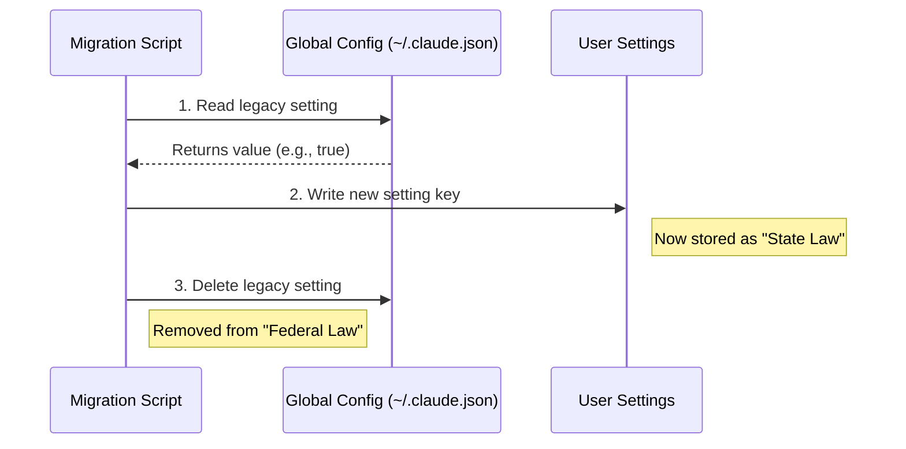

# Chapter 1: Configuration Scope Hierarchy

Welcome to the first chapter of the **Migrations** project tutorial!

In this chapter, we will explore how configuration data is organized within the application. Understanding where settings live—and how to move them—is the foundation for writing safe and effective migrations.

## Motivation: The "Federal vs. Local" Law Analogy

Imagine you are defining rules for a society. You have three levels of government:

1.  **Federal Law (Global):** Applies to everyone, everywhere. Hard to change.
2.  **State Law (User):** Applies to a specific region (or person). customizable.
3.  **Municipal Law (Local/Project):** Applies only to a specific city or town. Highly specific.

**The Problem:**
In the early days of our application, we stored almost everything in "Federal Law" (Global Config). For example, if a user wanted to turn off auto-updates, that setting was saved in a machine-wide file.

**The Use Case:**
What if a user wants strict security settings globally, but needs to relax permissions just for *one specific project* they are working on? If the setting is stuck in the Global scope, they can't do that.

**The Solution:**
We use **Migrations** to move data from the rigid Global scope down to the more flexible User or Local scopes. This chapter explains how that hierarchy works and how to move data between layers.

## Key Concepts: The Three Scopes

The codebase distinguishes between three distinct scopes.

### 1. GlobalConfig (Federal)
*   **Location:** `~/.claude.json`
*   **Purpose:** Machine-wide settings, installation flags, and "guards" (markers that ensure a migration only runs once).
*   **Access:** `getGlobalConfig()`

### 2. User Settings (State)
*   **Location:** `userSettings` (managed internally)
*   **Purpose:** The user's personal preferences. This is where most settings *should* live, allowing the user to configure their experience across all projects.
*   **Access:** `getSettingsForSource('userSettings')`

### 3. Local/Project Settings (Municipal)
*   **Location:** `localSettings` or `projectConfig`
*   **Purpose:** Context-specific rules. These override everything else when you are working inside a specific folder or project.
*   **Access:** `getSettingsForSource('localSettings')`

## How Migrations Move Data

A common task in this project is taking a legacy setting from `GlobalConfig` and moving it to `userSettings`. Let's look at how we implement this "Federal to State" shift.

### Step 1: Check the Source (Global)

First, we read the global configuration to see if the old data exists.

```typescript
import { getGlobalConfig } from '../utils/config.js'

export function migrateBypassPermissions() {
  const globalConfig = getGlobalConfig()

  // If the old setting isn't there, we don't need to do anything
  if (!globalConfig.bypassPermissionsModeAccepted) {
    return
  }
  // ... continue to Step 2
}
```

### Step 2: Write to the Destination (User Settings)

If we find the data, we write it to the new, more flexible location. We use a helper called `updateSettingsForSource`.

```typescript
import { updateSettingsForSource } from '../utils/settings/settings.js'

// Move the preference to 'userSettings'
// Note: We often rename the key to be more descriptive during this move
updateSettingsForSource('userSettings', {
  skipDangerousModePermissionPrompt: true,
})
```

### Step 3: Cleanup the Source (Global)

Finally, once the data is safely in User Settings, we remove it from Global Config so it doesn't cause conflicts later.

```typescript
import { saveGlobalConfig } from '../utils/config.js'

// Remove the old key from the global file
saveGlobalConfig(current => {
  // Destructure to remove the specific key, keep the rest
  const { bypassPermissionsModeAccepted, ...updatedConfig } = current
  return updatedConfig
})
```

## Internal Implementation: Under the Hood

When a migration runs, it acts as a bridge between these scopes. Here is the flow of a standard "Global to User" migration.

### Visualizing the Flow



### Deep Dive: Migrating Project Specifics

Sometimes we need to move data from a Project Config (legacy) to Local Settings (modern). This allows for better handling of things like MCP (Model Context Protocol) servers.

Let's look at `migrateEnableAllProjectMcpServersToSettings.ts`.

#### Reading Legacy Project Data
We look at the current project configuration to see if it has old MCP approval fields.

```typescript
import { getCurrentProjectConfig } from '../utils/config.js'

const projectConfig = getCurrentProjectConfig()

// Check for legacy fields
const hasEnableAll = projectConfig.enableAllProjectMcpServers !== undefined
// ... checks for other fields
```

#### Merging into Local Settings
Unlike global settings which might be simple booleans, local settings often involve lists (like arrays of enabled servers). We must merge carefully to avoid duplicates.

```typescript
// Merge existing local settings with the old project config data
const updates = {
  enabledMcpjsonServers: [
    ...new Set([
      ...existingEnabledServers, // Keep what we already have
      ...projectConfig.enabledMcpjsonServers, // Add legacy data
    ]),
  ],
}

updateSettingsForSource('localSettings', updates)
```

## Important Considerations

1.  **Preserving Intent:** When moving settings, always ensure you are interpreting the user's original intent correctly. For example, in `migrateAutoUpdatesToSettings.ts`, we only migrate if the user *explicitly* disabled updates.
2.  **Guards:** Some migrations need to run only once. We often use a flag in `GlobalConfig` to remember that a migration has finished. We will cover this in depth in [Idempotent Execution Guards](05_idempotent_execution_guards.md).

## Conclusion

In this chapter, you learned that our configuration is hierarchical: **Global**, **User**, and **Local/Project**. Migrations are the tools we use to refine this hierarchy, moving rigid "Federal" rules down to flexible "State" or "Municipal" preferences.

In the next chapter, we will look at how we manage the evolution of the application's state over time.

[Next Chapter: State Migration and Evolution](02_state_migration_and_evolution.md)

---

Generated by [Code IQ](https://github.com/adityasoni99/Code-IQ)