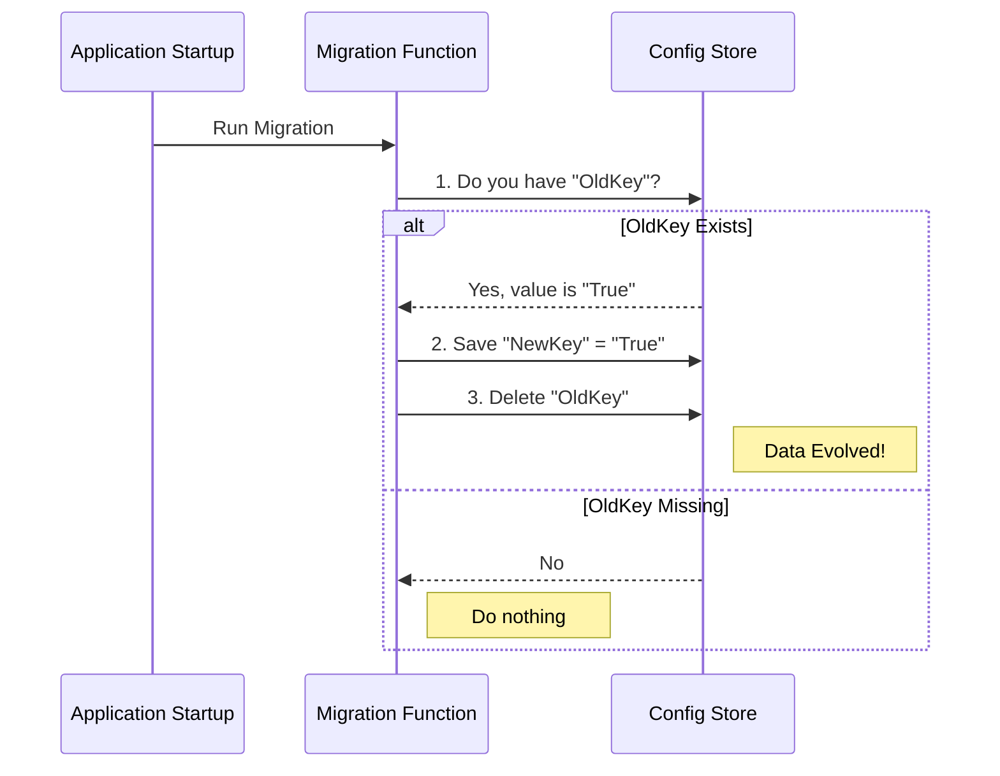

# Chapter 2: State Migration and Evolution

Welcome back! In the previous chapter, [Configuration Scope Hierarchy](01_configuration_scope_hierarchy.md), we learned **where** our application data lives (Global, User, or Local).

Now, we are going to learn **how** to move that data around as the application grows.

## Motivation: The Digital Moving Crew

Imagine you are renovating your house. You used to keep your books in a cardboard box labeled "Misc" on the floor. Now, you have built a beautiful new bookshelf labeled "Library."

If you just build the shelf but don't move the books, you lose access to your collection. You need a process to:
1.  **Find** the old box.
2.  **Move** the books to the new shelf.
3.  **Throw away** the old cardboard box so you don't trip over it.

In our codebase, this process is called **State Migration**. As we update the app, we might rename settings, change data formats, or move preferences from "Global" to "User" scope. Migrations act as the digital moving crew that runs automatically when the app starts, ensuring the user's old data is neatly repacked into the new format.

## The Core Pattern: Detect, Move, Cleanup

Every migration in this project follows a specific three-step pattern. Let's break it down using a real example: **Renaming a Setting**.

### The Use Case
We used to have a setting called `replBridgeEnabled`. We decided this name was too technical, so we changed it to `remoteControlAtStartup`. We want to preserve the user's choice without asking them to configure it again.

### Step 1: Detect (Check the Old Box)
First, we check if the legacy configuration exists. If the user never set the old value, our work is done immediately.

```typescript
// Inside a migration function...
saveGlobalConfig(prev => {
  // Try to find the old key
  const oldValue = prev['replBridgeEnabled']
  
  // If the old key isn't there, do nothing (return previous config)
  if (oldValue === undefined) return prev
  
  // ... continue to Step 2
```
*Explanation:* We look inside the global configuration object. If `replBridgeEnabled` is undefined, we stop.

### Step 2: Move (Pack into New Shelf)
If we find the old value, we need to write it to the new key. Crucially, we check if the *new* key already exists to avoid overwriting recent changes.

```typescript
  // If the NEW key is already set, don't overwrite it.
  if (prev.remoteControlAtStartup !== undefined) return prev

  // Create the new state with the new key name
  const next = { 
    ...prev, 
    remoteControlAtStartup: Boolean(oldValue) 
  }
```
*Explanation:* We create a copy of the configuration (`next`) where `remoteControlAtStartup` takes the value of the old `replBridgeEnabled`.

### Step 3: Cleanup (Recycle the Old Box)
Finally, we delete the old key. This ensures the migration never runs again and keeps our configuration file clean.

```typescript
  // Delete the old key so we don't process it again
  delete next['replBridgeEnabled']
  
  // Return the shiny new config object
  return next
})
```
*Explanation:* We delete the legacy key and save the result. The transformation is complete!

## Visualizing the Flow

Before we look at more code, let's visualize exactly what happens during application startup when a migration runs.



## Handling Complex Data: Merging Lists

Sometimes, moving data isn't as simple as renaming a key. Sometimes we need to merge two lists together without creating duplicates.

Imagine we are moving a list of "Approved Servers" from a project-specific config into the user's local settings.

### The Challenge
*   **Old List:** `['Server A', 'Server B']`
*   **New List:** `['Server B', 'Server C']`
*   **Goal:** Combine them into `['Server A', 'Server B', 'Server C']`. (Notice 'Server B' is only listed once).

### The Solution: Using Sets
We use a JavaScript `Set` to automatically handle duplicates.

```typescript
// From migrateEnableAllProjectMcpServersToSettings.ts

const updates = {
  enabledMcpjsonServers: [
    // Create a Set to automatically remove duplicates
    ...new Set([
      ...existingEnabledServers, // Items currently in the new location
      ...projectConfig.enabledMcpjsonServers, // Items from the old location
    ]),
  ],
}
```
*Explanation:* We pour both lists into a `Set`. A `Set` is a collection that only allows unique values. Then, we convert it back into an array (`[...]`). The result is a clean, merged list.

## Deep Dive: Cross-Scope Migration

In [Chapter 1](01_configuration_scope_hierarchy.md), we discussed moving data from **Global** to **User** scope. Let's look at `migrateAutoUpdatesToSettings.ts` to see this in action.

### 1. Reading the Source
We read the global config to find the user's intent.

```typescript
import { getGlobalConfig } from '../utils/config.js'

export function migrateAutoUpdatesToSettings(): void {
  const globalConfig = getGlobalConfig()

  // Only migrate if the user EXPLICITLY set this to false previously
  if (globalConfig.autoUpdates !== false) {
    return
  }
  // ... continue
```

### 2. Writing to the Destination
We use the helper `updateSettingsForSource` to write to the `userSettings` bucket.

```typescript
import { updateSettingsForSource } from '../utils/settings/settings.js'

// We translate the boolean 'false' into a specific environment variable
updateSettingsForSource('userSettings', {
  env: {
    DISABLE_AUTOUPDATER: '1',
  },
})
```

### 3. Cleaning the Source
We use `saveGlobalConfig` to remove the old setting.

```typescript
import { saveGlobalConfig } from '../utils/config.js'

saveGlobalConfig(current => {
  // Destructuring trick: extract 'autoUpdates' and keep everything else
  const { autoUpdates, ...updatedConfig } = current
  
  // Return the config object WITHOUT autoUpdates
  return updatedConfig
})
```

## Best Practices

1.  **Preserve Intent:** If a user turned a feature *off* in the old system, ensure it stays *off* in the new system.
2.  **Safety First:** Always check if the new setting already exists before overwriting it. We generally assume the "new" setting is more recent and accurate than the "old" legacy setting.
3.  **One-Time Only:** These functions run every time the app starts. They must be written so that after they run once (and delete the old key), they effectively do nothing on subsequent runs.

## Conclusion

State Migration is about evolution without disruption. By detecting legacy data, transforming it, and cleaning up after ourselves, we ensure users can upgrade their application without losing their carefully customized environments.

However, sometimes a migration is so complex that simply deleting the old key isn't enough to mark it as "done." We need a way to remember that we've already run a specific complex task.

In the next chapter, we will learn how we handle features meant for specific groups of people.

[Next Chapter: User Segmentation and Gating](03_user_segmentation_and_gating.md)

---

Generated by [Code IQ](https://github.com/adityasoni99/Code-IQ)