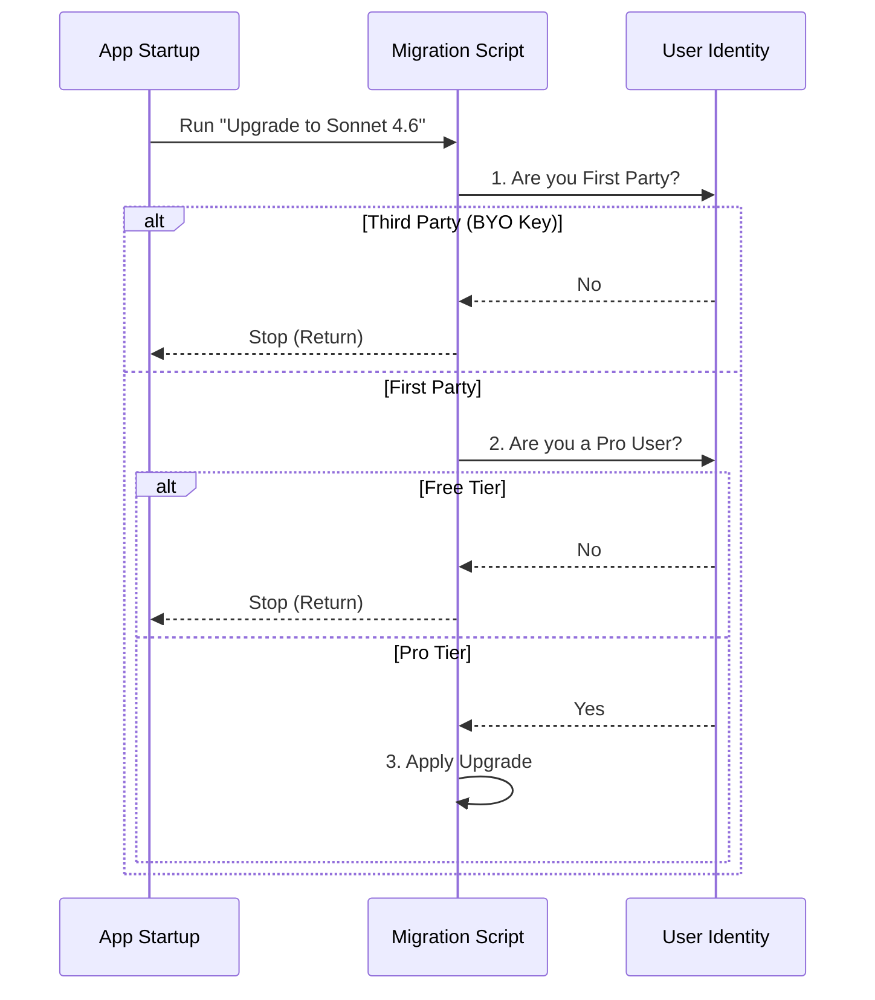

# Chapter 3: User Segmentation and Gating

Welcome back! In the previous chapter, [State Migration and Evolution](02_state_migration_and_evolution.md), we learned how to move data from old formats to new ones.

However, moving data isn't always a "one size fits all" operation. Sometimes, a change should only happen for **Pro** users. Other times, it should only apply to internal employees.

In this chapter, we will learn how to write **Gates**—logic that checks *who* the user is before applying a migration.

## Motivation: The "Club Bouncer" Analogy

Imagine a high-end nightclub with different rooms:
1.  **Main Floor:** Open to everyone.
2.  **VIP Lounge:** Only for "Pro" ticket holders.
3.  **Staff Room:** Only for employees.

If the club decides to upgrade the furniture in the **VIP Lounge**, they shouldn't force everyone on the **Main Floor** to move.

**The Use Case:**
We want to upgrade users from the model "Sonnet 4.5" to "Sonnet 4.6".
*   **Problem:** "Sonnet 4.6" is a premium model. If we migrate a **Free Tier** user to it, their requests will fail because they don't have permission to use it.
*   **Solution:** We place a "Bouncer" (a Gate) at the start of the migration function. It checks the user's subscription. If they aren't Premium, the migration stops immediately.

## Key Concepts: The Identity Cards

To make these decisions, we check specific "ID Cards" that the application holds.

### 1. API Provider (Who pays the bill?)
*   **First Party:** The user pays us a subscription (Pro/Max/Team). We manage the keys.
*   **Third Party:** The user brings their own API Key (OpenAI, Anthropic, etc.). We shouldn't mess with their model selections because we don't know what their key allows.

### 2. Subscription Tier (What is the ticket type?)
*   **Free:** Basic access.
*   **Pro / Max / Team:** specific tiers with access to advanced models and higher limits.

### 3. User Type (Are they Staff?)
*   **Ant:** Short for "Anthropic Employee." We often test secret features (like "Fennec" models) on internal users before releasing them.

## Implementing a Gate

A "Gate" is simply an `if` statement at the very top of your migration function. If the condition isn't met, we `return` immediately (do nothing).

### Step 1: Gating by Provider

The most common check is ensuring we only modify settings for **First Party** users.

```typescript
import { getAPIProvider } from '../utils/model/providers.js'

export function migrateMyFeature() {
  // GATE: Check if the user is using our managed service
  if (getAPIProvider() !== 'firstParty') {
    // If they are using their own keys (3rd party), stop here.
    return
  }

  // ... continue with migration
}
```

### Step 2: Gating by Subscription

If a feature is exclusive to paid users, we check their subscription status.

```typescript
import { isProSubscriber } from '../utils/auth.js'

export function upgradeToPremiumModel() {
  // GATE: Check if the user pays for a subscription
  if (!isProSubscriber()) {
    // If they are a free user, stop here.
    return
  }

  // ... upgrade them to the cool new model
}
```

## Visualizing the Bouncer Logic

Here is how the application decides whether to run a specific migration script.



## Deep Dive: Real World Examples

Let's look at how we combine these checks in real files.

### Example 1: Upgrading Pro Users (`migrateSonnet45ToSonnet46.ts`)

In this file, we want to move users from an old model to a new one. This requires passing **two** gates.

**Gate 1: The Provider Check**
```typescript
// From migrateSonnet45ToSonnet46.ts
export function migrateSonnet45ToSonnet46(): void {
  // 1. Must be First Party. We don't touch 3rd party keys.
  if (getAPIProvider() !== 'firstParty') {
    return
  }
  // ... continues below
```

**Gate 2: The Subscription Check**
We need to check if the user is Pro, Max, OR Team. Any of these allow access.

```typescript
  // 2. Must have a premium subscription
  if (!isProSubscriber() && !isMaxSubscriber() && !isTeamPremiumSubscriber()) {
    return
  }
  // ... continues to logic
```

**The Logic: Changing the Setting**
Once past the gates, we proceed with the logic we learned in [Chapter 2](02_state_migration_and_evolution.md).

```typescript
  // 3. Only change it if they are currently on the specific old model
  const model = getSettingsForSource('userSettings')?.model
  
  if (model === 'claude-sonnet-4-5-20250929') {
     updateSettingsForSource('userSettings', { model: 'sonnet' })
  }
}
```
*Note: We check the current model to ensure we don't accidentally overwrite a user who manually switched to something else entirely, like "Haiku".*

### Example 2: Internal Employee Features (`migrateFennecToOpus.ts`)

Sometimes we have features that only exist for employees ("Ants"). We use environment variables to check this.

```typescript
// From migrateFennecToOpus.ts
export function migrateFennecToOpus(): void {
  // GATE: Only run for internal "Ant" users
  if (process.env.USER_TYPE !== 'ant') {
    return
  }

  // ... migrate internal test models to public ones
}
```
*Why?* Regular users don't have access to the `USER_TYPE` variable (or it is undefined), so this code is safely skipped for the public.

## Best Practices

1.  **Fail Fast:** Put your gates at the very top of the function. Don't read settings or calculate things until you know the user is eligible.
2.  **Combine Checks:** It is common to need both `FirstParty` AND `ProSubscriber` checks.
3.  **Safety:** Never migrate a user to a setting they cannot use (e.g., don't set a Free user's model to a Pro-only model). This will cause errors when they try to send a message.

## Conclusion

User Segmentation acts as a safety filter. It ensures that the powerful state transformations we write are applied only to the users who need them—and are allowed to have them.

Now that we have verified the user's identity and updated their settings, we might run into a new problem: What happens if the *name* of a model changes (e.g., "claude-3-opus" becomes just "opus")?

In the next chapter, we will learn how the system handles these names dynamically.

[Next Chapter: Model Alias Resolution](04_model_alias_resolution.md)

---

Generated by [Code IQ](https://github.com/adityasoni99/Code-IQ)