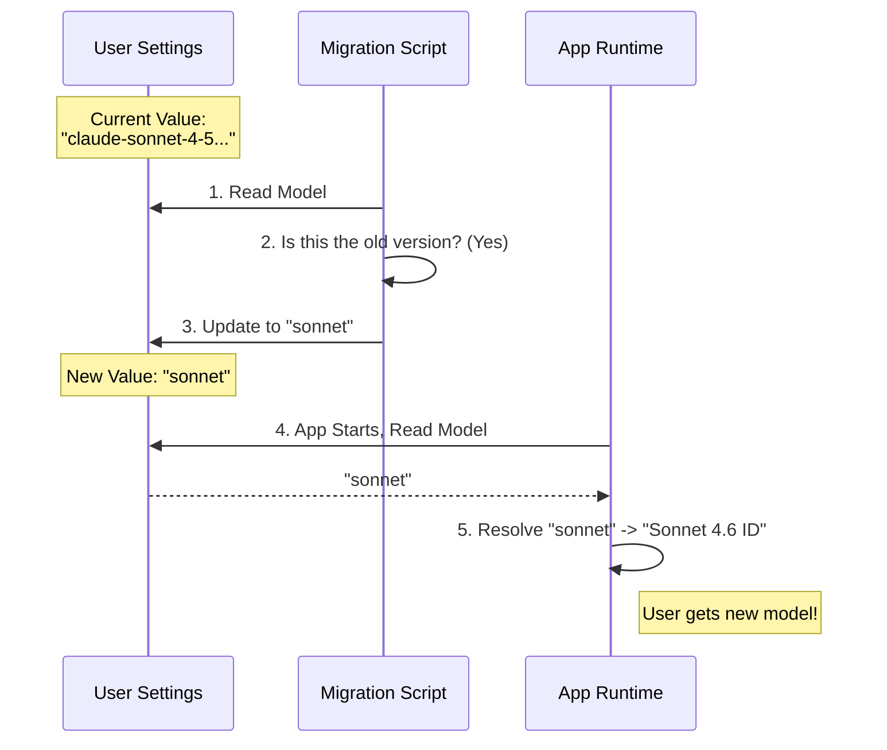

# Chapter 4: Model Alias Resolution

Welcome back! In the previous chapter, [User Segmentation and Gating](03_user_segmentation_and_gating.md), we learned how to check **who** the user is (Pro, Free, or Employee) before running a migration.

Now that we know who the user is, we need to handle **what** they are using. Specifically, we need to manage the complex names of the Large Language Models (LLMs) they use.

## Motivation: The "Restaurant Menu" Analogy

Imagine a restaurant with a menu item called **"The Chef's Special"**.
*   In January, the special is Lasagna.
*   In February, the special is Tacos.

When you order "The Chef's Special," you don't need to know the recipe version or the date it was added. You just want the current best dish.

**The Problem:**
In the world of AI, models have long, ugly technical names like `claude-3-5-sonnet-20241022`. These change frequently. If a user saves this specific name in their settings, they are "pinned" to that version. When a better version comes out a month later, they will still be stuck using the old one.

**The Solution:**
We use **Model Aliases**. Instead of saving the ugly ID, we save a friendly name like `sonnet` or `opus`.
*   **Alias:** `sonnet` (The Menu Item)
*   **Resolution:** The application checks the date and "resolves" `sonnet` to `claude-3-5-sonnet-20241022`.

This chapter explains how migrations help users switch between these aliases to ensure they are always on the correct version.

## Key Concepts

### 1. The Alias (Friendly Name)
This is what we want to store in the user's settings. It is stable and easy to read.
*   Examples: `opus`, `sonnet`, `sonnet[1m]` (Sonnet with 1 Million token context).

### 2. The Explicit ID (Pinned Version)
This is the specific backend identifier.
*   Examples: `claude-3-opus-20240229`, `claude-sonnet-4-5-20250929`.

### 3. The Resolution Migration
A script that looks at the user's current setting and decides if it needs to be updated to a new Alias or a new Explicit ID.

## The Use Case: Unpinning a User

Let's look at `migrateSonnet45ToSonnet46.ts`.

**Scenario:**
A user previously pinned their model to "Sonnet 4.5" (Explicit ID). Now, "Sonnet 4.6" is out. Since the user is a **Pro** subscriber, we want to upgrade them automatically by switching their setting to the generic `sonnet` alias (which currently points to 4.6).

### Step 1: The Gates (Review)
As learned in [User Segmentation and Gating](03_user_segmentation_and_gating.md), we first check if the user is allowed to have this upgrade.

```typescript
// migrateSonnet45ToSonnet46.ts
export function migrateSonnet45ToSonnet46(): void {
  // Gate 1: Must be First Party (managed by us)
  if (getAPIProvider() !== 'firstParty') return

  // Gate 2: Must be a paid subscriber
  if (!isProSubscriber() && !isMaxSubscriber()) return

  // ... proceed to logic
}
```

### Step 2: Check the Current Model
We need to see if the user is actually using the old specific version. If they are already on `opus`, we shouldn't force them to `sonnet`.

```typescript
  // Get the current setting from User Settings
  const model = getSettingsForSource('userSettings')?.model

  // Check if it matches the OLD specific version
  if (
    model !== 'claude-sonnet-4-5-20250929' &&
    model !== 'sonnet-4-5-20250929'
  ) {
    return // Not the target model, stop here.
  }
```

### Step 3: Update to the Alias
If they matched the old version, we update their setting to the generic alias `sonnet`.

```typescript
  // Move them to the generic alias
  updateSettingsForSource('userSettings', {
    model: 'sonnet', 
  })
```

*Result:* The next time the application runs, it sees `sonnet` and resolves it to the newest version (Sonnet 4.6). The user is now "unpinned" and will receive future updates automatically.

## Visualizing the Resolution Flow

Here is how the migration bridges the gap between old specific IDs and new Aliases.



## Deep Dive: Handling Internal Aliases

Sometimes, we use secret aliases for internal testing. When those features go public, we need to migrate employees ("Ants") to the public names.

Let's look at `migrateFennecToOpus.ts`. "Fennec" was the internal codename for a new model. Now that it is released as "Opus 4.6", we need to rename it in their settings.

### The Code Walkthrough

```typescript
// migrateFennecToOpus.ts
export function migrateFennecToOpus(): void {
  // Only run for employees
  if (process.env.USER_TYPE !== 'ant') return

  const settings = getSettingsForSource('userSettings')
  const model = settings?.model

  // Check if the model name starts with the secret codename
  if (typeof model === 'string' && model.startsWith('fennec-latest')) {
    
    // Map the internal name to the public alias
    updateSettingsForSource('userSettings', {
      model: 'opus',
    })
  }
}
```
*Explanation:*
1.  We check if the user is an "Ant" (Employee).
2.  We look for `fennec-latest` (The "Beta" Menu Item).
3.  We replace it with `opus` (The "Official" Menu Item).

## Why not just do this at Runtime?

You might wonder: *Why change the settings file? Why not just make the code treat 'fennec' as 'opus' silently?*

We prefer explicit migrations for two reasons:
1.  **Clarity:** If a user opens their config file, they should see valid, current model names, not deprecated codenames.
2.  **Cleanup:** If we keep adding silent redirects in the code, our "Model Resolver" becomes a mess of `if/else` statements for every model name we've ever used in history. Migrations verify the data once and update it, keeping the runtime code clean.

## Important Considerations

1.  **Don't Touch 3rd Party Keys:** Users bringing their own API keys (e.g., direct OpenAI keys) must use specific model IDs that their key supports. Our aliases (`sonnet`, `opus`) are designed for our First Party infrastructure. We usually skip 3rd Party users in these migrations.
2.  **Preserve Modifiers:** If a user had `fennec-latest[1m]` (1 million context), we must migrate them to `opus[1m]`, not just plain `opus`. We must preserve the *flavor* of the model they chose.

## Conclusion

Model Alias Resolution allows us to manage the complex timeline of AI model versions. By using migrations to shift users from **Specific IDs** (pinned versions) to **Aliases** (forwarding addresses), we ensure they always have access to the latest and greatest features without needing to manually update their configuration files.

Sometimes, however, a migration is complex and we need to ensure it absolutely runs only *one single time*, even if the user changes their settings back. To do this, we leave a "receipt" behind.

In the next chapter, we will learn how to leave these receipts.

[Next Chapter: Idempotent Execution Guards](05_idempotent_execution_guards.md)

---

Generated by [Code IQ](https://github.com/adityasoni99/Code-IQ)