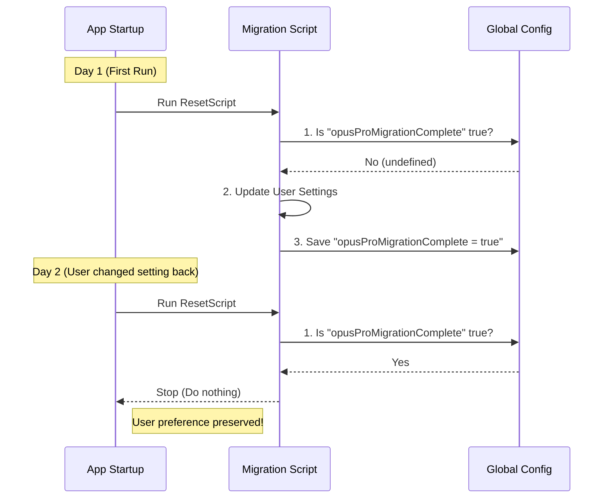

# Chapter 5: Idempotent Execution Guards

Welcome to the final chapter of our tutorial series!

In previous chapters like [Model Alias Resolution](04_model_alias_resolution.md), we learned how to update user settings. However, there is a hidden danger in running these scripts automatically.

Since our migrations run **every time the application starts**, we need to make sure they are **Idempotent**.

## Motivation: The "Groundhog Day" Problem

Imagine a migration designed to set a user's default model to "Opus".

1.  **Monday:** You run the migration. The user is moved to "Opus".
2.  **Tuesday:** The user decides they prefer "Haiku" and changes it back.
3.  **Wednesday:** The application starts. The migration runs again. It sees the user is on "Haiku" (not Opus), so it forces them back to "Opus".

**The Problem:** The user is fighting against the application. Every time they restart, their preference is overwritten.

**The Solution:** We need a way to say, *"I have already run this migration once. Do not run it again, even if the settings look 'wrong'."*

We call this pattern an **Execution Guard**. It acts like a checklist on a medication dispenser. Before acting, the system checks: "Did I already take the pill for today?" If the slot is empty, it does nothing.

## Key Concepts

To implement these guards, we use two main tools:

### 1. Idempotency
A fancy word that means: "Running a function multiple times has the same result as running it once."
*   **Bad:** `balance = balance + 10` (Run twice, you get +20).
*   **Good:** `balance = 100` (Run twice, you still have 100).

### 2. The Global Flag (The Receipt)
A boolean value (True/False) or a timestamp stored in the **Global Config**. This serves as permanent proof that a migration has finished.

## Use Case: The "One-Time" Reset

Let's look at a real scenario using `resetProToOpusDefault.ts`. We want to move Pro users to the "Opus" model, but **only once**. If they change it later, we must respect that.

### Step 1: Check the Receipt

At the very top of our function, we check the Global Config for a specific flag.

```typescript
import { getGlobalConfig } from '../utils/config.js'

export function resetProToOpusDefault(): void {
  const config = getGlobalConfig()

  // GUARD: If we have done this before, stop immediately.
  if (config.opusProMigrationComplete) {
    return
  }
  // ... continue to logic
```

### Step 2: Perform the Logic

If the flag was missing (false), we proceed to check the user's status (using concepts from [User Segmentation and Gating](03_user_segmentation_and_gating.md)).

```typescript
  // If they aren't a Pro user, we mark it as done anyway 
  // so we don't check them again.
  if (!isProSubscriber()) {
    markMigrationAsComplete() // Helper function (see Step 3)
    return
  }
  
  // ... perform the settings update here ...
```

### Step 3: Print the Receipt

Once the logic is finished—whether we changed a setting or not—we **must** save the flag so the code never runs again.

```typescript
import { saveGlobalConfig } from '../utils/config.js'

// We save the flag to Global Config
saveGlobalConfig(current => ({
  ...current,
  opusProMigrationComplete: true, // The Receipt
}))
```

## Visualizing the Flow

Here is how the application behaves over multiple restarts.



## Deep Dive: Complex Guards

Sometimes, a simple True/False isn't enough. We might want to migrate a specific setting but only if it matches a *very specific* old value.

Let's look at `migrateSonnet1mToSonnet45.ts`. Here, we need to handle a specific legacy model string: `sonnet[1m]`.

### The Double Guard

This migration uses **two** layers of protection.

1.  **The Explicit Guard:** Have we run this script before?
2.  **The Implicit Guard:** Does the user actually have the problem setting?

```typescript
export function migrateSonnet1mToSonnet45(): void {
  const config = getGlobalConfig()
  
  // Layer 1: Explicit Receipt
  if (config.sonnet1m45MigrationComplete) return

  // Layer 2: Implicit State Check
  const model = getSettingsForSource('userSettings')?.model
  
  // Only act if they have the specific legacy string
  if (model === 'sonnet[1m]') {
    updateSettingsForSource('userSettings', {
      model: 'sonnet-4-5-20250929[1m]',
    })
  }
  // ... see next block
```

### Closing the Loop

Whether the user had `sonnet[1m]` or not, we mark the migration as complete.

```typescript
  // Even if they didn't have the model, we save the flag.
  // We don't want to check this every time the app boots forever.
  saveGlobalConfig(current => ({
    ...current,
    sonnet1m45MigrationComplete: true,
  }))
}
```

*Why mark it complete if we did nothing?*
Performance! Reading settings and checking strings takes a tiny bit of time. By checking the global boolean first, we skip all that logic on future runs.

## Where to Store Guards?

You might wonder why we use `GlobalConfig` (`~/.claude.json`) instead of `userSettings`.

1.  **GlobalConfig:** Stores "System State" (e.g., "I have finished the update to version 2.0"). This applies to the *machine*.
2.  **UserSettings:** Stores "User Preferences" (e.g., "I like Dark Mode").

If we stored the migration flag in `userSettings`, and the user wiped their settings file to start fresh, the migration would run again! By keeping the "Receipt" in the Global Config, we ensure the migration respects the machine's history, even if user settings are reset.

## Conclusion

Congratulations! You have completed the **Migrations** tutorial series.

You now possess the full toolkit to manage the evolution of the application:

1.  **Scope Hierarchy:** You know where data lives ([Chapter 1](01_configuration_scope_hierarchy.md)).
2.  **State Evolution:** You can move data and rename keys ([Chapter 2](02_state_migration_and_evolution.md)).
3.  **Gating:** You can target specific users like Pro subscribers ([Chapter 3](03_user_segmentation_and_gating.md)).
4.  **Alias Resolution:** You can manage complex model names ([Chapter 4](04_model_alias_resolution.md)).
5.  **Idempotency:** You can ensure your migrations run safely and only once ([Chapter 5](05_idempotent_execution_guards.md)).

With these tools, you can ensure that as the application improves and changes, the user's experience remains seamless and their preferences are respected. Happy coding!

---

Generated by [Code IQ](https://github.com/adityasoni99/Code-IQ)