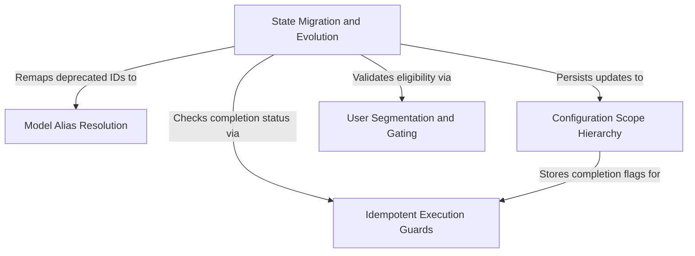

# Tutorial: migrations

This project functions as an **automated maintenance system** that ensures the application's configuration evolves smoothly over time without breaking user customization. It executes a series of **idempotent migration scripts** during startup to update deprecated data formats, move settings between **global and local scopes**, and standardize **model aliases** (like updating "Sonnet" to its latest version). By strictly gating these changes based on **user segmentation** (such as subscription tier), it guarantees that upgrades are applied safely and only to the eligible users.

## Chapters

1. [Configuration Scope Hierarchy](01_configuration_scope_hierarchy.md)
2. [State Migration and Evolution](02_state_migration_and_evolution.md)
3. [User Segmentation and Gating](03_user_segmentation_and_gating.md)
4. [Model Alias Resolution](04_model_alias_resolution.md)
5. [Idempotent Execution Guards](05_idempotent_execution_guards.md)

---

Generated by [Code IQ](https://github.com/adityasoni99/Code-IQ)