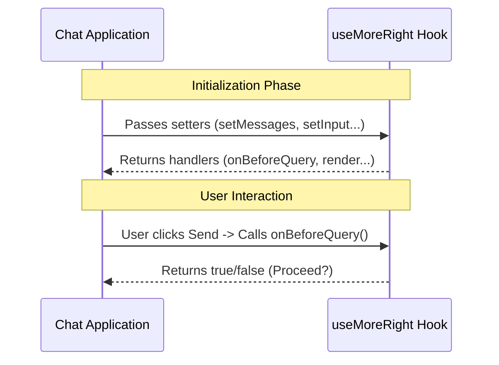

# Chapter 1: Feature Hook Interface

Welcome to the **MoreRight** project! In this tutorial series, we are going to explore how to enhance a standard chat application with powerful external logic.

## Motivation: The Expansion Slot
Imagine you have a standard gaming console. It works great on its own, but it becomes truly powerful when you plug in a specific game cartridge.

In our context:
*   **The Console** is your existing Chat Application (the "Host").
*   **The Cartridge** is the **MoreRight** logic (the "Guest").

The **Feature Hook Interface** is the connector that allows the Cartridge to plug into the Console. Without this bridge, the two cannot talk to each other.

### Central Use Case
You have a Chat UI. You want to add a feature where, before the user's message is sent to the AI, a separate logic layer checks the message or modifies the state (like adding a "Thinking..." status). You need a standard way to connect this logic to your UI.

## The Bridge: `useMoreRight`

The core of this interface is a React Hook called `useMoreRight`.

When you call this function, you are effectively establishing a handshake. You give the hook access to change the app's screen (inputs), and the hook gives you back control functions (outputs) to run logic at specific times.

### Key Concepts

1.  **Inputs (Host State):** The app gives the hook permission to change things, like the list of messages or the text inside the input box.
2.  **Outputs (Event Handlers):** The hook gives the app functions to run when events happen, like "User pressed Enter" (`onBeforeQuery`).

## How to Use It

Let's look at how a host application connects to this interface.

### Step 1: Prepare the State
First, the Chat App usually has its own state. The hook needs access to setters so it can control the app later.

```tsx
// Inside your ChatApp component
const [messages, setMessages] = useState([]);
const [input, setInput] = useState("");
const [toolUI, setToolUI] = useState(null);
```
*Explanation:* We create standard React state variables for the chat history, the typing box, and a place to show extra UI tools.

### Step 2: Plug in the Hook
Now, we call `useMoreRight` and pass those state setters into it.

```tsx
const moreRight = useMoreRight({
  enabled: true,
  setMessages: setMessages,
  inputValue: input,
  setInputValue: setInput,
  setToolJSX: setToolUI
});
```
*Explanation:* We enable the hook and hand over the "keys" to the application state. This allows MoreRight to modify messages or clear the input box later. Read more about this in [Host State Control](05_host_state_control.md).

### Step 3: Connect the Signals
The hook returns an object (we called it `moreRight`). We need to wire this up to our UI events, specifically when the user tries to send a message.

```tsx
const handleSend = async () => {
  // Ask the hook if we can proceed
  const shouldContinue = await moreRight.onBeforeQuery(input, messages, 0);

  if (shouldContinue) {
    // Standard logic to send message to AI...
  }
};
```
*Explanation:* Instead of sending the message immediately, we ask `moreRight.onBeforeQuery` first. This allows the external logic to intercept the request. We will cover this deeply in [Query Interception](02_query_interception.md).

## Under the Hood

What actually happens when `useMoreRight` is initialized? Let's visualize the handshake.



### Understanding the Stub Implementation

The code provided for this chapter is a **Stub**. This means it is a simplified version used for external builds to ensure the types are correct, even if the complex internal logic isn't exposed directly here.

Let's look at the structure of `useMoreRight.tsx` to understand the "Contract" of this interface.

#### The Inputs Contract
This defines what the Chat App *must* provide to the hook.

```tsx
export function useMoreRight(_args: {
  enabled: boolean;
  setMessages: (action: any) => void;
  inputValue: string;
  setInputValue: (s: string) => void;
  setToolJSX: (args: any) => void;
})
```
*Explanation:* The hook expects an object with `enabled` (is it on?) and various `set...` functions. This allows the hook to "drive" the application.

#### The Outputs Contract
This defines what the hook gives back to the app.

```tsx
: {
  onBeforeQuery: (input: string, all: any[], n: number) => Promise<boolean>;
  onTurnComplete: (all: any[], aborted: boolean) => Promise<void>;
  render: () => null;
}
```
*Explanation:*
1.  **`onBeforeQuery`**: Triggered before sending a message.
2.  **`onTurnComplete`**: Triggered when the AI finishes replying. See [Lifecycle Event Handling](03_lifecycle_event_handling.md).
3.  **`render`**: A function that returns a React component (or null) to draw overlays on the screen. See [UI Overlay Rendering](04_ui_overlay_rendering.md).

#### The Default Behavior
Since this file is a stub, it returns safe, empty defaults:

```tsx
{
  return {
    onBeforeQuery: async () => true, // Always say "Yes, proceed"
    onTurnComplete: async () => {},  // Do nothing
    render: () => null               // Draw nothing
  };
}
```
*Explanation:* By default, the stub tells the app "Go ahead and send the message" (`true`) and doesn't render any extra UI. This ensures the app doesn't crash if the real logic isn't loaded.

## Conclusion

In this chapter, we learned that the **Feature Hook Interface** (`useMoreRight`) acts as an expansion slot for your chat application. It takes control of the app's state (inputs) and provides specific points to inject logic (outputs).

Currently, our hook is just a "passthrough"—it lets everything happen normally. In the next chapter, we will learn how to actually stop and modify the user's message flow.

[Next Chapter: Query Interception](02_query_interception.md)

---

Generated by [Code IQ](https://github.com/adityasoni99/Code-IQ)