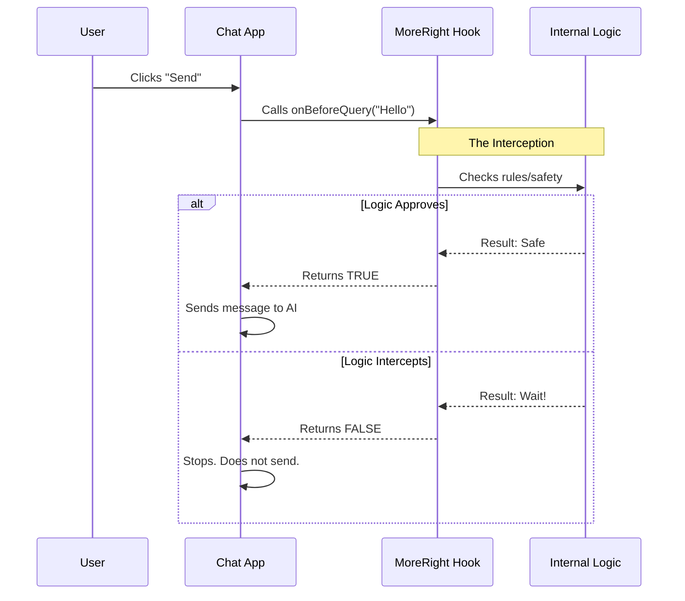

# Chapter 2: Query Interception

Welcome back! In [Chapter 1: Feature Hook Interface](01_feature_hook_interface.md), we learned how to plug the **MoreRight** "cartridge" into your chat application using `useMoreRight`.

Now that the bridge is built, we can start using it to control the conversation. The first and most important power at your disposal is **Query Interception**.

## Motivation: The "Personal Editor"

Imagine you are about to send an angry email to your boss. Before you hit send, a wise friend standing behind you puts a hand on your shoulder and says, "Wait, let's rephrase that."

That is exactly what **Query Interception** does.

### Central Use Case
1.  **User types:** "Delete all files."
2.  **User hits Send.**
3.  **System Intercepts:** Instead of sending the command to the AI immediately, the system pauses.
4.  **Logic Checks:** The external logic sees a dangerous command.
5.  **Result:** The logic stops the message and shows a confirmation box instead.

Without interception, the application would blindly send every message to the AI. With interception, we have a "Gatekeeper."

## The Core Concept: `onBeforeQuery`

The mechanism for this feature is a function called `onBeforeQuery`.

Think of this function as a question you ask the hook: **"May I proceed?"**

*   **Input:** You give it the text the user wants to send and the current chat history.
*   **Output:** It returns a `Promise` that resolves to either:
    *   `true`: "Yes, the message is safe/ready. Send it."
    *   `false`: "No, stop! I need to do something else first (like ask a clarifying question)."

## How to Use It

To use Query Interception, we need to modify the function in your Chat App that handles the "Send" button.

### Step 1: The Setup
As a reminder from the previous chapter, you first initialize the hook.

```tsx
const moreRight = useMoreRight({
  enabled: true,
  inputValue: input,
  setInputValue: setInput,
  // ... other setters
});
```
*Explanation:* We have our `moreRight` object ready to go.

### Step 2: asking for Permission
Inside your send handler, do not send the message yet. Ask `moreRight` first.

```tsx
const handleUserSend = async () => {
  // 1. Capture what the user typed
  const userText = input; 

  // 2. Ask the hook: Can we proceed?
  const shouldSend = await moreRight.onBeforeQuery(
    userText, 
    messages, 
    0 // This is the retry count (usually 0)
  );
```
*Explanation:* We pass the current input and history (`messages`) to the hook. We `await` the answer because the hook might need a moment to think or check an API.

### Step 3: Handling the Answer
Now we act based on the result.

```tsx
  // 3. If the hook says FALSE, we stop immediately.
  if (shouldSend === false) {
    return; 
  }

  // 4. If TRUE, we proceed with normal AI sending logic
  myChatClient.sendMessage(userText);
};
```
*Explanation:* If `shouldSend` is `false`, the hook has "intercepted" the query. It might have triggered a popup or changed the input text (we will cover how it does that in [Host State Control](05_host_state_control.md)). Your app simply stops and waits.

## Under the Hood

What happens inside the hook when you call `onBeforeQuery`?

### Visualizing the Flow

Let's trace the path of a message using a sequence diagram.



### The Stub Implementation

In the `useMoreRight.tsx` file provided for this project, the implementation is a **Stub**. This means it simulates the behavior without the complex logic, so you can build your UI safely.

Let's look at the code inside `useMoreRight.tsx`:

```tsx
onBeforeQuery: async (input: string, all: M[], n: number) => {
  // Real logic would go here to check the input.
  
  // For now, always return TRUE (allow everything)
  return true; 
},
```

*Explanation:*
1.  It accepts the `input` string.
2.  It is `async` because real logic might involve network calls.
3.  Currently, it always returns `true`. This ensures that if you plug this stub into your app, your chat will still function normally (passthrough mode).

### Hypothetical "Real" Logic

To help you understand the power of this, here is what the code *might* look like inside the full version of the hook:

```tsx
// Hypothetical internal logic
onBeforeQuery: async (input, history) => {
  if (input.includes("secret password")) {
    alert("You cannot send secrets!");
    return false; // Intercepted!
  }
  return true; // Proceed
}
```

In this hypothetical scenario, if the user types "secret password", `onBeforeQuery` returns `false`. Your app receives `false` and stops the message from being sent to the AI, effectively protecting the data.

## Conclusion

**Query Interception** gives your application a "brain" before the AI even gets involved. It allows you to pause the conversation flow to ensure safety, improve context, or ask for user confirmation.

Currently, if we stop the query, nothing happens on the screen. The user clicks send, and... nothing. That's bad UX!

In the next chapters, we will learn how to verify what happens *after* the query is sent, and more importantly, how to show visuals (like popups) when a query is intercepted.

[Next Chapter: Lifecycle Event Handling](03_lifecycle_event_handling.md)

---

Generated by [Code IQ](https://github.com/adityasoni99/Code-IQ)