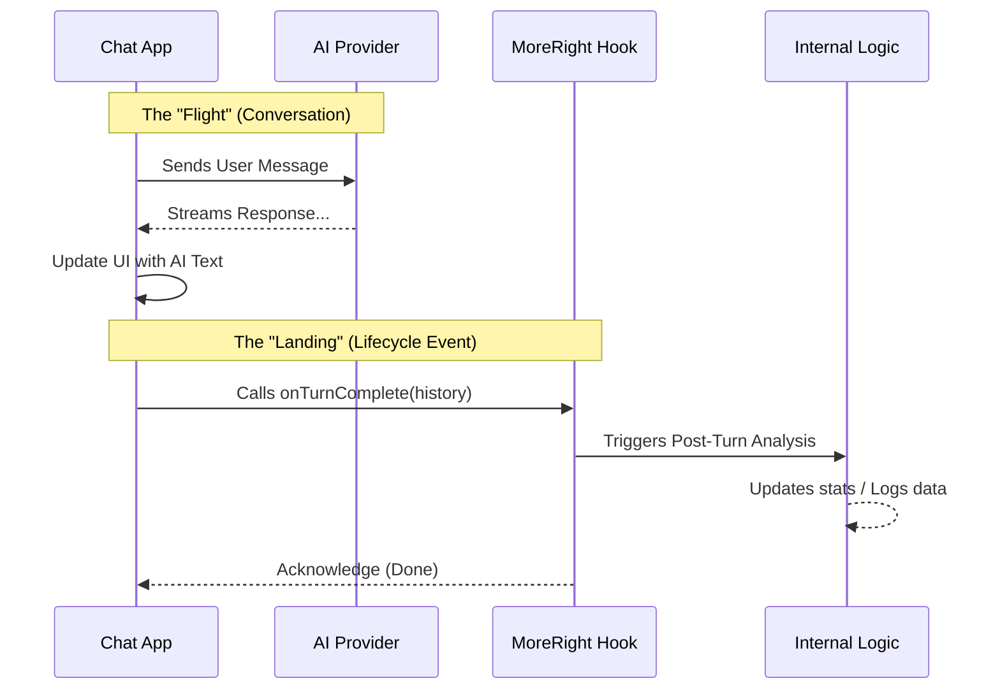

# Chapter 3: Lifecycle Event Handling

Welcome to Chapter 3! In [Chapter 2: Query Interception](02_query_interception.md), we acted as a "Gatekeeper," stopping or modifying messages *before* they were sent to the AI.

Now, we move to the other end of the conversation: **What happens after the AI replies?**

## Motivation: The Post-Flight Inspection

In our aviation analogy, sending a message is like a plane taking off, and the AI generating a response is the flight.

When the plane lands (the AI finishes typing), the job isn't quite done.
*   **The Ground Crew** needs to inspect the landing gear.
*   **The Logs** need to be updated.
*   **The Systems** need to be reset for the next flight.

In **MoreRight**, this phase is handled by **Lifecycle Event Handling**. It allows your external logic to run "cleanup" or "analysis" tasks immediately after a conversation exchange finishes.

### Central Use Case: "The Silent Observer"
Imagine you want a feature that analyzes the conversation tone.
1.  **User sends:** "I'm really frustrated with this!"
2.  **AI replies:** "I'm sorry to hear that..."
3.  **Event Trigger:** As soon as the AI stops typing, **MoreRight** analyzes the chat history.
4.  **Result:** It detects high frustration and internally flags the user for "Priority Support" in your database, without interrupting the user's flow.

## Key Concept: The "Turn"

In a chat interface, a "Turn" consists of one full exchange:
1.  User Message (Input)
2.  AI Message (Response)

We use the function `onTurnComplete` to signal that this pair is finished and safe to record.

## How to Use It

Unlike `onBeforeQuery` (which asks for permission), `onTurnComplete` is a notification. You are telling the hook: **"We are done here. Do your thing."**

### Step 1: Initialize the Hook
As always, we start by setting up our connection.

```tsx
const moreRight = useMoreRight({
  enabled: true,
  setMessages: setMessages, // Logic needs to see history
  // ... other setters
});
```
*Explanation:* We ensure the hook has access to `setMessages` so it can read the latest history.

### Step 2: Locate the "Finish" Event
You need to find the place in your Chat App code where the AI's response is **fully complete**. This is often in a `finally` block or a callback like `onFinish`.

```tsx
const handleAIResponse = async () => {
  try {
    // ... logic that streams the AI response ...
    await streamResponseToUI(); 
  } catch (err) {
    console.error("AI Error");
  }
  // Code continues below...
```
*Explanation:* This represents your existing logic that handles talking to the AI API.

### Step 3: Trigger the Lifecycle Event
Once the stream is done, we manually call `onTurnComplete`.

```tsx
  finally {
    // The AI has finished (or failed).
    // Let MoreRight know the turn is over.
    
    await moreRight.onTurnComplete(
      currentMessages, // The full history
      false            // Was it aborted/cancelled?
    );
  }
};
```
*Explanation:*
1.  We pass the `currentMessages` (which now includes the AI's reply).
2.  We pass a boolean (`false`) indicating the user didn't hit a "Stop" button.
3.  We `await` it just in case the logic needs to save data before the UI updates again.

## Under the Hood

What happens when you call this function?

### Visualizing the Flow



### The Stub Implementation

As with previous chapters, let's look at `useMoreRight.tsx` to see the definition.

```tsx
// Inside useMoreRight.tsx

onTurnComplete: async (all: M[], aborted: boolean) => {
  // 1. Accepts the chat history 'all'
  // 2. Accepts 'aborted' status
  
  // Stub behavior: Do nothing.
},
```

*Explanation:*
The stub is an empty function that returns a Promise. This ensures that if you add the `await moreRight.onTurnComplete(...)` line to your app, it won't crash even if no external logic is loaded. It just "no-ops" (does nothing).

### Hypothetical "Real" Logic

In a production scenario, this function is very powerful. Here is what might happen inside the real logic:

```tsx
// Hypothetical internal logic
onTurnComplete: async (history, aborted) => {
  if (aborted) return; // Don't log cancelled chats

  // 1. Calculate how many tokens were used
  const tokenCount = countTokens(history);

  // 2. Update a database or internal state
  await saveSessionStats(tokenCount);
  
  // 3. Maybe trigger a UI Overlay update?
  // (We will learn this in Chapter 4)
}
```

## Why is this "Lifecycle" Handling?

We call it **Lifecycle** because it deals with the life and death of a request:
1.  **Birth:** `onBeforeQuery` (Chapter 2)
2.  **Life:** The streaming of the response.
3.  **Completion:** `onTurnComplete` (Chapter 3)

By hooking into both the start and the end, we wrap the entire interaction in a controlled environment.

## Conclusion

In this chapter, we learned how to use `onTurnComplete` to perform **Post-Flight Inspections**. This allows our external logic to synchronize with the app, log data, or perform analysis after the AI has finished talking.

However, all this logic is invisible! What if the analysis decides it wants to *show* something to the user? What if we want to display that "Mood Score" we calculated?

In the next chapter, we will learn how to draw graphics on top of your application.

[Next Chapter: UI Overlay Rendering](04_ui_overlay_rendering.md)

---

Generated by [Code IQ](https://github.com/adityasoni99/Code-IQ)