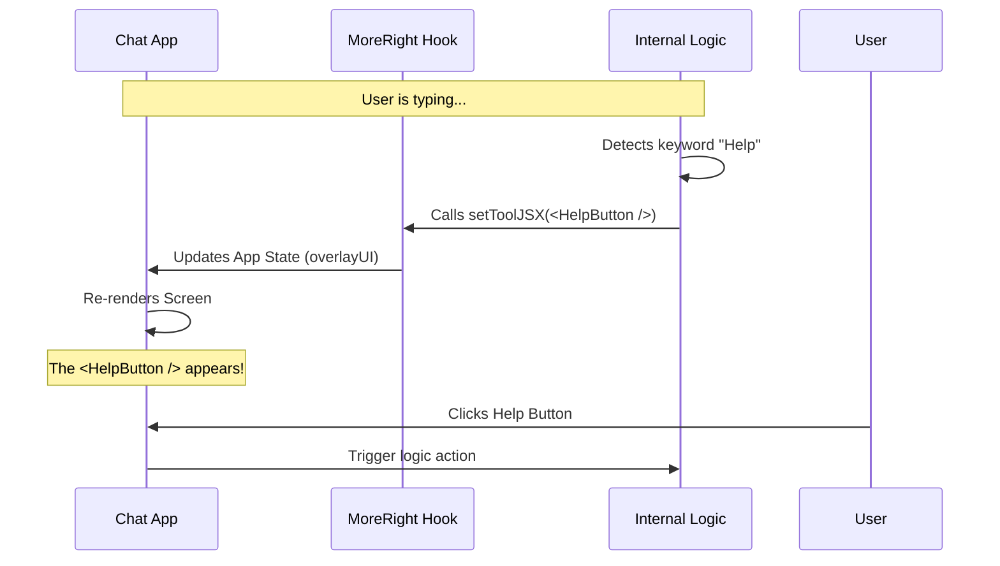

# Chapter 4: UI Overlay Rendering

Welcome to Chapter 4! In [Chapter 3: Lifecycle Event Handling](03_lifecycle_event_handling.md), we learned how to listen to the conversation and perform analysis after the AI finishes talking.

But there was a missing piece: **Feedback.**

If our logic detects a problem or wants to suggest a better phrase, how does it tell the user? Up until now, our logic has been invisible.

In this chapter, we will learn about **UI Overlay Rendering**. This is how **MoreRight** draws graphics, buttons, and status messages directly onto the host application.

## Motivation: The "Heads-Up Display" (HUD)

Imagine you are driving a high-tech car. Instead of looking down at the dashboard to check your speed or navigation, the car projects this information directly onto the windshield glass. This is a **Heads-Up Display**.

In our context:
*   **The Windshield** is your existing Chat Application.
*   **The Projection** is the **UI Overlay** from MoreRight.

### Central Use Case: The "Thinking" Indicator
1.  **User types:** "Write a poem about rust."
2.  **User hits Send.**
3.  **Interception:** The hook pauses the message (as learned in [Chapter 2: Query Interception](02_query_interception.md)).
4.  **The Problem:** The user sees nothing happening. Did the app freeze?
5.  **The Solution:** We project a specialized "Analyzing Safety..." banner right over the chat input until the check is done.

## Key Concepts

To make this HUD work, we need two things: a place to draw (The Canvas) and something to draw (The Projector).

### 1. The Canvas (`setToolJSX`)
When we initialize the hook, we pass a function called `setToolJSX`. Think of this as giving the hook a blank canvas or a "Remote Control" to a specific part of your screen.

### 2. The Projector (`render`)
The hook returns a function called `render`. When the Host App calls this, it asks the hook: "Do you have any graphics you want to show right now?"

## How to Use It

Let's integrate the visual layer into our Host Application.

### Step 1: Create the Space
First, your application needs a place to show these overlays. Usually, this is right above the chat input box or floating in the corner.

```tsx
// Inside your ChatApp component
function ChatApp() {
  // 1. This variable will hold the Hook's UI
  const [overlayUI, setOverlayUI] = useState(null); 
  
  // ... other logic ...
```
*Explanation:* We create a standard React state variable to hold whatever the hook wants to show.

### Step 2: Pass the "Remote Control"
We give the setter to the hook. This allows the hook to update `overlayUI` whenever it wants.

```tsx
  const moreRight = useMoreRight({
    enabled: true,
    setToolJSX: setOverlayUI, // <--- The Remote Control
    // ... other inputs
  });
```
*Explanation:* Now, if the internal logic decides to show a button, it calls this function, and your app updates automatically.

### Step 3: Place the Component
Finally, we place the `overlayUI` variable inside our JSX HTML, exactly where we want it to appear.

```tsx
  return (
    <div className="chat-container">
      <MessageList messages={messages} />
      
      {/* The Overlay appears here! */}
      <div className="hud-layer">
        {overlayUI}
      </div>

      <InputBox />
    </div>
  );
}
```
*Explanation:* If `overlayUI` is `null`, nothing shows up. If the hook puts a "Warning" box there, it appears between the messages and the input box.

### Alternative: Direct Rendering
Sometimes, instead of using state, the hook simply provides a `render()` method that you can drop directly into your JSX.

```tsx
{/* Direct usage */}
<div className="hud-layer">
  {moreRight.render()} 
</div>
```
*Explanation:* This asks the hook *right now* what it wants to render.

## Under the Hood

How does the hook inject HTML into another application?

### Visualizing the Projection



### The Stub Implementation

Let's look at `useMoreRight.tsx` to see how this is defined in the contract.

```tsx
// Inside useMoreRight.tsx

// 1. Input: The hook receives the setter
setToolJSX: (args: any) => void;

// 2. Output: The hook returns a render function
render: () => null;
```

And the default behavior:

```tsx
return {
  // ... other handlers
  render: () => null // By default, draw nothing (invisible)
};
```

*Explanation:*
The stub guarantees safety. If the real logic isn't loaded, `render()` returns `null`. In React, returning `null` means "render nothing," so your layout stays clean.

### Hypothetical "Real" Logic

Here is an example of what the logic *could* look like inside the full version to show a suggestion box.

```tsx
// Hypothetical Internal Logic
let showSuggestion = false;

const onUserType = (text) => {
  if (text === "stats") {
    // Update the Host UI immediately
    hostSetToolJSX(
      <div style={{ background: "blue", color: "white" }}>
        Chat Statistics: 5 messages sent.
      </div>
    );
  } else {
    hostSetToolJSX(null); // Clear the overlay
  }
};
```

## Why is this important?

Without Overlay Rendering, the logic is a "Black Box." It does things to your messages, but the user doesn't know why.

With Overlay Rendering, the logic becomes an **Assistant**.
*   It can warn you about policy violations.
*   It can offer buttons to auto-complete text.
*   It can show progress bars for long tasks.

## Conclusion

In this chapter, we turned our invisible logic into a visible interface. We learned that **UI Overlay Rendering** works like a car's HUD, projecting tools and information onto the host app using `setToolJSX` or `render()`.

Now we can see what the logic is thinking. But what if we want to click a button in that overlay and have it *change* what we are typing?

In the final chapter, we will learn how the hook takes full control of the application state.

[Next Chapter: Host State Control](05_host_state_control.md)

---

Generated by [Code IQ](https://github.com/adityasoni99/Code-IQ)