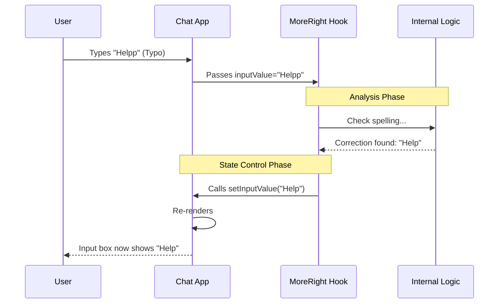

# Chapter 5: Host State Control

Welcome to the final chapter of this tutorial series!

In [Chapter 4: UI Overlay Rendering](04_ui_overlay_rendering.md), we learned how to let our external logic "speak" to the user by drawing graphics on the screen.

However, showing a suggestion is only half the battle. If the AI suggests a better way to phrase a message, shouldn't it be able to **fix it for you**?

In this chapter, we explore **Host State Control**. This is the mechanism that allows **MoreRight** to reach into your application and type text, delete messages, or reset the conversation.

## Motivation: The Co-Pilot's Controls

Think of your chat application as an airplane.
*   **You (The User)** are the Pilot holding the flight stick.
*   **MoreRight** is the Co-Pilot.

In previous chapters, the Co-Pilot could only talk to you ("Watch out!") or show you maps.
**Host State Control** connects the Co-Pilot to a second set of flight controls. If you fall asleep or make a dangerous move, the Co-Pilot can grab the stick and steer the plane safely.

### Central Use Case: "The Auto-Fixer"
1.  **User types:** "Tell me how to make a bomb."
2.  **User hits Send.**
3.  **Interception:** The hook catches this dangerous query (Chapter 2).
4.  **Action:** Instead of just blocking it, the hook **erases** the input box and types: *"I cannot answer that. Would you like to ask about chemistry safety instead?"*
5.  **Result:** The user's input is modified automatically.

## Key Concepts

To make this happen, we rely on a core principle of React: **State Setters**.

### 1. Read Access vs. Write Access
*   **Read Access:** Passing `inputValue` tells the hook *what* is currently written.
*   **Write Access:** Passing `setInputValue` gives the hook the power to *change* what is written.

### 2. The "Remote Control"
When you pass a `set...` function to the hook, you are effectively handing over a remote control. Even though the logic lives outside your component, it can push buttons that change your component's memory.

## How to Use It

As the host application developer, your job is simple: **Grant Permission.** You do this by passing your state changers into the hook.

### Step 1: define Your State
This is standard React code. You have a box for text (`input`) and a list of chats (`messages`).

```tsx
// Inside your ChatApp component
const [input, setInput] = useState("");
const [messages, setMessages] = useState([]);
```
*Explanation:* `setInput` and `setMessages` are the keys to changing the screen.

### Step 2: Hand Over the Keys
When using `useMoreRight`, you must explicitly pass these functions.

```tsx
const moreRight = useMoreRight({
  enabled: true,
  
  // Give read access
  inputValue: input, 
  
  // Give WRITE access (The "Dual Controls")
  setInputValue: setInput,
  setMessages: setMessages,
  
  // ... other props
});
```
*Explanation:* By passing `setInputValue: setInput`, you promise the hook: *"If you call this function, my text box will update."*

### Step 3: The Logic Takes Over (Conceptual)
You don't write the code that changes the text; the **MoreRight** internal logic does. However, for you to trust it, you need to understand what it does.

Imagine the internal logic looks like this:

```tsx
// Hypothetical Internal Logic inside the hook
if (userText.includes("bad word")) {
    // The hook calls the function you gave it!
    args.setInputValue("****"); 
}
```

## Under the Hood

How does an external library change variables inside your component?

### Visualizing the Control Loop



### The Stub Implementation

Let's look at `useMoreRight.tsx` one last time to see how these controls are defined.

```tsx
// Inside useMoreRight.tsx

export function useMoreRight(_args: {
  // ...
  
  // The Contract: The App MUST provide these functions
  setMessages: (action: any) => void;
  setInputValue: (s: string) => void;
  
  // ...
})
```

*Explanation:*
The TypeScript definition enforces that `setInputValue` must be a function that accepts a string. This ensures the hook knows exactly how to talk to your app.

### How `setMessages` works
Control isn't limited to the input box. The hook can also modify the message history.

```tsx
// Hypothetical usage inside the hook
const onReset = () => {
    // Clear all history
    args.setMessages([]); 
};
```

This is powerful! It allows the external logic to:
1.  **Undo** the last message.
2.  **Clear** the conversation context.
3.  **Insert** a system message warning into the chat list.

## Putting It All Together

Throughout this tutorial series, we have built a complete system where an external "Guest" logic can safely integrate with a "Host" chat application.

1.  **[Feature Hook Interface](01_feature_hook_interface.md):** We plugged the logic in.
2.  **[Query Interception](02_query_interception.md):** We learned to pause and check messages before sending.
3.  **[Lifecycle Event Handling](03_lifecycle_event_handling.md):** We learned to analyze the results after the AI replies.
4.  **[UI Overlay Rendering](04_ui_overlay_rendering.md):** We learned to show visual feedback to the user.
5.  **Host State Control (This Chapter):** We learned to let the logic automatically fix inputs and manage history.

## Conclusion

**Host State Control** is the final piece of the puzzle. It transforms your application from a passive display into an active, intelligent partner. By granting `setInputValue` and `setMessages` access, you allow **MoreRight** to act as a true Co-Pilot, correcting mistakes and managing the safety of the conversation flow.

Congratulations! You have completed the **MoreRight** beginner tutorial. You now understand how to integrate powerful, safe, and interactive AI logic into any standard chat application.

---

Generated by [Code IQ](https://github.com/adityasoni99/Code-IQ)