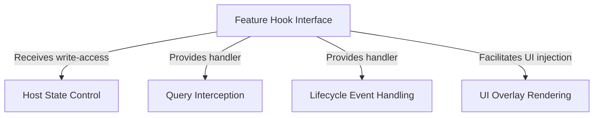

# Tutorial: moreright

This project functions as a **smart extension system** for a chat application, acting like an advanced "co-pilot" cartridge plugged into a console. It uses a central **hook** to bridge the external logic with the main app, allowing it to *intercept* user messages before they are sent, perform tasks after the AI responds, and inject custom **visual tools** directly onto the user's screen. It also maintains direct access to the chat's memory, enabling it to modify messages and input automatically.

## Chapters

1. [Feature Hook Interface](01_feature_hook_interface.md)
2. [Query Interception](02_query_interception.md)
3. [Lifecycle Event Handling](03_lifecycle_event_handling.md)
4. [UI Overlay Rendering](04_ui_overlay_rendering.md)
5. [Host State Control](05_host_state_control.md)

---

Generated by [Code IQ](https://github.com/adityasoni99/Code-IQ)