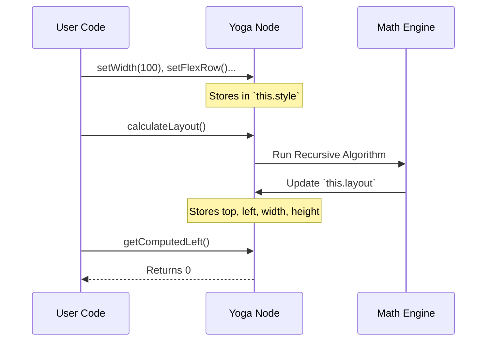

# Chapter 1: Yoga Node (The Layout Block)

Welcome to the **`native-ts`** project! If you've ever struggled to position UI elements using hard-coded coordinates (like `x: 50, y: 100`), you know how painful it is when screen sizes change.

This project is a port of **Yoga Layout**, the engine that powers Flexbox in React Native. It solves the positioning problem for us.

In this first chapter, we will explore the **Yoga Node**.

## What is a Yoga Node?

Think of a **Node** as an "Invisible Box."

It doesn't have a color, a border, or text. It doesn't draw anything to the screen. Instead, it acts like a calculator.
1. **You give it rules:** "I want to be 100px wide" or "I want my children aligned in a row."
2. **It gives you numbers:** "Okay, based on that, your X position is 0 and your Y position is 10."

This separation is powerful. The `Node` handles the **math**, so your rendering engine (whether it's Ink for terminals, or a canvas renderer) only needs to draw based on the final numbers.

### The Use Case: A Simple Button

Imagine we want to build a button with an icon and text, centered horizontally.

```text
+-----------------------+
|  [Icon]  "Click Me"   |
+-----------------------+
```

Calculating the exact `x` and `y` for the text relative to the icon manually is tedious. We will use `Node` to do it for us.

## 1. Creating the Scaffolding

Everything starts with the `Node` class. In our system, a UI is just a tree of these nodes.

First, we create a container (the button background) and two children (icon and text).

```typescript
import { Node } from './yoga-layout';

// 1. Create the parent (The Button Container)
const button = new Node();

// 2. Create the children
const icon = new Node();
const text = new Node();

// 3. Build the tree
button.insertChild(icon, 0);
button.insertChild(text, 1);
```

At this point, the nodes exist, but they have no size. They are essentially $0 \times 0$ points at coordinates $(0,0)$.

## 2. Input: Setting the Style

Each `Node` has a **Style**. This is the *Input*. These are properties you might recognize from CSS, like `width`, `flexDirection`, and `padding`.

Let's style our button to be a row (horizontal) and tell the children how big they should be.

```typescript
import { FlexDirection, Align, Justify } from './yoga-layout';

// Set up the container (Row, centered content)
button.setFlexDirection(FlexDirection.Row);
button.setJustifyContent(Justify.Center);
button.setAlignItems(Align.Center);
button.setWidth(200);
button.setHeight(50);
```

Now let's style the children. We'll give them fixed sizes for this example.

```typescript
// The Icon is a 20x20 box
icon.setWidth(20);
icon.setHeight(20);

// The Text is 100px wide
text.setWidth(100);
text.setHeight(20);
```

**Key Concept:** We haven't calculated anything yet. We are simply filling out a form inside the `Node` telling it what we *want*.

## 3. The Magic: Calculate Layout

Once the tree is built and styles are set, we trigger the calculation. This is where the engine runs the math.

```typescript
// Calculate everything starting from the root (button)
// We pass 'undefined' to let the node use the width/height we set above
button.calculateLayout(undefined, undefined);
```

When this function runs, it triggers the [Recursive Layout Algorithm](02_recursive_layout_algorithm.md), which visits every node in the tree to figure out its final size and position.

## 4. Output: Reading the Layout

Each `Node` has a **Layout**. This is the *Output*.

After `calculateLayout` finishes, the `Node` has populated its internal layout variables. We can now read them to draw our UI.

```typescript
// Get the final calculated numbers
const iconX = icon.getComputedLeft();
const iconY = icon.getComputedTop();

console.log(`Icon Position: x=${iconX}, y=${iconY}`);
// Output might be: Icon Position: x=40, y=15
// (Centered within the 200x50 button!)
```

The engine did the centering math for us!

## Under the Hood: Inside `Node`

What does the `Node` class actually look like internally? It is designed to be a lightweight container for two distinct data structures: **Style** (what you want) and **Layout** (what you get).

Here is the high-level flow:



### The Implementation Details

If we look into `yoga-layout/index.ts`, we see that the `Node` class maintains these two states explicitly.

```typescript
// yoga-layout/index.ts

export class Node {
  // Input: CSS rules provided by the user
  style: Style 

  // Output: Calculated geometry
  layout: Layout 

  // Tree management
  children: Node[] = []
  
  // ... constructor ...
}
```

### The Style Bucket

The `Style` type is just a plain object holding specific CSS values. When you call `setWidth(100)`, you are just updating a value in this object and marking the node as "Dirty" (needing an update).

```typescript
// yoga-layout/index.ts

type Style = {
  flexDirection: FlexDirection
  width: Value
  height: Value
  // ... margin, padding, etc.
}
```

### The Layout Bucket

The `Layout` type holds the results. These are the physical numbers used for drawing.

```typescript
// yoga-layout/index.ts

type Layout = {
  left: number   // x position relative to parent
  top: number    // y position relative to parent
  width: number  // physical width
  height: number // physical height
  // ...
}
```

Because calculation can be expensive, the `Node` uses a smart dirty-checking mechanism. If you change a style, `isDirty_` becomes true. If you try to calculate layout on a clean node, it skips the work. We will cover this in detail in the [Layout Caching System](03_layout_caching_system.md).

## Summary

The **Yoga Node** is the building block of our layout engine.
1. It acts as a **Virtual DOM element**.
2. It separates **Style (Input)** from **Layout (Output)**.
3. It organizes constraints in a **Tree Structure**.

In the next chapter, we will look at exactly *how* `calculateLayout` traverses this tree and converts your flex rules into concrete numbers.

[Next Chapter: Recursive Layout Algorithm](02_recursive_layout_algorithm.md)

---

Generated by [Code IQ](https://github.com/adityasoni99/Code-IQ)