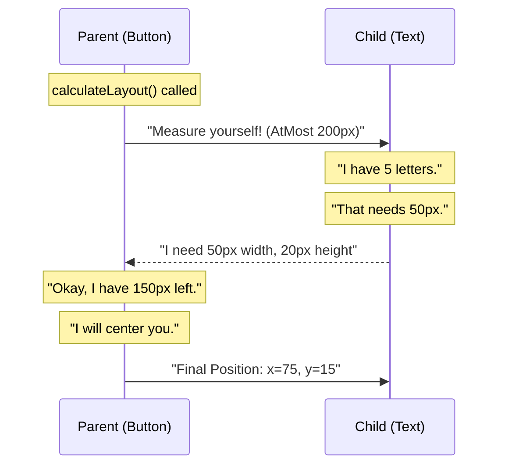

# Chapter 2: Recursive Layout Algorithm

In the previous chapter, [Yoga Node (The Layout Block)](01_yoga_node__the_layout_block_.md), we learned how to build a tree of nodes and give them style rules. But a tree of rules is just a wish list. To draw pixels on the screen, we need **concrete numbers**.

This chapter explores the **Recursive Layout Algorithm**. This is the engine that runs when you call `.calculateLayout()`. It turns your "wishes" (styles) into reality (coordinates).

## The Core Problem: The Negotiation

Layout is difficult because it is a negotiation.

Imagine a parent box that is `200px` wide. It has two children:
1.  **Child A:** Wants to be `100px` wide.
2.  **Child B:** Wants to `flex-grow` (take up remaining space).

The parent cannot calculate Child B's width until it knows Child A's width. And Child A cannot know its final position until the Parent knows its own size.

To solve this, the engine uses **Recursion**.

## Concept 1: The "Measure Mode"

Before we look at the algorithm, we must understand the vocabulary parents use to talk to children. When a parent node asks a child node to measure itself, it uses a **Measure Mode**.

Think of a parent pouring water into a container (the child):

1.  **Exactly (`MeasureMode.Exactly`)**
    *   **The Rule:** "You must be exactly this size."
    *   **Use Case:** You set `width: 100`. The engine tells the node: "You are 100. Deal with it."
    
2.  **At Most (`MeasureMode.AtMost`)**
    *   **The Rule:** "You can be any size from 0 up to this limit."
    *   **Use Case:** A text block inside a `200px` wide column. The text can be narrow, but it cannot exceed 200px.

3.  **Undefined (`MeasureMode.Undefined`)**
    *   **The Rule:** "Be whatever size you want. Sky is the limit."
    *   **Use Case:** A ScrollView. The content inside can be as tall as it needs to be; the parent will scroll to show it.

## The Recursive Flow

When you trigger `calculateLayout`, a wave of calculations travels down the tree (input) and bubbles back up (output).

Here is the conversation that happens for a simple Button with Text:



## Internal Implementation

The heart of `native-ts` is a single, massive function called `layoutNode`. It is located in `yoga-layout/index.ts`.

It handles the complexity of Flexbox in **one giant pass** (mostly).

### Step 1: Input Setup

The function signature tells the whole story. It takes a `node` and the constraints from the parent.

```typescript
// yoga-layout/index.ts

function layoutNode(
  node: Node,
  availableWidth: number,    // How much space parent has
  availableHeight: number,
  widthMode: MeasureMode,    // The "Vocabulary" (Exactly, AtMost...)
  heightMode: MeasureMode,
  // ... other context
): void {
  // ...
}
```

### Step 2: Determine Main vs. Cross Axis

Flexbox is directional. If `flexDirection` is `Row`:
*   **Main Axis:** Horizontal (Width/X)
*   **Cross Axis:** Vertical (Height/Y)

The algorithm calculates the **Main Axis** first because that determines how much space is left over.

```typescript
// Inside layoutNode...

// 1. Determine direction
const mainAxis = node.style.flexDirection;
const isRow = mainAxis === FlexDirection.Row;

// 2. Determine available size for main axis
const mainSize = isRow ? availableWidth : availableHeight;
```

### Step 3: Loop 1 - Collect Preferences

The engine loops through all children to ask: *"What is your Flex Basis?"* (How big do you start?).

```typescript
// Simplified logic from the engine
let totalFlexBasis = 0;

for (const child of node.children) {
  // Recursively ask child how big it wants to be
  child.resolveFlexBasis(availableWidth, ...);
  
  // Add it to the total tally
  totalFlexBasis += child.getFlexBasis();
}
```

### Step 4: Resolve Flexible Lengths

This is the magic of Flexbox. If `totalFlexBasis` is *less* than the parent's size, we have empty space. The engine checks `flexGrow` to see who gets that space.

```typescript
const remainingSpace = availableWidth - totalFlexBasis;

if (remainingSpace > 0) {
  // Distribute extra space to children with flexGrow > 0
  distributeFreeSpace(children, remainingSpace);
}
```

### Step 5: Determine Cross Axis Size

Once the Main Axis (Width) is locked in, the engine looks at the Cross Axis (Height).

If a child is set to `alignSelf: 'stretch'`, this is where the parent forces the child to expand to match the parent's height.

```typescript
for (const child of node.children) {
  if (child.style.alignSelf === Align.Stretch) {
    // Force child height to match parent height
    child.layout.height = node.layout.height;
  }
}
```

### Step 6: Final Positioning

Finally, now that every child has a concrete Width and Height, the engine acts like a coordinate calculator.

It applies `justifyContent` (Main Axis alignment) and `alignItems` (Cross Axis alignment) to set `node.layout.left` and `node.layout.top`.

```typescript
// Example: justifyContent = 'center'
let currentX = (availableWidth - totalContentWidth) / 2;

for (const child of node.children) {
  child.layout.left = currentX;
  currentX += child.layout.width; // Move cursor for next child
}
```

## How to Use It

You don't call `layoutNode` manually. You call `calculateLayout` on the root, and the recursion handles the rest.

### The Use Case: Responsive Layout

Imagine a box that needs to adapt.

```typescript
const root = new Node();
root.setWidth(500); // Parent is 500px wide
root.setFlexDirection(FlexDirection.Row);

const childA = new Node();
childA.setFlexGrow(1); // "I want all the space I can get"

const childB = new Node();
childB.setWidth(100); // "I want exactly 100px"

root.insertChild(childA, 0);
root.insertChild(childB, 1);

// TRIGGER THE ALGORITHM
root.calculateLayout(500, 300); 
```

**What happens recursively?**
1.  **Child B** claims 100px (Fixed).
2.  **Root** sees 400px remaining (500 - 100).
3.  **Child A** has `flexGrow: 1`. It gets all 400px.
4.  **Result:** Child A width = 400, Child B width = 100.

## Summary

The **Recursive Layout Algorithm** is the brain of the project.
1.  It uses **Measure Modes** to negotiate constraints.
2.  It calculates the **Main Axis** (widths/flexing) first.
3.  It calculates the **Cross Axis** (heights/stretching) second.
4.  It finalizes **X/Y coordinates**.

However, doing this math for every single pixel change is slow. In the next chapter, we will learn how the engine remembers its homework so it doesn't have to recalculate everything every time.

[Next Chapter: Layout Caching System](03_layout_caching_system.md)

---

Generated by [Code IQ](https://github.com/adityasoni99/Code-IQ)