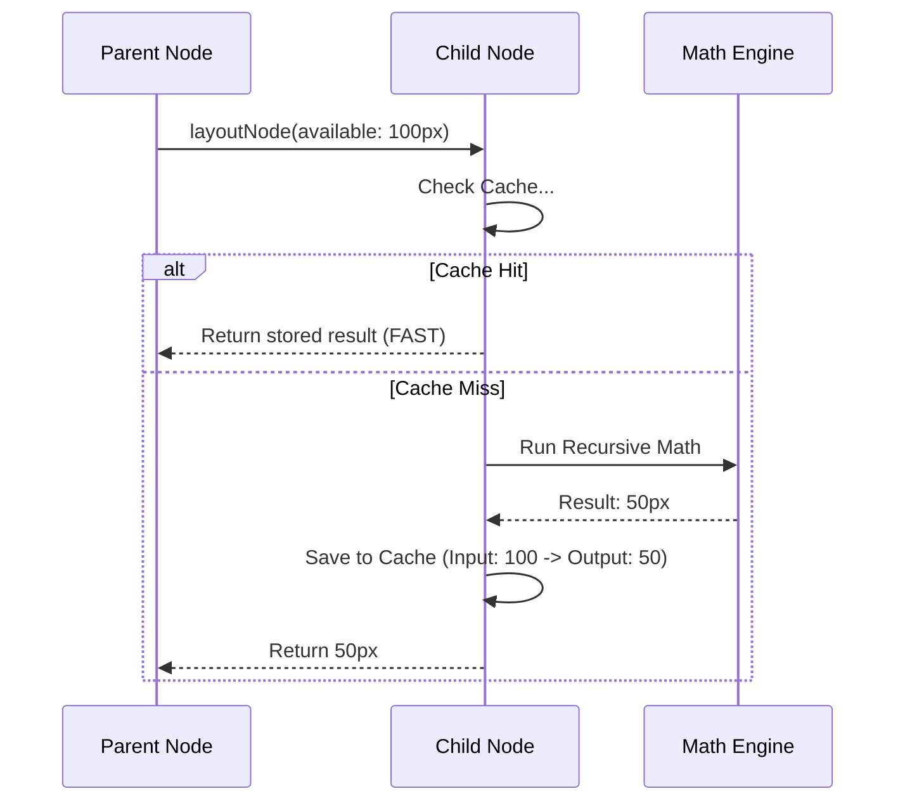

# Chapter 3: Layout Caching System

In the previous chapter, [Recursive Layout Algorithm](02_recursive_layout_algorithm.md), we saw how the engine visits every single node, negotiates sizes, and calculates coordinates.

That sounds great for a static page, but what if you have an animation running at 60 frames per second? Or a scrollable list with 1,000 items?

If we re-run the entire math equation for every pixel shift, the CPU will choke.

This chapter introduces the **Layout Caching System**. It is the memory that allows `native-ts` to say: *"I already calculated this part, so I'm going to skip the math and just give you the answer."*

## The Motivation: The Forgetful Waiter

Imagine a waiter in a restaurant.
1.  **Customer A** asks: "What is the soup of the day?"
2.  **Waiter** walks to the kitchen, asks the chef, writes it down, walks back, and says: "Tomato Bisque."

Now, **Customer B** asks the same question.
*   **Without Caching:** The waiter walks to the kitchen *again*, asks the chef *again*, and walks back.
*   **With Caching:** The waiter remembers "Tomato Bisque" and answers immediately.

In layout terms:
*   **The Kitchen** is the expensive `layoutNode` function.
*   **The Question** is the "Available Space" provided by the parent.
*   **The Answer** is the computed `width` and `height`.

## Concept 1: The Dirty Flag (`isDirty`)

The most basic optimization is the **Dirty Flag**.

When you create a node or update its style, it is marked as **Dirty**. This means "I have changed, my previous calculations are invalid."

### Marking it Dirty
When you change a style property, the setter automatically sets this flag.

```typescript
// yoga-layout/index.ts

setWidth(v: number): void {
  this.style.width = pointValue(v);
  
  // Mark myself as needing a recalculation
  this.markDirty(); 
}
```

### Checking the Flag
When the layout engine visits a node, the first thing it checks is: *Is this node dirty?*

If `isDirty` is **false**, and the context hasn't changed, the engine **skips the entire recursion** for that branch. It trusts the existing numbers in `node.layout`.

## Concept 2: The Multi-Entry Cache

Sometimes, a node is NOT dirty, but we still can't just return the current width/height.

Why? Because Flexbox is a negotiation. A parent might ask a child to measure itself multiple times in a single pass:
1.  **First:** "How tall are you if I give you 500px width?" (Draft measurement).
2.  **Second:** "Okay, actually I only have 400px. How tall are you now?" (Final measurement).

To handle this, `native-ts` uses a sophisticated cache that stores **Inputs** and **Outputs**.

### The Inputs (`_cIn`)
The cache remembers the exact conditions under which the calculation happened:
*   Available Width / Height
*   Measure Mode (Exactly, At Most, Undefined)

### The Outputs (`_cOut`)
The cache remembers the result:
*   Computed Width
*   Computed Height

## Visualization: The Cache Flow

Here is what happens when a Parent asks a Child to layout.



## Internal Implementation

Let's look under the hood in `yoga-layout/index.ts`. The implementation uses raw typed arrays (`Float64Array`) for speed, but the logic is straightforward.

### 1. The Cache Check
At the very top of the `layoutNode` function, before doing any work, we try to exit early.

```typescript
// yoga-layout/index.ts - Inside layoutNode()

// Check if we have seen these EXACT inputs before
if (node._cN > 0 && !node.isDirty_) {
  
  // Loop through cache slots (native-ts stores up to 4 past results)
  for (let i = 0; i < node._cN; i++) {
    
    // helper function checks if cached inputs == current inputs
    if (cacheMatches(node, i, availableWidth, widthMode...)) {
       
       // CACHE HIT! Restore the result and stop.
       node.layout.width = node._cOut[i * 2];
       node.layout.height = node._cOut[i * 2 + 1];
       return; 
    }
  }
}
```

### 2. Writing to Cache
If we miss the cache, we proceed with the [Recursive Layout Algorithm](02_recursive_layout_algorithm.md). Once finished, we save the result so the *next* time we are asked, we can skip the work.

```typescript
// yoga-layout/index.ts

// After layout is finished...
cacheWrite(
  node,
  availableWidth, availableHeight, // The Question (Inputs)
  widthMode, heightMode,
  // ... other context
);
```

The `cacheWrite` function pushes these values into `_cIn` (Inputs) and `_cOut` (Outputs).

## The Generation ID (`_generation`)

There is one final safety mechanism: **The Generation ID**.

When you call `.calculateLayout()` on the root, the engine increments a global counter called `_generation`.

```typescript
// Global counter for the entire system
let _generation = 0;

node.calculateLayout() {
  _generation++; 
  // ... start recursion
}
```

When a node writes to its cache, it stamps the entry with the current `_generation`.

**Why is this needed?**
If you scroll a list, new items appear. The cache from the *previous* frame might be invalid because the tree structure itself changed. The generation ID ensures that we only use cache entries that are relevant to the **current** calculation pass.

## Example Scenario

Let's verify this behavior with a mental walkthrough.

**Setup:**
1.  We have a `Text` node inside a `Box`.
2.  The `Text` takes 5ms to measure (slow!).

**Frame 1:**
1.  `calculateLayout` starts. Generation = 1.
2.  `Box` asks `Text` to measure.
3.  `Text` is dirty. Cache empty.
4.  **Math runs (5ms).**
5.  `Text` saves result to cache (Gen 1).

**Frame 2 (We resize the `Box` slightly, but `Text` is unchanged):**
1.  `calculateLayout` starts. Generation = 2.
2.  `Box` asks `Text` to measure.
3.  `Text` is NOT dirty.
4.  `Text` checks cache. It sees an entry for the same available width.
5.  **Cache HIT! (0ms).** Returns result immediately.

This caching system is what allows `native-ts` (and React Native) to perform complex layouts efficiently in real-time.

## Summary

The **Layout Caching System** prevents unnecessary work.
1.  **Dirty Flags** tell the engine what *needs* updating.
2.  **Input/Output Caching** remembers answers to complex layout questions.
3.  **Generation IDs** keep the cache fresh across frames.

Now that we understand how the layout engine positions boxes efficiently, we need to switch gears. In a text editor or file explorer, we don't just layout boxes; we need to find files quickly.

In the next chapter, we will explore the search engine behind the project.

[Next Chapter: Fuzzy File Index](04_fuzzy_file_index.md)

---

Generated by [Code IQ](https://github.com/adityasoni99/Code-IQ)