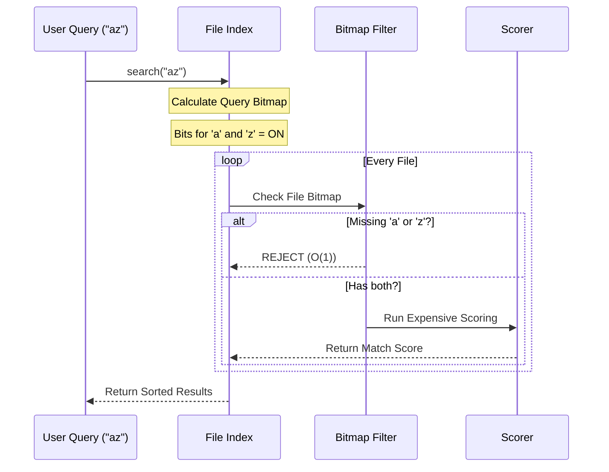

# Chapter 4: Fuzzy File Index

In the previous chapter, [Layout Caching System](03_layout_caching_system.md), we optimized how our engine calculates where to draw boxes. We now have a performant UI renderer.

But a file explorer or code editor isn't just about drawing boxes; it's about **finding things**.

If you have used tools like VS Code, you know the "Ctrl+P" (Go to File) feature. You type `utf`, and it instantly finds `utils/file_handler.ts`. It doesn't need an exact match; it matches "fuzzily."

This chapter introduces the **Fuzzy File Index**.

## The Problem: The Needle in a Haystack

Imagine your project has **50,000 files**.
You type `app`.

If we iterate through all 50,000 strings and check every character position for `a`, then `p`, then `p`, the interface will lag. This operation is expensive ($O(N \times M)$).

We need a way to **instantly reject** files that definitely don't match, so we only run expensive math on the few that might.

## Concept 1: The Bitmap (The Sieve)

How do we reject files quickly? We use a **Bitmap**.

A computer integer has 32 bits (0s and 1s). The English alphabet has 26 letters. This is a happy coincidence! We can use a single integer to represent *which* letters exist in a filename.

*   **Bit 0** = Does it have 'a'?
*   **Bit 1** = Does it have 'b'?
*   ...
*   **Bit 25** = Does it have 'z'?

### The Analogy

Imagine a security guard at a club.
*   **The Rule:** "You can only enter if you are wearing a Hat AND a Tie."
*   **Person A:** Wearing a Hat. (Missing Tie). **REJECTED.**
*   **Person B:** Wearing Hat and Tie. **ALLOWED.**

The guard doesn't need to know the person's name or life story. One glance at their "attributes" (Hat/Tie) is enough to say "No."

In our code:
1.  **Query Bitmap:** You type "az". We need a file containing 'a' AND 'z'.
2.  **File Bitmap:** We look at a file named "cat". It has 'c', 'a', 't'. It does *not* have 'z'.
3.  **Result:** We reject "cat" instantly using one math operation.

## Concept 2: Async Chunking

Loading 50,000 files takes time. If we do it all at once, the app will freeze for 2 seconds. This is bad UX.

The `FileIndex` splits the work into small "chunks."
1.  Process 1,000 files.
2.  **Stop.** Let the UI draw a frame or handle a mouse click.
3.  Resume processing.

## Use Case: Building the Index

Let's see how to use the `FileIndex` class.

### 1. Creating and Loading

We feed the index a raw list of file paths (e.g., from a `git ls-files` command).

```typescript
import { FileIndex } from './file-index';

const index = new FileIndex();
const files = ['src/app.ts', 'src/utils.ts', 'readme.md'];

// Load files (Synchronous version for small lists)
index.loadFromFileList(files);
```

### 2. Searching

Now we search. Notice how `ut` matches `utils.ts` (exact) but also `computer.ts` (fuzzy).

```typescript
// Search for "ut"
// Limit results to top 10
const results = index.search('ut', 10);

console.log(results);
// Output:
// [
//   { path: "src/utils.ts", score: 0.05 },
//   { path: "computer.ts",  score: 0.25 }
// ]
```

## Under the Hood: The Internal Flow

When you search, the engine doesn't look at strings immediately. It looks at **numbers** (bitmaps).



### Implementation Details

Let's look at `file-index/index.ts`.

#### Step 1: Ingestion (Creating the Bitmap)

When we ingest a file, we lowercase it and turn its characters into a standard integer (`bits`).

```typescript
// file-index/index.ts

private indexPath(i: number): void {
  const lp = this.paths[i]!.toLowerCase();
  
  // Create the bitmap
  let bits = 0;
  for (let j = 0; j < lp.length; j++) {
    const c = lp.charCodeAt(j);
    // If char is a-z (ASCII 97-122)
    if (c >= 97 && c <= 122) {
      // Flip the specific bit for this letter
      bits |= 1 << (c - 97);
    }
  }
  this.charBits[i] = bits; // Store it!
}
```

*   `1 << (c - 97)`: This shifts the number `1` to the left. If the letter is 'a' (0), it stays at bit 0. If 'b' (1), it moves to bit 1.
*   `|=`: This combines the new bit with the existing bits.

#### Step 2: The Fast Rejection

Inside the `search` function, we do the "Security Guard" check before anything else.

```typescript
// file-index/index.ts

// 1. Create bitmap for the USER'S query
// ... (logic similar to indexPath) ...

// 2. Loop through files
for (let i = 0; i < readyCount; i++) {
  
  // THE CHECK:
  // Does the file have ALL the bits the query needs?
  if ((charBits[i]! & needleBitmap) !== needleBitmap) {
    continue; // SKIP! Instant rejection.
  }

  // If we survive, do the expensive string matching...
}
```

The `&` operator compares the two numbers. If the result doesn't match the query's requirements, we `continue` (skip) immediately.

#### Step 3: Async Chunking

To prevent freezing, the `buildAsync` method checks the clock.

```typescript
// file-index/index.ts

// Check time every 256 iterations
if ((i & 0xff) === 0xff && performance.now() - chunkStart > CHUNK_MS) {
  
  // If we've worked for more than 4ms, take a break
  await yieldToEventLoop();
  
  // Restart the clock
  chunkStart = performance.now();
}
```

`CHUNK_MS` is set to 4ms. This ensures the loop runs very fast but yields control back to the system constantly, keeping the UI smooth.

## Summary

The **Fuzzy File Index** is the database of our search engine.
1.  It pre-computes **Bitmaps** to know which files contain which letters.
2.  It uses these bitmaps to **Instantly Reject** non-matches ($O(1)$).
3.  It loads files in **Chunks** to keep the UI responsive.

We now have a fast list of potential matches. But if I type `file`, and I have `file_manager.ts` and `profile.ts`, both "survive" the bitmap check. Which one is better?

To answer that, we need to calculate a **Score**.

[Next Chapter: Match Scoring Logic](05_match_scoring_logic.md)

---

Generated by [Code IQ](https://github.com/adityasoni99/Code-IQ)