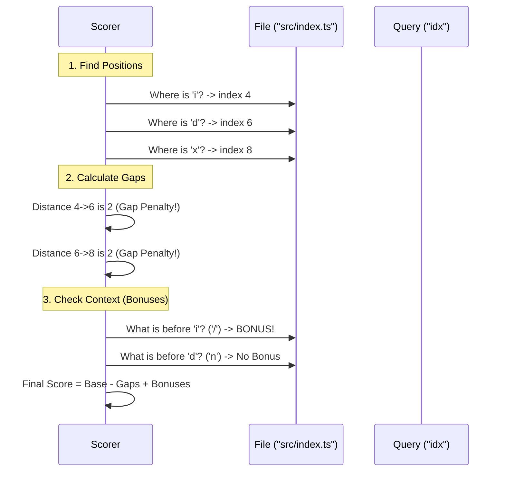

# Chapter 5: Match Scoring Logic

In the previous chapter, [Fuzzy File Index](04_fuzzy_file_index.md), we built a high-speed filter. We learned how to use Bitmaps to instantly reject files that don't contain the letters we are looking for.

But rejection is only half the battle.

If you have a project with 1,000 files, and you type `idx`, you might get 50 results that technically contain those letters.
1.  `src/index.ts` (This is probably what you want).
2.  `node_modules/uuid/example.ts` (This also has `i`, `d`, `x`, but it's noise).

How does the computer know that result #1 is "better" than result #2?

This chapter introduces **Match Scoring Logic**. We will turn file searching into a point-based video game.

## The Motivation: Human Intuition

Humans search with patterns. When we type `idx`, we usually mean:
*   **Initials:** The start of words (e.g., **ind**ex).
*   **CamelCase:** The capital letters (e.g., **I**mage**D**ecoder**X**).
*   **Continuity:** Letters that are next to each other.

We rarely mean "find an `i` at the start, a `d` in the middle, and an `x` at the very end."

The Scoring Logic assigns a numerical value to these human habits so the computer can rank the results effectively.

## Concept 1: The Point System

To determine the best match, we calculate a **Score** for every file that survives the Bitmap filter.

Think of it like a game show where the file wants to get the highest score possible.

### The Bonuses (Good Things)
We award points when characters match in "special" places:
1.  **Word Boundary:** Matching a letter right after a separator (`/`, `_`, `-`, or `.`).
    *   *Example:* Searching `u` in `src/utils.ts`. (The `u` is after `/`).
2.  **CamelCase:** Matching a Capital letter that follows a lowercase letter.
    *   *Example:* Searching `u` in `checkUser`. (The `U` is a hump).
3.  **Consecutive:** Matching letters that are side-by-side without gaps.
    *   *Example:* Searching `app` in `application.ts`.

### The Penalties (Bad Things)
We subtract points (or award fewer points) when there is a **Gap**.
*   *Example:* Searching `idx` in `ids_and_extra.ts`.
*   The distance between `i`, `d`, and `x` is large. This is a "weak" match.

## Internal Implementation: The Flow

Before looking at code, let's visualize the scoring process for a single file.



## Code Deep Dive

The logic is contained within `file-index/index.ts`. It uses a few constants to define the "rules of the game."

### 1. The Rules (Constants)

These numbers define how much we value different types of matches.

```typescript
// file-index/index.ts

const SCORE_MATCH = 16          // Base points for finding a letter
const BONUS_BOUNDARY = 8        // Points for being after /, _, -
const BONUS_CAMEL = 6           // Points for CamelCase
const BONUS_CONSECUTIVE = 4     // Points for being next to previous match
const PENALTY_GAP_START = 3     // Penalty for opening a gap
```

### 2. Calculating the Score

The scoring loop iterates through your search query (the `needle`) and looks at where it lands in the file path (the `haystack`).

First, we calculate **Gap Penalties** and **Consecutive Bonuses**.

```typescript
// Simplified logic from file-index/index.ts

let gapPenalty = 0;
let consecBonus = 0;
let prev = posBuf[0]; // Position of first letter

// Loop through the rest of the query letters
for (let j = 1; j < nLen; j++) {
  const current = posBuf[j];
  const gap = current - prev - 1;

  if (gap === 0) {
    // Letters are side-by-side!
    consecBonus += BONUS_CONSECUTIVE;
  } else {
    // Letters are far apart.
    gapPenalty += PENALTY_GAP_START + gap * PENALTY_GAP_EXTENSION;
  }
  prev = current;
}
```

*Explanation:* If `gap` is 0, we add to the bonus. If `gap` is big, `gapPenalty` grows larger.

### 3. Contextual Bonuses

Next, we look at the specific character positions to see if they deserve "Special" bonuses (Boundary or CamelCase).

We use a helper function `scoreBonusAt`.

```typescript
// file-index/index.ts

function scoreBonusAt(path: string, pos: number): number {
  const prevCh = path.charCodeAt(pos - 1);
  
  // Is the previous character a separator? (e.g. / or _)
  if (isBoundary(prevCh)) return BONUS_BOUNDARY;
  
  // Is it a CamelCase hump? (lower -> Upper)
  if (isLower(prevCh) && isUpper(path.charCodeAt(pos))) return BONUS_CAMEL;
  
  return 0;
}
```

### 4. The Final Tally

Finally, we combine everything into a raw score.

```typescript
// file-index/index.ts

// Start with base score
let score = nLen * SCORE_MATCH;

// Add consecutive bonuses
score += consecBonus;

// Subtract gap penalties
score -= gapPenalty;

// Add specific context bonuses (Boundary/Camel)
for (let j = 0; j < nLen; j++) {
  score += scoreBonusAt(path, posBuf[j], ...);
}
```

## Use Case: Comparing Two Files

Let's trace how the engine decides between two files for the query `ui`.

**File A: `src/ui.ts`**
1.  Match `u`: Found at index 4. Previous char is `/`. **Boundary Bonus (+8)**.
2.  Match `i`: Found at index 5. Gap is 0. **Consecutive Bonus (+4)**.
3.  **Result:** Massive Score.

**File B: `public/index.ts`**
1.  Match `u`: Found at index 1 (`p`**`u`**`blic`). Previous char is `p`. **No Bonus**.
2.  Match `i`: Found at index 7 (`publ`**`i`**`c`). Gap is 5. **Gap Penalty (-8)**.
3.  **Result:** Low Score.

Because File A has a higher raw score, it appears at the top of the list.

## Sorting the Results

After scoring the files, the engine keeps a list of the "Top K" (e.g., Top 10) results.

It sorts them so the highest scores are first.

```typescript
// file-index/index.ts

// Sort descending (Highest score first)
topK.sort((a, b) => b.fuzzScore - a.fuzzScore);
```

*Note: In the final output of `file-index`, the system normalizes these scores to be between 0.0 and 1.0, where smaller is better (rank-based), but the internal logic uses the point-based system described above.*

## Summary

The **Match Scoring Logic** is what makes the search feel "smart."
1.  It rewards **Human Habits** (using initials, camelCase).
2.  It penalizes **Random Matches** (gaps).
3.  It ensures the most relevant files bubble to the top.

Now that we have:
1.  Calculated Layouts (Chapters 1-3)
2.  Found the correct file (Chapters 4-5)

We are ready to display the content of those files. In the next chapter, we will look at how to efficiently render text differences.

[Next Chapter: Diff Renderer](06_diff_renderer.md)

---

Generated by [Code IQ](https://github.com/adityasoni99/Code-IQ)