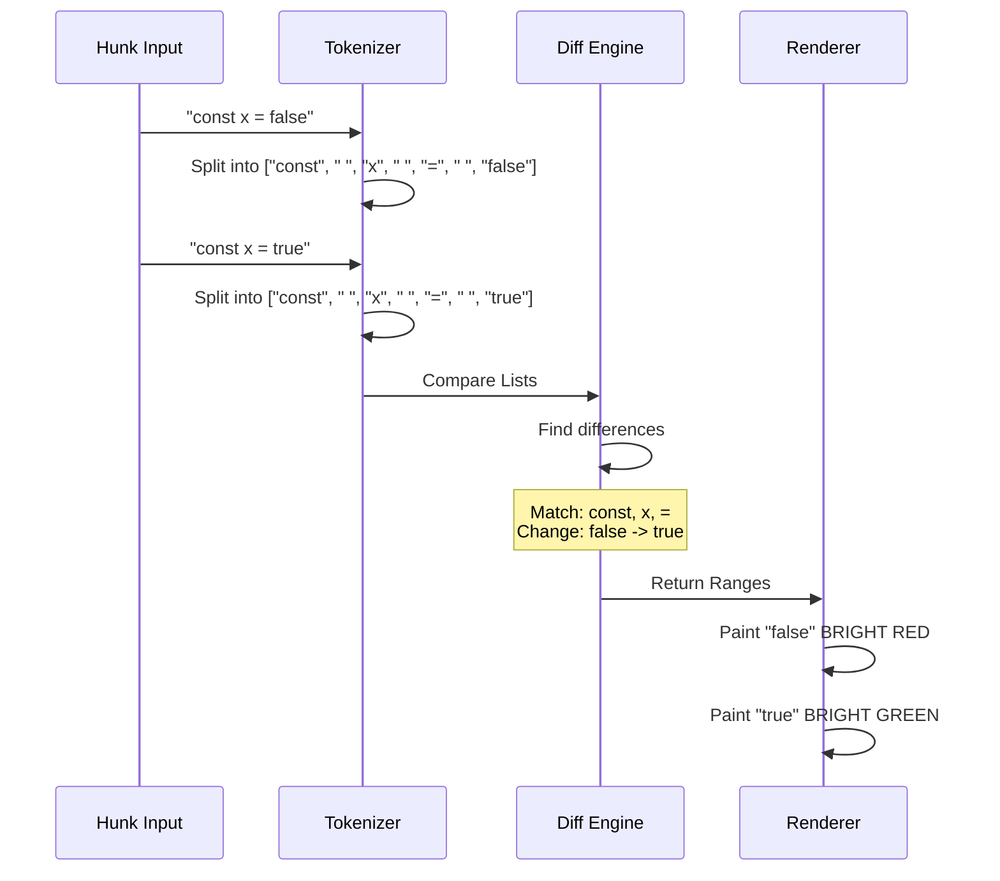

# Chapter 6: Diff Renderer

In the previous chapter, [Match Scoring Logic](05_match_scoring_logic.md), we learned how to find the exact file the user is looking for.

Once we find that file, we often need to show **what changed**. If you have ever used `git diff` or looked at a Pull Request on GitHub, you know that reading raw changes can be hard.

This chapter introduces the **Diff Renderer**. Its job is to take a boring list of text changes and turn them into a beautiful, colorful, easy-to-read visualization in the terminal.

## The Motivation: Spot the Difference

Imagine you changed one word in a long line of code.

**Raw Text Output:**
```text
- const userSettings = { active: false, theme: 'dark' };
+ const userSettings = { active: true, theme: 'dark' };
```
It takes a second to spot that `false` became `true`.

**Diff Renderer Output:**
The renderer will:
1.  Color the first line background **Red** (Deleted).
2.  Color the second line background **Green** (Added).
3.  **Highlight** the word `false` and `true` in bright colors so your eye goes straight to the change.

## Concept 1: The "Hunk"

We don't usually render an entire file when showing changes. We render a **Hunk**.

A Hunk is a specific slice of the file that contains the changes plus a little bit of context around them.

In `native-ts`, a hunk looks like this:

```typescript
type Hunk = {
  oldStart: number   // Line number in original file
  newStart: number   // Line number in new file
  lines: string[]    // The raw text content
}
```

The `lines` array contains strings starting with:
*   `-` (Deleted line)
*   `+` (Added line)
*   ` ` (Context line, unchanged)

## Concept 2: Visual Layers

Rendering a diff isn't just printing text. It is like painting a picture with layers.

1.  **Base Layer:** The background color (Red for delete, Green for add).
2.  **Text Layer:** The code itself (Syntax highlighted, e.g., `const` is pink).
3.  **Decoration Layer:** The `+` or `-` markers and line numbers.
4.  **Highlight Layer:** The specific words that changed within the line.

## How to Use It

The main class is `ColorDiff`. You give it a hunk, and it calculates all the layers for you.

### Step 1: Define the Input

Let's say we changed a variable from `false` to `true`.

```typescript
const myHunk = {
  oldStart: 10,  oldLines: 1,
  newStart: 10,  newLines: 1,
  lines: [
    "- const isReady = false;", 
    "+ const isReady = true;"
  ]
};
```

### Step 2: Create the Renderer

We instantiate the class. We pass the file path so the renderer knows which language syntax to use (TypeScript in this case).

```typescript
import { ColorDiff } from './color-diff';

// Create the renderer
const renderer = new ColorDiff(
  myHunk, 
  null,         // (Optional) first line of file
  "script.ts"   // File name
);
```

### Step 3: Render to Strings

Finally, we tell it to generate the output. We provide the theme (e.g., 'dark') and the width of the terminal.

```typescript
// Render lines fitted to 80 columns
const outputLines = renderer.render('dark', 80, false);

console.log(outputLines.join('\n'));
```

**What happens visually?**
The terminal prints two lines.
1.  Line 10: Red background. The word `false` is bright red.
2.  Line 10: Green background. The word `true` is bright green.

## Under the Hood: Word Diff Algorithm

The most complex part of this renderer is the **Word Diff**.

It's easy to see that Line A is different from Line B. It is much harder to programmatically find *exactly* which words changed inside those lines.

### The Algorithm Flow

The `ColorDiff` class uses a specialized algorithm to compare strings.



### Implementation Details

Let's look at `color-diff/index.ts`.

#### 1. Tokenizing
First, we treat the sentence like a necklace of beads. We break it apart.

```typescript
// color-diff/index.ts

function tokenize(text: string): string[] {
  const tokens: string[] = []
  // Regex looks for Letters/Numbers OR Whitespace
  // It effectively splits "a = b" into ["a", " ", "=", " ", "b"]
  // ... (loop logic) ...
  return tokens
}
```
*Why?* If we compared character-by-character, changing `apple` to `apply` might look like `appl` is the same and `e`->`y` changed. But usually, we want to treat the whole word `apple` as changing to `apply`.

#### 2. Calculating the Diff
We use a library helper `diffArrays` to compare the list of tokens.

```typescript
// color-diff/index.ts

function wordDiffStrings(oldStr: string, newStr: string) {
  const oldTokens = tokenize(oldStr)
  const newTokens = tokenize(newStr)
  
  // Find the operations (Add, Remove, Keep)
  const ops = diffArrays(oldTokens, newTokens)
  
  // Calculate character ranges for highlighting
  // ...
  return [oldRanges, newRanges]
}
```

This function returns **Ranges** (e.g., "From character 12 to 17 changed"). The renderer uses these ranges to apply the "Bright" background color later.

#### 3. Painting the ANSI Codes
Finally, after we know what lines changed and what words changed, we need to convert this into "Escape Codes" (the weird `\x1b[31m` characters that terminals understand).

The renderer loops through every character, checking:
1.  Is this a keyword? (Color it pink).
2.  Is this inside a Word Diff Range? (Color the background brighter).
3.  Is this an added line? (Color the background green).

```typescript
// color-diff/index.ts

function colorToEscape(c: Color, fg: boolean): string {
  // If alpha is 0, it's a palette index (0-255)
  if (c.a === 0) {
     return `\x1b[38;5;${c.r}m` // ANSI 256 color code
  }
  
  // Otherwise it's TrueColor (RGB)
  return `\x1b[38;2;${c.r};${c.g};${c.b}m`
}
```

## Summary

The **Diff Renderer** is the artist of the project.
1.  It takes raw **Hunks** of changes.
2.  It uses **Tokenization** to find exactly which words were modified.
3.  It layers **Background Colors** and **Syntax Highlighting** to create a readable terminal UI.

However, to know that `const` should be pink and `string` should be yellow, the renderer needs a brain that understands languages. It needs a **Syntax Highlighter**.

In the next chapter, we will connect our renderer to the syntax engine.

[Next Chapter: Syntax Highlighter Bridge](07_syntax_highlighter_bridge.md)

---

Generated by [Code IQ](https://github.com/adityasoni99/Code-IQ)