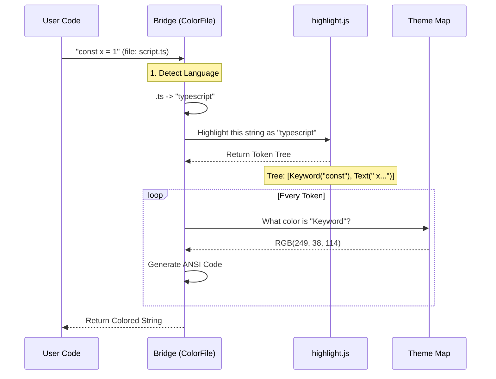

# Chapter 7: Syntax Highlighter Bridge

In the previous chapter, [Diff Renderer](06_diff_renderer.md), we learned how to visualize changes between files using background colors (Red for deleted lines, Green for added lines).

However, a solid background isn't enough. If you look at code in a modern editor like VS Code, the text itself is colorful. Keywords like `const` are one color, strings like `"hello"` are another. This makes code readable.

This chapter introduces the **Syntax Highlighter Bridge**. It is the final piece of the puzzle that translates abstract code into beautiful, colored terminal output.

## The Motivation: "Paint by Numbers"

Terminals are dumb. They don't know what "JavaScript" is. They only know "Print this character."

To get colors, we use a library called `highlight.js`. It understands grammar, but it outputs HTML (like `<span class="keyword">`). Our terminal doesn't speak HTML; it speaks **ANSI Escape Codes** (like `\x1b[31m`).

Our **Bridge** acts as a translator.
1.  **Input:** Raw code (`const x = 1;`).
2.  **Parser:** Identify the parts (`const` is a keyword).
3.  **Theme Map:** Look up the color for "keyword" (e.g., Pink).
4.  **Output:** ANSI string (`Pink(const) White(x)...`).

## Concept 1: Language Detection

Before we can color code, we must know what language it is. Coloring Python rules on TypeScript code looks messy.

Sometimes the file extension (`.ts`) is enough. But what about a file simply named `Makefile`? or a script named `run`?

The Bridge uses a three-step detection strategy:
1.  **Filename:** Is it `Dockerfile` or `Jenkinsfile`?
2.  **Extension:** Is it `.js`, `.rs`, `.go`?
3.  **Shebang:** Read the first line. Does it say `#!/bin/bash`?

## Concept 2: The Theme Bridge

`highlight.js` gives us abstract "Scopes". It says: *"This word is a `string`."*

We need a specific RGB color. We use a **Theme Object** to map these scopes to colors.

```typescript
// Conceptual mapping
const Theme = {
  keyword:  { r: 249, g: 38,  b: 114 }, // Pink
  string:   { r: 230, g: 219, b: 116 }, // Yellow
  comment:  { r: 117, g: 113, b: 94  }  // Grey
};
```

## How to Use It

The main entry point for a whole file is the `ColorFile` class. It handles the detection and coloring automatically.

### 1. The Setup
Imagine we have a snippet of TypeScript code.

```typescript
import { ColorFile } from './color-diff';

const code = `const hello = "world";`;
const filename = "example.ts";

// Create the highlighter wrapper
const highlighter = new ColorFile(code, filename);
```

### 2. The Render
We tell it to render using a specific theme (like 'dark' or 'light').

```typescript
// Render for a dark terminal, 80 columns wide
const output = highlighter.render('dark', 80, false);

console.log(output.join('\n'));
```

**Result:** The terminal prints `const` in pink and `"world"` in yellow.

## Under the Hood: The Flow

What actually happens inside `render`? It's a pipeline.



### Implementation Details

Let's look at `color-diff/index.ts`.

#### Step 1: Lazy Loading

`highlight.js` is huge. It supports hundreds of languages. If we load it immediately, the app starts slowly. We use a "Lazy" pattern to only load it when we actually need to print colors.

```typescript
// color-diff/index.ts

let cachedHljs: any = null;

function hljs() {
  // Only require the heavy library the first time this runs
  if (!cachedHljs) {
    cachedHljs = require('highlight.js');
  }
  return cachedHljs;
}
```

#### Step 2: Language Detection

Here is how we figure out what language a file is.

```typescript
// color-diff/index.ts

function detectLanguage(filePath: string, firstLine: string | null): string | null {
  const base = basename(filePath);
  
  // 1. Check special filenames (e.g., Makefile)
  if (FILENAME_LANGS[base]) return FILENAME_LANGS[base];

  // 2. Check Extension
  const ext = extname(filePath).slice(1);
  if (ext) return ext;

  // 3. Check Shebang (e.g., #!/bin/node)
  if (firstLine && firstLine.includes('node')) return 'javascript';
  
  return null;
}
```

#### Step 3: Flattening the Tree

`highlight.js` returns a tree of nodes. A function might contain parameters, which might contain types. We need to flatten this into a linear list of "Blocks" to print them in order.

We use a recursive function `flattenHljs`.

```typescript
// color-diff/index.ts

function flattenHljs(node: any, theme: Theme, out: Block[]): void {
  if (typeof node === 'string') {
    // It's just text. Color it based on the parent scope.
    out.push([style, node]); 
    return;
  }

  // It's a scope (like "function"). Dig deeper.
  for (const child of node.children) {
    flattenHljs(child, theme, out);
  }
}
```

#### Step 4: The Scope Map

Finally, we need the dictionary that defines our "Monokai" look. We manually mapped the scopes to match the colors used in popular text editors.

```typescript
// color-diff/index.ts

const MONOKAI_SCOPES = {
  keyword: rgb(249, 38, 114),      // Pink
  string: rgb(230, 219, 116),      // Yellow
  comment: rgb(117, 113, 94),      // Grey
  type: rgb(166, 226, 46),         // Green
  // ... maps generic names to specific RGBs
};
```

## Summary

The **Syntax Highlighter Bridge** brings our terminal UI to life.
1.  It **Detects Languages** using filenames and shebangs.
2.  It uses **Lazy Loading** to keep the app fast.
3.  It **Maps Scopes** from `highlight.js` to specific RGB themes like Monokai.

### Conclusion

Congratulations! You have navigated the core architecture of `native-ts`.

1.  We started with **Layout** (calculating X/Y coordinates).
2.  We optimized it with **Caching**.
3.  We built a **Search Engine** to find files.
4.  We built a **Renderer** to display code and differences.

You now understand the fundamental blocks required to build a high-performance, terminal-based code tool. Happy coding!

---

Generated by [Code IQ](https://github.com/adityasoni99/Code-IQ)