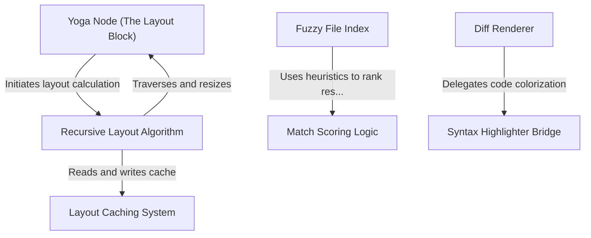

# Tutorial: native-ts

This project implements high-performance, native-quality utilities in pure TypeScript, removing dependencies on C++ bindings. It features a complete port of the **Yoga flexbox engine** for calculating UI layouts via a node tree and **caching system**, a **fuzzy file searcher** that uses character bitmaps and **smart scoring** for speed, and a terminal-based **diff renderer** that applies **syntax highlighting** and word-level diffing to code changes.

## Chapters

1. [Yoga Node (The Layout Block)](01_yoga_node__the_layout_block_.md)
2. [Recursive Layout Algorithm](02_recursive_layout_algorithm.md)
3. [Layout Caching System](03_layout_caching_system.md)
4. [Fuzzy File Index](04_fuzzy_file_index.md)
5. [Match Scoring Logic](05_match_scoring_logic.md)
6. [Diff Renderer](06_diff_renderer.md)
7. [Syntax Highlighter Bridge](07_syntax_highlighter_bridge.md)

---

Generated by [Code IQ](https://github.com/adityasoni99/Code-IQ)