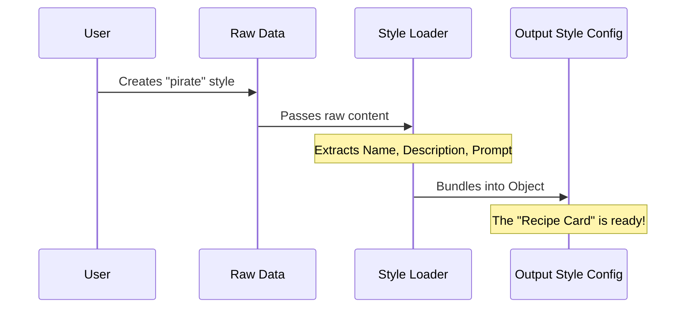

# Chapter 1: Output Style Configuration

Welcome to the `outputStyles` project! If you've ever wanted to make an AI sound like a 17th-century pirate, a strict code reviewer, or a friendly tutor, you are in the right place.

In this first chapter, we will explore the core building block of this system: the **Output Style Configuration**.

## Motivation: The "Recipe Card"

Imagine you run a restaurant (the application) and you have a chef (the AI). You want the chef to cook different dishes depending on what the customer asks for.

To do this, you hand the chef a **Recipe Card**. This card needs to follow a standard format so the chef can understand it quickly. It usually contains:
1.  **Title:** What is this dish?
2.  **Summary:** A quick description of the flavor.
3.  **Instructions:** The step-by-step guide on how to cook it.

In our software, the **Output Style Configuration** is that Recipe Card. It is a simple data structure that bundles the instructions for the AI into a single, easy-to-pass-around package.

### The Use Case: "Pirate Mode"
Throughout this chapter, we will try to solve a simple goal: **We want the AI to speak like a pirate.**

To do this, we need to create a configuration object that contains the rules for "Pirate Mode" so the rest of the application knows how to handle it.

## The Concept: What's on the Card?

The configuration is just an object (a collection of data). Here are the key parts that make up our "Recipe Card":

1.  **Name:** A unique identifier (e.g., "pirate").
2.  **Description:** What does this style do? (e.g., "Talks like a sea captain").
3.  **Prompt:** The actual instruction text sent to the AI (e.g., "Start every sentence with 'Arrr'").

By ensuring every style looks like this, the system doesn't care if the style came from a file, a plugin, or user input. It handles them all exactly the same way.

### Seeing it in Code

Here is what this structure looks like in a simple TypeScript object.

```typescript
// This is our "Recipe Card"
const pirateStyle = {
  name: "pirate",
  description: "Talks like a sea captain",
  prompt: "You are a pirate. Start sentences with 'Arrr'.",
  source: "project" // Just a note on where it came from
};
```

This simple object is the destination we are trying to reach. Everything else in this project exists to help us build objects like this one.

## Under the Hood: Creating the Configuration

How does the application actually build these objects? It usually reads raw data (like a text file) and converts it into this structured format.

### The Process

Here is a high-level view of what happens when the application processes a style.



1.  The system finds raw data (we'll learn how it finds files in [Hierarchical File Loading](03_hierarchical_file_loading.md)).
2.  It extracts the **Name** (often from the filename).
3.  It finds the **Description** (from metadata).
4.  It treats the main text as the **Prompt**.
5.  It bundles them into the `OutputStyleConfig` object.

### Internal Implementation

Let's look at the actual code in `loadOutputStylesDir.ts`. This file is responsible for taking raw file data and turning it into our configuration object.

We will focus on the `.map()` function, which is the factory line creating these objects.

#### Step 1: Determining the Name
First, the code needs to decide what to call the style. It prefers a specific name provided in the metadata, but if that's missing, it simply uses the filename.

```typescript
// Inside loadOutputStylesDir.ts
const fileName = basename(filePath)
const styleName = fileName.replace(/\.md$/, '')

// Use name from frontmatter (metadata), or fallback to filename
const name = (frontmatter['name'] || styleName) as string
```
*Explanation:* If your file is named `pirate.md`, the `styleName` becomes `pirate`.

#### Step 2: Extracting the Description
Next, it looks for a description. It tries to read it from metadata first. If that fails, it tries to read the first few lines of the text content itself.

```typescript
// Try to get description from frontmatter or extract from content
const description =
  coerceDescriptionToString(
    frontmatter['description'],
    styleName,
  ) ??
  extractDescriptionFromMarkdown(content, `Custom ${styleName} output style`)
```
*Explanation:* We will learn more about how this parsing works in [Metadata Parsing and Coercion](04_metadata_parsing_and_coercion.md).

#### Step 3: Handling Special Flags
Sometimes, we have specific instructions, like `keep-coding-instructions`. This tells the AI if it should strictly follow coding rules or relax them.

```typescript
// Parse the boolean flag from the raw data
const keepCodingInstructionsRaw = frontmatter['keep-coding-instructions']

const keepCodingInstructions =
  keepCodingInstructionsRaw === true || keepCodingInstructionsRaw === 'true'
    ? true
    : undefined // logic simplified for clarity
```
*Explanation:* This adds an extra checkbox to our "Recipe Card" regarding coding rules.

#### Step 4: Building the Final Object
Finally, the code returns the nice, clean object we discussed at the beginning.

```typescript
// Return the structured configuration
return {
  name,
  description,
  prompt: content.trim(),
  source,
  keepCodingInstructions,
}
```
*Explanation:* `content.trim()` ensures the prompt doesn't have accidental empty space around it.

## Conclusion

In this chapter, we learned about the **Output Style Configuration**. It acts as a standardized "Recipe Card" containing a **Name**, **Description**, and **Prompt**. This abstraction ensures that no matter how complex the instructions are, the application treats them all the same way.

But how do we write these recipes without hard-coding them into the software? We need a way to write them in plain text.

In the next chapter, we will learn how to write these recipes using the [Markdown-Based Configuration strategy](02_markdown_based_configuration_strategy.md).

---

Generated by [Code IQ](https://github.com/adityasoni99/Code-IQ)