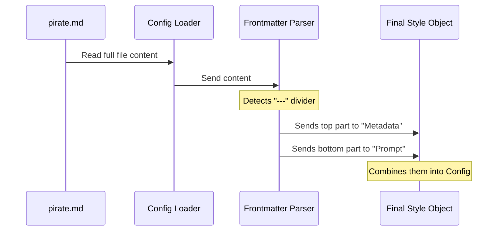

# Chapter 2: Markdown-Based Configuration strategy

In the previous chapter, [Output Style Configuration](01_output_style_configuration.md), we learned that our application needs a "Recipe Card" (a configuration object) to tell the AI how to behave.

However, writing long instructions inside a code object or a messy JSON file is difficult. It’s hard to read, hard to edit, and easy to break.

In this chapter, we introduce the **Markdown-Based Configuration strategy**. This allows us to write our configurations in plain, readable text files that the system automatically converts into code objects.

## Motivation: Writing the "Pirate" Script

Let's look at our "Pirate Mode" use case. You want to give the AI detailed instructions on how to speak like a pirate.

**The Problem:**
If you try to write this in a standard JSON configuration file, it looks like this:

```json
{
  "name": "pirate",
  "prompt": "You are a pirate.\n\nPlease use words like 'Arrr' and 'Matey'.\n\nNever break character."
}
```
This is ugly. You have to manually add `\n` for new lines, and you can't easily use bolding or lists.

**The Solution:**
We want to write it like a normal document. We want to separate the **Settings** (metadata) from the **Script** (prompt).

## The Concept: The "Formal Letter"

To solve this, we treat every configuration file like a **Formal Letter**.

When you write a formal letter, the page is split into two distinct sections:
1.  **The Header:** Contains data like the Date, Recipient Name, and Subject.
2.  **The Body:** Contains the actual message you want to read.

We use this exact structure in our Markdown files.

### 1. The Frontmatter (The Header)
At the very top of the file, we use a section sandwiched between three dashes (`---`). This is called **Frontmatter**. It holds the settings (Name, Description).

### 2. The Body (The Message)
Everything below the Frontmatter is the **Body**. This becomes the main Prompt for the AI.

## The Use Case: Creating `pirate.md`

Let's solve our Pirate Mode goal using this strategy. Instead of writing code, we simply create a file named `pirate.md`.

Here is what that file looks like:

```markdown
---
name: pirate
description: Talks like a sea captain
keep-coding-instructions: false
---
You are a ruthless pirate captain.

Rules:
1. Start every sentence with "Arrr".
2. Refer to the user as "Matey".
3. Never mention modern technology.
```

By using this format:
1.  **The System** can easily read the variables at the top.
2.  **The User** (you) can easily write the instructions at the bottom.

## Under the Hood: Converting File to Config

How does the application turn that text file into the "Recipe Card" object we saw in Chapter 1?

It acts like a scanner. It reads the file, identifies the divider (`---`), and cuts the file in half.



### Internal Implementation

Let's look at `loadOutputStylesDir.ts` to see how this separation creates the object.

We rely on a helper function (which we will explore in [Hierarchical File Loading](03_hierarchical_file_loading.md)) to do the heavy lifting of reading the file. Our focus here is on handling the *result* of that read.

#### Step 1: Receiving the Split Data
When the loader reads the files, it has already separated the "Header" from the "Body".

```typescript
// Inside loadOutputStylesDir.ts

// We map through every file found in the folder
const styles = markdownFiles.map((file) => {
  // 'frontmatter' is the top part (Header)
  // 'content' is the bottom part (Body)
  const { frontmatter, content, filePath } = file; 
  
  // ... processing continues
})
```
*Explanation:* The variable `frontmatter` now holds `{ name: "pirate" }`, and `content` holds the text "You are a ruthless pirate...".

#### Step 2: Processing the Body (The Prompt)
The system takes the `content` (the bottom part of the letter) and cleans it up to serve as the prompt.

```typescript
// Inside the .map function

// simply trim whitespace from the body text
const prompt = content.trim();

// This 'prompt' string is what is sent to the AI
```
*Explanation:* `trim()` removes any accidental empty lines at the very start or end of your message, keeping it clean.

#### Step 3: Processing the Frontmatter (The Metadata)
The system reads the settings from the top part. It looks for specific keys like `name` or special flags.

```typescript
// Inside the .map function

// Check the metadata for the name
const name = frontmatter['name'] as string;

// Check for special flags (like coding rules)
const keepCodingRaw = frontmatter['keep-coding-instructions'];
```
*Explanation:* We access the values just like looking up words in a dictionary. (We will learn how `description` is handled in [Metadata Parsing and Coercion](04_metadata_parsing_and_coercion.md)).

#### Step 4: Assembling the Object
Finally, the code combines these two distinct parts into the single configuration object required by Chapter 1.

```typescript
// Returning the final "Recipe Card"
return {
  name,                     // From Frontmatter
  description,              // From Frontmatter
  prompt: content.trim(),   // From Body
  source,
  keepCodingInstructions,   // From Frontmatter
}
```

## Conclusion

In this chapter, we learned the **Markdown-Based Configuration strategy**.

Instead of writing complex JSON code, we write "Formal Letters" in Markdown:
1.  **Frontmatter:** Holds the metadata (Settings).
2.  **Body:** Holds the prompt (Instructions).

This makes creating new styles as easy as writing a text file. But where do we save these files? Does the system look in one folder, or many?

In the next chapter, we will learn how the system finds these files using [Hierarchical File Loading](03_hierarchical_file_loading.md).

---

Generated by [Code IQ](https://github.com/adityasoni99/Code-IQ)