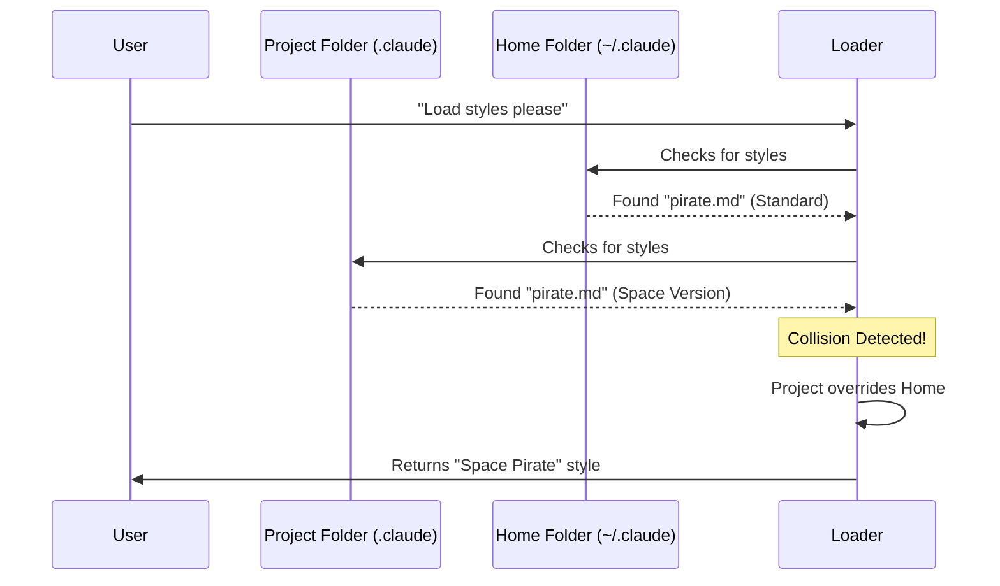

# Chapter 3: Hierarchical File Loading

In the previous chapter, [Markdown-Based Configuration strategy](02_markdown_based_configuration_strategy.md), we learned **how** to write a style configuration using a simple Markdown file.

Now, we need to answer the question: **Where** do we put that file?

This chapter covers **Hierarchical File Loading**. This is the logic the system uses to find your files, and more importantly, decide which one to use if there are duplicates.

## Motivation: The "Toolbox vs. Garage" Analogy

Imagine you are a handy person working on a specific job, like fixing a sink.

1.  **The Garage (User/Global Scope):** This is where you keep all your general tools. You have a hammer, a screwdriver, and a wrench here. You use these for everything.
2.  **The Portable Toolbox (Project Scope):** This is the box you carry right next to you for *this specific job*. It might contain a special wrench that only fits this sink.

**The Rule:**
When you need a tool, you look in your **Portable Toolbox** first.
*   If the tool is there, you use it (even if you have a similar one in the garage).
*   If it's not there, only then do you walk to the **Garage** to get the general version.

### The Use Case: "Cyber-Pirate"

Let's apply this to our AI styles.
*   **Global:** You have a style named `pirate` in your user folder. It makes the AI talk like a standard 17th-century sailor. You use this in most of your projects.
*   **Project:** Currently, you are working on a Sci-Fi game. You want the AI to be a pirate, but a *Space Pirate*.

You don't want to delete your standard pirate style. Instead, you create a new `pirate.md` inside your project folder. Because of **Hierarchical File Loading**, the system sees the project file and effectively says: *"For this specific project, 'pirate' means Space Pirate."*

## The Concept: Two Scopes

The application looks for styles in two specific places.

### 1. The Project Scope
*   **Location:** `.claude/output-styles/` (inside your current project folder).
*   **Priority:** High.
*   **Purpose:** Styles that only apply to the current work you are doing.

### 2. The User Scope
*   **Location:** `~/.claude/output-styles/` (in your computer's home directory).
*   **Priority:** Low.
*   **Purpose:** Styles you want available everywhere, regardless of what project you are working on.

## Under the Hood: The Loading Logic

When the application starts, it scans both locations and merges them into a single list.

### Visualizing the Process

Here is how the system decides which file to load.



### Internal Implementation

Let's look at `loadOutputStylesDir.ts`. This file orchestrates the loading process.

It uses a helper function (which we won't dive into deeply, but we will see how it is called) that scans the directories for us.

#### Step 1: Scanning the Directories
The function `getOutputStyleDirStyles` is the entry point. It asks a utility to go look for files named `output-styles`.

```typescript
// Inside loadOutputStylesDir.ts

// 'cwd' is your current project folder
export const getOutputStyleDirStyles = memoize(
  async (cwd: string): Promise<OutputStyleConfig[]> => {
    
    // This helper scans both Project and Home directories
    const markdownFiles = await loadMarkdownFilesForSubdir(
      'output-styles',
      cwd,
    )
    
    // ... processing continues
```
*Explanation:* `loadMarkdownFilesForSubdir` does the hard work of walking to the "Garage" and the "Toolbox" and collecting everything it finds into the `markdownFiles` array.

#### Step 2: Mapping to Configuration
Once we have the raw files, we transform them into the configuration objects we learned about in [Output Style Configuration](01_output_style_configuration.md).

Interestingly, the system keeps track of *where* the file came from using a `source` property.

```typescript
// Inside the .map() function

return {
  name,
  description,
  prompt: content.trim(),
  source, // This tells us if it came from 'project' or 'user'
  keepCodingInstructions,
}
```
*Explanation:* The `source` variable helps the system debug or display where a specific style originated, confirming if you are using the generic version or the project-specific version.

#### Step 3: Handling Errors
File loading can sometimes fail (maybe a file is corrupted). The hierarchy logic includes safety nets to ensure one bad file doesn't crash the whole system.

```typescript
// Inside the .map() function

} catch (error) {
  logError(error)
  return null // Return null if this specific file fails
}
})
.filter(style => style !== null) // Remove the failed ones
```
*Explanation:* The code tries to process a file. If it fails (`catch`), it logs an error and ignores that specific file, returning only the valid styles to the user.

## Solving the Use Case

To achieve our "Cyber-Pirate" goal:

1.  **Global (Existing):**
    *   File: `~/.claude/output-styles/pirate.md`
    *   Content: "You are a pirate."

2.  **Project (New):**
    *   Create file: `./my-game/.claude/output-styles/pirate.md`
    *   Content: "You are a Cyber-Pirate in the year 3000."

3.  **Result:**
    When you run the application inside `./my-game/`, the `loadMarkdownFilesForSubdir` function finds both. Because the names match (`pirate`), the Project version wins. The AI receives the instruction: "You are a Cyber-Pirate in the year 3000."

## Conclusion

In this chapter, we learned about **Hierarchical File Loading**.
*   We have a **User Scope** (Garage) for general styles.
*   We have a **Project Scope** (Toolbox) for specific styles.
*   The Project Scope always overrides the User Scope.

Now that we know *how* to write styles and *where* to put them, we need to look closer at the metadata (the headers in our files). Sometimes, users write messy metadata, and the system needs to clean it up.

In the next chapter, we will learn how the system handles this in [Metadata Parsing and Coercion](04_metadata_parsing_and_coercion.md).

---

Generated by [Code IQ](https://github.com/adityasoni99/Code-IQ)