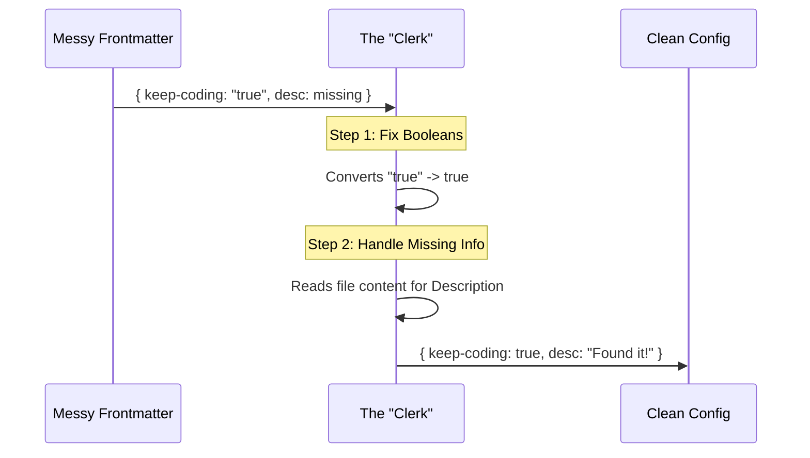

# Chapter 4: Metadata Parsing and Coercion

Welcome back! In the previous chapter, [Hierarchical File Loading](03_hierarchical_file_loading.md), we learned **where** the system looks for files (the "Garage" vs. the "Toolbox") and how it decides which file to load.

But finding the file is only half the battle. Once we open the file, we have to read the data inside.

What happens if the user makes a typo? What if they write "True" (a text string) instead of `true` (a boolean logic value)? What if they forget to write a description entirely?

In this chapter, we explore **Metadata Parsing and Coercion**. This is the logic that cleans up messy human input and converts it into strict, computer-readable data.

## Motivation: The "Messy Form"

Imagine you are a clerk at a government office. Your job is to process forms.

A citizen hands you a form.
1.  **Checkbox:** Instead of checking the box for "Yes", they scribbled the word "True" next to it.
2.  **Description Field:** They left it completely blank.

If you were a rigid robot, you would throw the form in the trash. But you are a smart human. You know that "True" means "Yes," and you can probably fill in the description yourself based on the title of the form.

**The Problem:**
Computers are usually rigid robots. If our code expects a Boolean (`true`), but receives a String (`"true"`), the program might crash or behave unexpectedly.

**The Solution:**
We write a "Coercion" layer. This acts like the smart clerk. It looks at the input, figures out the intent, fixes the data types, and fills in the blanks before passing it to the rest of the system.

### The Use Case: The Lazy Pirate

Let's stick with our Pirate theme. A user creates a file named `lazy_pirate.md`. They are in a rush, so the metadata is a bit messy.

```markdown
---
name: lazy_pirate
keep-coding-instructions: "true"
---
You are a pirate who hates writing code.
```

**Notice the errors:**
1.  `keep-coding-instructions` is in quotes (`"true"`). In YAML/JSON, this is text, not a switch.
2.  There is no `description` field.

Our goal is to turn this messy input into a perfect configuration object.

## The Concept: Coercion and Fallbacks

To handle this, we use two main concepts:

### 1. Coercion (Type Juggling)
**Coercion** is the process of converting a value from one data type to another.
*   Input: `"true"` (String)
*   Coercion Logic: "Does this word look like 'true'?"
*   Output: `true` (Boolean)

### 2. Fallbacks (Plan B)
**Fallbacks** are default values used when the original information is missing.
*   Input: `undefined` (Missing description)
*   Fallback Logic: "Since there is no description, I will read the first few lines of the file content instead."
*   Output: "You are a pirate who hates writing code."

## Under the Hood: The Validator

How does the system perform this cleanup? It happens immediately after the file is loaded, inside the mapping function we saw in previous chapters.



### Internal Implementation

Let's look at `loadOutputStylesDir.ts`. This file contains the logic that acts as our "Smart Clerk."

#### Step 1: Coercing Booleans
We need to handle the `keep-coding-instructions` flag. This flag tells the AI if it should follow strict coding rules.

The code is designed to be forgiving. It accepts the actual boolean `true`, or the string `"true"`.

```typescript
// Inside loadOutputStylesDir.ts

// 1. Get the raw value from the file header
const keepCodingInstructionsRaw = frontmatter['keep-coding-instructions']

// 2. Check if it matches strict true OR string "true"
const keepCodingInstructions =
  keepCodingInstructionsRaw === true ||
  keepCodingInstructionsRaw === 'true'
    ? true
    // 3. Do the same check for false
    : keepCodingInstructionsRaw === false ||
        keepCodingInstructionsRaw === 'false'
      ? false
      : undefined // If it's gibberish, leave it undefined
```

*Explanation:* This logic ensures that even if the user made a typo and put quotes around the word "true", the system still turns on the setting.

#### Step 2: Generating Fallback Descriptions
Next, we handle the missing description.

1.  **Plan A:** Check the metadata (`frontmatter`).
2.  **Plan B:** If missing, look at the file content (`prompt`) and grab the first sentence.
3.  **Plan C:** If all else fails, generate a generic string like "Custom pirate output style".

```typescript
// Inside loadOutputStylesDir.ts

const description =
  // Try to clean up the frontmatter description first
  coerceDescriptionToString(
    frontmatter['description'],
    styleName,
  ) ??
  // Fallback: extract it from the prompt text
  extractDescriptionFromMarkdown(
    content,
    `Custom ${styleName} output style`, // Final fallback
  )
```

*Explanation:* The `??` operator is a "nullish coalescing operator." It means: "Try the left side. If it's null/undefined, do the right side." This ensures we *always* have a description.

#### Step 3: Cleaning Up the Name
Even the name has a fallback. Ideally, the user provides a `name` in the metadata. If not, we just use the filename.

```typescript
const fileName = basename(filePath)
const styleName = fileName.replace(/\.md$/, '')

// Use provided name, OR fallback to the filename
const name = (frontmatter['name'] || styleName) as string
```

## Solving the Use Case

Let's look at our "Lazy Pirate" example again and trace what happens.

**Input (`lazy_pirate.md`):**
```markdown
---
keep-coding-instructions: "true"
---
You are a pirate.
```

**The Parsing Process:**
1.  **Name:** No name in metadata. -> Fallback to filename: `"lazy_pirate"`.
2.  **Coding Instructions:** Value is `"true"` (string). -> Coerced to: `true` (boolean).
3.  **Description:** Missing. -> Extracted from content: `"You are a pirate."`.

**Final Output Object:**
```typescript
{
  name: "lazy_pirate",
  keepCodingInstructions: true,
  description: "You are a pirate.",
  prompt: "You are a pirate."
}
```

The system successfully cleaned up the messy input without complaining to the user!

## Conclusion

In this chapter, we learned about **Metadata Parsing and Coercion**.

We discovered that users can't always be trusted to write perfect configuration files. To make our application robust and user-friendly, we act like a "Smart Clerk":
1.  We **Coerce** messy data types (like turning strings into booleans).
2.  We provide **Fallbacks** for missing information (like generating descriptions from content).

At this point, our system can find files, load them, and clean them. But what if we have 500 style files? Reading them from the hard drive every single time we need them is slow.

In the next chapter, we will learn how to speed this up using [Cache Management](05_cache_management.md).

---

Generated by [Code IQ](https://github.com/adityasoni99/Code-IQ)