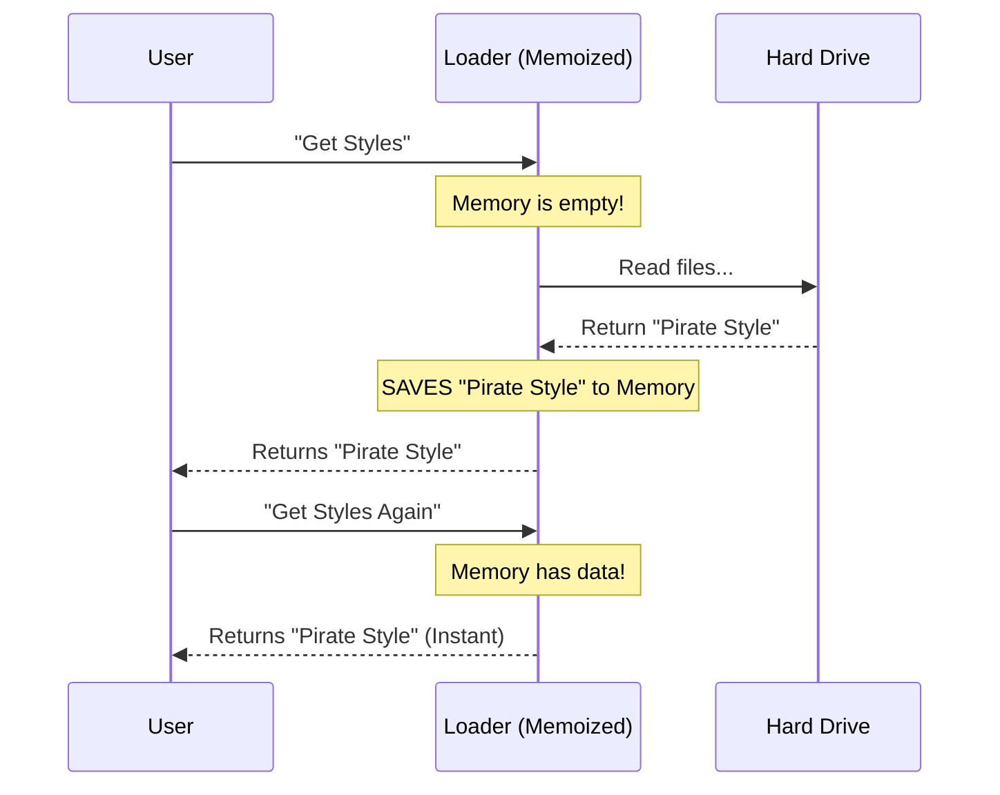

# Chapter 5: Cache Management

Welcome to the final chapter of the `outputStyles` tutorial!

In the previous chapter, [Metadata Parsing and Coercion](04_metadata_parsing_and_coercion.md), we learned how the system acts like a "Smart Clerk" to clean up messy user input.

However, being a Smart Clerk takes time. Reading files from the hard drive, parsing text, and coercing types is "expensive" in terms of computer performance. If we do this every single time the user presses a button, the application will feel sluggish.

In this chapter, we explore **Cache Management**. This acts as the "Short-Term Memory" of our application, allowing it to run instantly after the first load.

## Motivation: The "Waiter" Analogy

Imagine a busy restaurant. You are the customer (the User), and the application is the Waiter.

**Without Caching:**
1.  You ask: "What are the specials today?"
2.  The Waiter walks all the way to the kitchen.
3.  The Waiter asks the Chef.
4.  The Waiter writes it down and walks back to you.
5.  **Result:** Slow service.

**With Caching:**
1.  You ask: "What are the specials today?"
2.  The Waiter **remembers** the list from the morning briefing.
3.  The Waiter answers immediately.
4.  **Result:** Instant service.

There is one catch: **What if the Chef changes the menu at noon?**
If the Waiter relies only on memory, they will give you the wrong information. We need a way to tell the Waiter: *"Forget what you know, go check the kitchen again."*

### The Use Case: "The Rapid Typer"

Imagine a user interacting with the AI. They send 10 messages in 1 minute.

Each time a message is sent, the system needs to know which Output Style to use (e.g., "Pirate Mode").

1.  **Message 1:** The system reads the `pirate.md` file from the hard drive. (Slow: 50ms)
2.  **Message 2:** The system remembers `pirate.md`. (Fast: 0ms)
3.  **Message 3:** The system remembers `pirate.md`. (Fast: 0ms)

This "remembering" is what we call **Cache Management**.

## The Concept: Memoization

In programming, we use a technique called **Memoization**.

Memoization wraps a function. It says: *"If I have seen these inputs before, I will return the answer I calculated last time. I will not do the work again."*

We use a helper library called `lodash` to do this for us.

## Under the Hood: The Request Flow

Here is what happens when the application runs.



### Internal Implementation

Let's look at `loadOutputStylesDir.ts`. We don't write complex caching logic ourselves; we wrap our main function in `memoize`.

#### Step 1: The Import
We import the tool that gives our function a memory.

```typescript
// Inside loadOutputStylesDir.ts
import memoize from 'lodash-es/memoize.js'
```

#### Step 2: Wrapping the Function
Normally, we would just write `export const getStyles = async () => { ... }`. Instead, we wrap it.

```typescript
// We assign the result of 'memoize' to our variable
export const getOutputStyleDirStyles = memoize(
  // This is the actual worker function
  async (cwd: string): Promise<OutputStyleConfig[]> => {
    
    // ... logic to read files (from Chapter 3) ...
    // ... logic to parse metadata (from Chapter 4) ...

    return styles
  }
)
```
*Explanation:* Now, `getOutputStyleDirStyles` is a "smart" function. If you call it with the same `cwd` (Current Working Directory), it skips the code inside and returns the previous result.

## Handling Changes: Clearing the Cache

We have solved the speed problem. Now we must solve the **Stale Data** problem.

If the user edits `pirate.md` to make the pirate sound friendlier, the application won't know because it is still looking at its memory.

We need a "Flush" button. This function wipes the memory clean.

### The Implementation

We export a simple function called `clearOutputStyleCaches`.

```typescript
// Inside loadOutputStylesDir.ts

export function clearOutputStyleCaches(): void {
  // 1. Clear the main style list cache
  getOutputStyleDirStyles.cache?.clear?.()

  // 2. Clear the low-level file reader cache
  loadMarkdownFilesForSubdir.cache?.clear?.()
  
  // 3. Clear plugin caches (if any)
  clearPluginOutputStyleCache()
}
```

*Explanation:*
1.  We access the `.cache` property that `memoize` added to our function.
2.  We call `.clear()`.
3.  Next time the user asks for styles, the "Waiter" will be forced to walk back to the "Kitchen" (Hard Drive).

### When is this used?
The application watches files. When you save a file in your editor (`Ctrl+S`), the application detects the change and automatically runs `clearOutputStyleCaches()`.

## Conclusion

In this chapter, we learned about **Cache Management**.

*   **Memoization:** We use it to memorize the result of our file loading, making the app feel instant.
*   **Cache Clearing:** We learned how to wipe that memory so the app doesn't get stuck using old, outdated instructions.

### Series Wrap-Up

Congratulations! You have completed the `outputStyles` tutorial. You now understand the full lifecycle of an AI personality in this system:

1.  **Defined** via a standard object ([Chapter 1](01_output_style_configuration.md)).
2.  **Written** in friendly Markdown ([Chapter 2](02_markdown_based_configuration_strategy.md)).
3.  **Found** using hierarchical loading ([Chapter 3](03_hierarchical_file_loading.md)).
4.  **Cleaned** using metadata coercion ([Chapter 4](04_metadata_parsing_and_coercion.md)).
5.  **Optimized** using cache management (This Chapter).

You are now ready to create your own Output Styles and customize the AI to your heart's content!

---

Generated by [Code IQ](https://github.com/adityasoni99/Code-IQ)