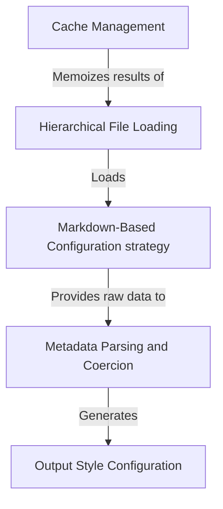

# Tutorial: outputStyles

This system manages **Output Styles**, which act like "recipes" telling the AI how to format its responses. It searches for these instructions within *Markdown files* located in your project or user folders, automatically cleaning up the metadata and **caching** the results to ensure the application runs quickly.

## Chapters

1. [Output Style Configuration](01_output_style_configuration.md)
2. [Markdown-Based Configuration strategy](02_markdown_based_configuration_strategy.md)
3. [Hierarchical File Loading](03_hierarchical_file_loading.md)
4. [Metadata Parsing and Coercion](04_metadata_parsing_and_coercion.md)
5. [Cache Management](05_cache_management.md)

---

Generated by [Code IQ](https://github.com/adityasoni99/Code-IQ)