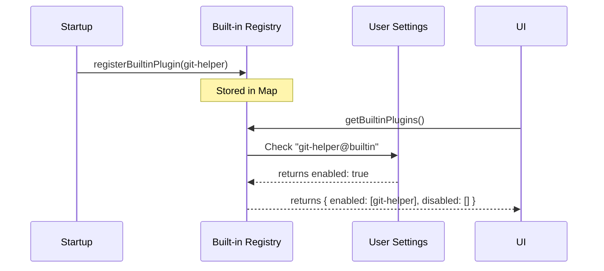

# Chapter 1: Built-in Plugin Registry

Welcome to the first chapter of the **Plugins** project! In this series, we will explore how a Command Line Interface (CLI) manages modular features.

## Motivation: The "Factory Settings" Problem

Imagine you are building a smartphone. You want it to come with pre-installed apps like "Camera" or "Calculator."
-   **The Problem:** You could hardcode these features deep into the operating system, but then they wouldn't behave like normal apps. Users couldn't disable them, and they wouldn't appear in your "All Apps" list.
-   **The Solution:** You need a way to ship features *inside* the code but treat them as modular components.

This is exactly what the **Built-in Plugin Registry** does. It acts as a catalog for features shipped directly with the CLI (the "factory settings"), allowing the system to list, enable, or disable them just like plugins downloaded from the internet.

### Core Use Case
We want to ship a "Git Helper" plugin inside our CLI. Even though it's compiled into the binary, the user should be able to go to their settings and turn it off if they don't use Git.

## Key Concepts

To solve this, we use three main concepts:

1.  **The Registry Map:** A simple in-memory list (a `Map`) that holds the definitions of all pre-installed plugins.
2.  **The Built-in Suffix:** We tag these plugins with a specific ID format (ending in `@builtin`) so the system knows they don't need to be downloaded.
3.  **Lifecycle Management:** A function that checks the user's settings file to decide if a built-in plugin is currently `enabled` or `disabled`.

## How to Use the Registry

Let's look at how we interact with this registry. We primarily need to **register** plugins when the app starts and **retrieve** them when the UI needs to show a list.

### 1. Registering a Plugin
When the application starts up, we need to tell the registry which plugins are available.

```typescript
import { registerBuiltinPlugin } from './builtinPlugins'

// We call this at startup
registerBuiltinPlugin({
  name: 'git-helper',
  description: 'Helps with git commits',
  version: '1.0.0',
  // ... skills and hooks go here
})
```
*Explanation:* This adds "git-helper" to our internal list. It is now ready to be discovered.

### 2. Retrieving Plugins
When the UI wants to show the user what plugins they have, it asks the registry.

```typescript
import { getBuiltinPlugins } from './builtinPlugins'

// Get the lists based on user settings
const { enabled, disabled } = getBuiltinPlugins()

console.log('Active Plugins:', enabled.map(p => p.name))
// Output: ['git-helper'] (if enabled in settings)
```
*Explanation:* This function doesn't just return a list; it splits plugins into `enabled` and `disabled` arrays based on what the user prefers.

## Internal Implementation

How does the system know if a plugin is enabled? How does it turn a "definition" into a usable feature? Let's walk through the flow.

### The Flow
1.  **Startup:** The CLI initializes and registers all internal definitions into the `BUILTIN_PLUGINS` map.
2.  **Query:** The UI requests the list of plugins.
3.  **Check Settings:** The registry looks at the user's persistent settings (e.g., a JSON file).
4.  **Decision:**
    *   If the user specifically set it to `false`, it goes to the **disabled** list.
    *   Otherwise, it defaults to the plugin's preference (usually `true`) and goes to the **enabled** list.



### Deep Dive: Code Breakdown

Let's look at the implementation in `builtinPlugins.ts`.

#### The Storage
First, we need a place to store the definitions.

```typescript
// builtinPlugins.ts
import type { BuiltinPluginDefinition } from '../types/plugin.js'

// The central catalog
const BUILTIN_PLUGINS: Map<string, BuiltinPluginDefinition> = new Map()

export const BUILTIN_MARKETPLACE_NAME = 'builtin'
```
*Explanation:* We use a `Map` because it allows quick lookups by name. The `BUILTIN_MARKETPLACE_NAME` constant helps us identify these plugins later. You will see how this naming convention works in detail in [Plugin Namespacing](02_plugin_namespacing.md).

#### separating Enabled vs. Disabled
This is the "brain" of the registry. It converts raw definitions into `LoadedPlugin` objects with state.

```typescript
// Inside getBuiltinPlugins() function...
for (const [name, definition] of BUILTIN_PLUGINS) {
  // Construct the ID, e.g., "git-helper@builtin"
  const pluginId = `${name}@${BUILTIN_MARKETPLACE_NAME}`
  
  // Check user settings
  const userSetting = settings?.enabledPlugins?.[pluginId]
  
  // Logic: User preference > Plugin default > true
  const isEnabled = userSetting !== undefined 
    ? userSetting === true 
    : (definition.defaultEnabled ?? true)

  // ... create plugin object and push to list ...
}
```
*Explanation:* We construct a unique ID using the `@builtin` suffix. We then check `settings`. If the user hasn't made a choice yet, we fall back to the plugin's default (usually on). To understand how this state affects the app at runtime, see [Runtime Plugin State](03_runtime_plugin_state.md).

#### Converting Skills to Commands
A plugin contains "skills" (functions it can perform). The CLI needs to treat these as "commands."

```typescript
// builtinPlugins.ts
function skillDefinitionToCommand(definition: BundledSkillDefinition): Command {
  return {
    type: 'prompt',
    name: definition.name,
    // ... maps description, usage, etc ...
    source: 'bundled', // Important!
    isEnabled: definition.isEnabled ?? (() => true),
    // ...
  }
}
```
*Explanation:* This helper function transforms a skill definition into a `Command` object the CLI understands. Notice the `source: 'bundled'`. Even though the *Plugin* is "builtin," the *Command* source is marked as "bundled" to ensure it shows up in analytics and tool listings correctly. We will explore this conversion logic further in [Skill-to-Command Adaptation](04_skill_to_command_adaptation.md).

## Summary

In this chapter, we learned:
1.  **Built-in Plugins** allow us to ship features inside the CLI while keeping them modular.
2.  The **Registry** is a `Map` that stores these plugin definitions.
3.  We separate plugins into **Enabled** and **Disabled** lists based on user settings.

Now that we understand how to store and retrieve these plugins, we need to understand how to name them correctly so they don't clash with plugins from the internet.

[Next Chapter: Plugin Namespacing](02_plugin_namespacing.md)

---

Generated by [Code IQ](https://github.com/adityasoni99/Code-IQ)