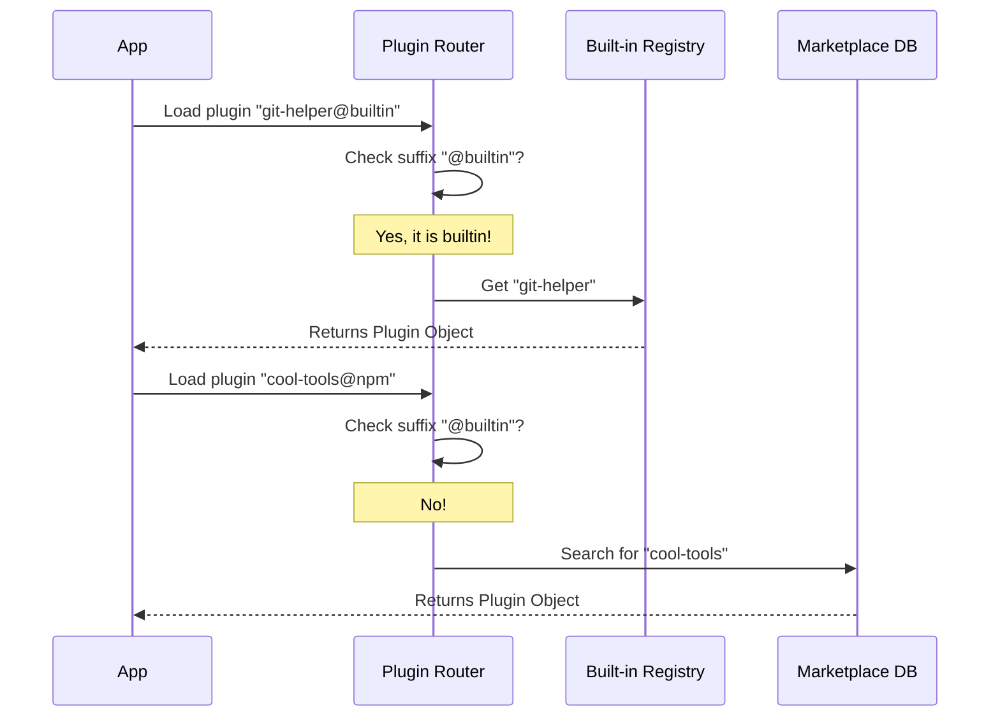

# Chapter 2: Plugin Namespacing

Welcome to the second chapter of the **Plugins** project! In the previous chapter, [Built-in Plugin Registry](01_built_in_plugin_registry.md), we created a specific place in memory to store our official features.

Now, we face a new challenge: **Identity.**

## Motivation: The "Verified Badge" Problem

Imagine our CLI has a built-in plugin called `calculator`.
Later, a community developer creates an *amazing* calculator plugin and also names it `calculator`.

If a user installs the community version, we have two plugins with the exact same name.
*   **The Problem:** When the user types "calculate," which plugin should run? The official one or the community one?
*   **The Solution:** Just like social media accounts have "Verified Badges" or unique handles (e.g., `@official`), we need a way to verify the origin of a plugin.

This is **Plugin Namespacing**. By adding a specific suffix (like `@builtin`) to the ID, we ensure our internal features never clash with external ones.

### Core Use Case
We want to distinguish between the official `git-helper` (shipped with the app) and a community `git-helper` (downloaded from the internet).

## Key Concepts

To solve this, we use two simple logical rules:

1.  **The Origin Suffix:** We treat the `@` symbol as a separator. Everything after it tells us *where* the plugin came from.
2.  **The Gatekeeper:** A simple function that looks at a plugin ID and answers: *"Is this one of ours?"*

## How to Use Namespacing

We rarely type these names manually. Instead, the code constructs them automatically when loading plugins.

### 1. Constructing the ID
When we load a built-in plugin from our registry, we don't just use its name. We append the namespace.

```typescript
// builtinPlugins.ts
export const BUILTIN_MARKETPLACE_NAME = 'builtin'

// Example: "git-helper" becomes "git-helper@builtin"
const pluginId = `${name}@${BUILTIN_MARKETPLACE_NAME}`
```
*Explanation:* We define a constant string `'builtin'`. By attaching this to the name, we create a globally unique ID.

### 2. Checking the ID
Later, when the system needs to find code for a plugin, it checks this suffix.

```typescript
import { isBuiltinPluginId } from './builtinPlugins'

const idToCheck = 'git-helper@builtin'

if (isBuiltinPluginId(idToCheck)) {
  console.log('Look in local memory!')
} else {
  console.log('Look in the database!')
}
```
*Explanation:* If the ID ends in `@builtin`, we skip the internet/database search entirely and look directly in the registry we built in Chapter 1.

## Internal Implementation

Let's look at how the system uses this logic to route requests.

### The Routing Logic
When the CLI starts, or when a user wants to configure a plugin, the system looks at the ID to decide where to go.

1.  **Input:** The system receives an ID (e.g., from a user settings file).
2.  **Check:** It runs `isBuiltinPluginId()`.
3.  **Route:**
    *   **Yes:** It fetches the plugin from the `BUILTIN_PLUGINS` Map.
    *   **No:** It assumes it is a 3rd party plugin and looks elsewhere (like the file system).



### Deep Dive: Code Breakdown

Let's look at the implementation in `builtinPlugins.ts`.

#### The Gatekeeper Function
This is the most critical logic. It prevents the system from confusing external plugins with internal ones.

```typescript
// builtinPlugins.ts

export const BUILTIN_MARKETPLACE_NAME = 'builtin'

// Determines if we should look in the Map or the Database
export function isBuiltinPluginId(pluginId: string): boolean {
  return pluginId.endsWith(`@${BUILTIN_MARKETPLACE_NAME}`)
}
```
*Explanation:* We use the standard string method `.endsWith`. This is efficient and safe. If we ever change the constant `BUILTIN_MARKETPLACE_NAME`, the logic automatically updates.

#### Applying the Namespace
In the previous chapter, we saw `getBuiltinPlugins`. Now let's focus specifically on *how* it applies the name.

```typescript
// inside getBuiltinPlugins()...
for (const [name, definition] of BUILTIN_PLUGINS) {
  
  // 1. Create the Unique ID
  const pluginId = `${name}@${BUILTIN_MARKETPLACE_NAME}`
  
  // 2. Use the Unique ID to check settings
  const userSetting = settings?.enabledPlugins?.[pluginId]

  // ... rest of logic
}
```
*Explanation:*
1.  We take the raw name (`git-helper`) from the Map.
2.  We transform it into the ID (`git-helper@builtin`).
3.  We use this ID to look up user preferences. This means in the settings file, the key is `"git-helper@builtin"`, not just `"git-helper"`. This allows a user to have `"git-helper@builtin": true` AND `"git-helper@npm": false` at the same time!

## Summary

In this chapter, we learned:
1.  **Namespacing** prevents collisions between official features and community extensions.
2.  We use the suffix **`@builtin`** to mark our internal plugins.
3.  The function **`isBuiltinPluginId`** acts as a traffic director, telling the system where to look for the plugin's code.

Now that we have unique IDs for our plugins, we can safely save user preferences (like "Enabled" or "Disabled") without worrying about mixing up plugins.

[Next Chapter: Runtime Plugin State](03_runtime_plugin_state.md)

---

Generated by [Code IQ](https://github.com/adityasoni99/Code-IQ)