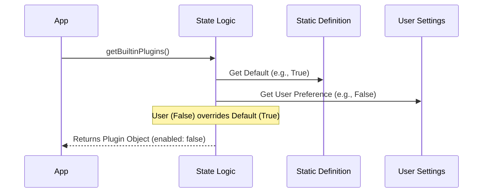

# Chapter 3: Runtime Plugin State

Welcome to the third chapter of the **Plugins** project!

In the previous chapter, [Plugin Namespacing](02_plugin_namespacing.md), we learned how to give every plugin a unique ID (like `git-helper@builtin`) so we never confuse official features with community ones.

Now we face a new question: **Is the plugin actually running?**

## Motivation: The "Smart Switch" Problem

Imagine you have a lamp.
1.  **The Bulb (The Plugin):** It exists. It *can* produce light.
2.  **The Switch (The Setting):** You can flip it ON or OFF.

Just because you bought a bulb (registered a plugin) doesn't mean the room is lit. You need to know the state of the switch.

*   **The Problem:** Our code has a list of plugins. It also has a settings file where the user saves their preferences. These are two separate things.
*   **The Solution:** We need a logic layer that combines "What exists" with "What the user wants" to create a final **Runtime State**.

This chapter explains how we convert a static definition into a `LoadedPlugin`—an object that tells the system if a feature is ready to use.

### Core Use Case
We ship a `git-helper` plugin.
*   **Default:** It should be **ON** for most people.
*   **User Preference:** One specific user hates Git and turns it **OFF** in their settings.
*   **Goal:** When that specific user starts the app, the system must respect their choice and hide the Git tools.

## Key Concepts

To calculate this state, we look at three inputs:

1.  **Hard Availability (`isAvailable`):** Does the computer actually support this? (e.g., You can't use the `bluetooth` plugin if your computer has no Bluetooth chip).
2.  **User Settings:** Has the user explicitly said `true` or `false` in their config file?
3.  **Factory Defaults:** If the user hasn't said anything, what should we do?

## The `LoadedPlugin` Object

The result of this calculation is an interface called `LoadedPlugin`. This is the "live" version of the plugin used by the app.

Unlike the static definition (which just describes the code), the `LoadedPlugin` contains the **state**.

```typescript
// A simplified look at the result
interface LoadedPlugin {
  name: string
  source: string     // e.g., 'git-helper@builtin'
  enabled: boolean   // <--- The most important part!
  // ... other details
}
```

## Internal Implementation

How does the system calculate that `enabled` boolean? It acts like a logic gate.

### The Logic Flow

When the application asks "What plugins do I have?", the system runs a specific sequence:

1.  **Check Hardware:** If the plugin requires specific OS features and they are missing, stop. It's disabled.
2.  **Check Settings:** Look for the specific ID (e.g., `git-helper@builtin`) in the user's settings file.
3.  **Resolve:**
    *   If the user has a setting, **User wins**.
    *   If no setting exists, **Default wins**.



### Deep Dive: Code Breakdown

Let's look at the real logic inside `builtinPlugins.ts`. We will break the `getBuiltinPlugins` function into small pieces.

#### 1. Checking Hardware Availability
First, we check if the plugin is even allowed to run on this computer.

```typescript
// inside getBuiltinPlugins()...
for (const [name, definition] of BUILTIN_PLUGINS) {
  
  // If the plugin has a hardware check and fails it...
  if (definition.isAvailable && !definition.isAvailable()) {
    continue // Skip it entirely!
  }
  
  // ... proceed to settings check
}
```
*Explanation:* Some plugins might define an `isAvailable()` function. If this returns `false` (e.g., "This is a Windows plugin but you are on Mac"), we skip the plugin immediately.

#### 2. Fetching User Settings
We need to see what the user wants. We use a helper to get the persistent settings.

```typescript
import { getSettings_DEPRECATED } from '../utils/settings/settings.js'

// ... inside the loop
const settings = getSettings_DEPRECATED()

// Recall from Chapter 2: We use the unique ID!
const pluginId = `${name}@builtin` 

const userSetting = settings?.enabledPlugins?.[pluginId]
```
*Explanation:* We retrieve the value stored under the unique ID. `userSetting` will be `true`, `false`, or `undefined` (if the user has never touched the switch).

#### 3. The Decision Matrix (The "Smart Switch")
This is the core logic that resolves conflicts.

```typescript
// Logic: User preference > Plugin default > true
const isEnabled =
  userSetting !== undefined
    ? userSetting === true 
    : (definition.defaultEnabled ?? true)
```
*Explanation:*
1.  **Ternary Operator:** We ask, "Is `userSetting` defined?"
2.  **If Yes:** Use the user's setting exactly as is.
3.  **If No:** Fall back to the plugin's `defaultEnabled`.
4.  **Final Fallback:** If the plugin didn't specify a default, assume `true` (Enabled).

#### 4. Creating the Object
Finally, we bundle this decision into the `LoadedPlugin` object.

```typescript
const plugin: LoadedPlugin = {
  name,
  source: pluginId,
  enabled: isEnabled, // The result of our logic
  isBuiltin: true,
  // ... passing through hooks and skills
}
```

#### 5. Categorizing
The function returns two arrays so the UI knows how to display them.

```typescript
if (isEnabled) {
  enabled.push(plugin)
} else {
  disabled.push(plugin)
}

return { enabled, disabled }
```
*Explanation:* The UI receives `{ enabled: [...], disabled: [...] }`. It can now show active tools in green and inactive ones in gray.

## Summary

In this chapter, we learned:
1.  **Runtime State** is different from static code; it combines definitions with user preferences.
2.  **The `LoadedPlugin`** abstraction represents this final state.
3.  The logic hierarchy is: **Hardware Check > User Setting > Factory Default**.

At this point, we have a list of enabled plugins. These plugins contain "skills" (functions code can run). But the CLI doesn't speak "Skill"—it speaks "Command."

In the next chapter, we will see how we translate these raw skills into commands the CLI can execute.

[Next Chapter: Skill-to-Command Adaptation](04_skill_to_command_adaptation.md)

---

Generated by [Code IQ](https://github.com/adityasoni99/Code-IQ)