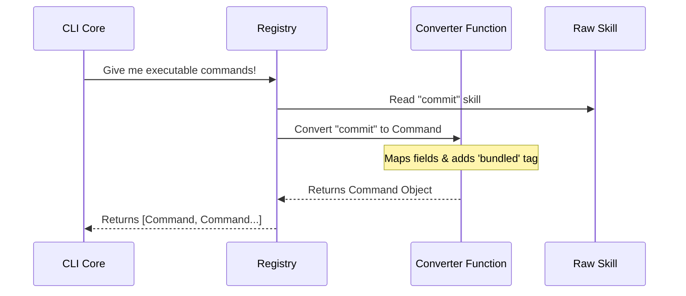

# Chapter 4: Skill-to-Command Adaptation

Welcome to the fourth chapter of the **Plugins** project!

In the previous chapter, [Runtime Plugin State](03_runtime_plugin_state.md), we learned how to determine which plugins are "Enabled" based on user settings. We ended up with a list of `LoadedPlugin` objects.

However, we have a compatibility problem. The core logic of our CLI was built to understand **Commands** (like `/help` or `/clear`). Our new plugins provide **Skills**.

How do we make the old system understand the new features?

## Motivation: The Universal Adapter

Imagine you are traveling to a different country.
*   **The Wall Socket (The CLI Core):** It only accepts one specific shape of plug (The `Command` interface).
*   **Your Device (The Plugin Skill):** It has a completely different plug shape (The `SkillDefinition`).

You cannot plug your device directly into the wall. You need a **Travel Adapter**.

This is exactly what **Skill-to-Command Adaptation** does. It takes the rich, specific metadata of a Plugin Skill and wraps it in a standard container that the CLI Core can understand and execute.

### Core Use Case
We have the `git-helper` plugin enabled. It has a skill called `commit`.
*   **Goal:** The user types `/commit`.
*   **Problem:** The command runner doesn't know what a "Git Skill" is. It only knows `Command`.
*   **Solution:** We convert the `commit` skill into a generic `Command` object so the system can run it.

## Key Concepts

To build this adapter, we need to map the concepts from one world to the other.

### 1. The Metadata Map
A **Skill** has specific AI-related fields: `allowedTools`, `model`, `context`.
A **Command** has generic execution fields: `executionFunction`, `name`, `description`.

Our adapter simply moves data from one bucket to the other.

### 2. The Identity Tag (`source: 'bundled'`)
This is a subtle but critical detail.
*   The Plugin itself is **Built-in**.
*   But the Command must be tagged as **Bundled**.

Why?
*   If we tag it `builtin`, the system treats it like `/help` or `/exit`—boring utilities that the AI shouldn't worry about.
*   By tagging it `bundled`, we tell the system: *"This is a smart AI feature that came with the app. Track it in analytics and let the AI model use it as a tool."*

## How to Use the Adapter

We don't run this manually. It happens automatically when the application gathers all available commands.

### The Transformation
Here is a high-level view of the input and output.

**Input (Raw Skill):**
```typescript
{
  name: 'commit',
  description: 'Generate a git commit message',
  allowedTools: ['git_diff'],
  model: 'gpt-4'
}
```

**Output (Adapted Command):**
```typescript
{
  name: 'commit',
  description: 'Generate a git commit message',
  type: 'prompt',
  source: 'bundled', // <--- The important tag
  // ... hidden implementation details
}
```

## Internal Implementation

Let's look at how the code performs this translation.

### The Flow
1.  The system asks for all commands from enabled plugins.
2.  The registry loops through the plugins.
3.  For every skill found, it runs the `skillDefinitionToCommand` function.
4.  The resulting list is handed to the CLI core.



### Deep Dive: Code Breakdown

The magic happens in `builtinPlugins.ts` inside a helper function.

#### 1. The Function Signature
We take a `BundledSkillDefinition` (the plugin way) and return a `Command` (the core way).

```typescript
// builtinPlugins.ts

function skillDefinitionToCommand(definition: BundledSkillDefinition): Command {
  return {
    type: 'prompt', // Skills are usually prompts
    name: definition.name,
    description: definition.description,
    // ... more mapping below
  }
}
```
*Explanation:* We start creating the object. We map the name and description directly.

#### 2. Mapping AI Capabilities
Skills define what tools they need (like reading files or running git). We pass this through.

```typescript
    // ... inside the object ...
    allowedTools: definition.allowedTools ?? [],
    argumentHint: definition.argumentHint,
    model: definition.model,
    context: definition.context,
    // ...
```
*Explanation:* The CLI core doesn't "execute" these itself, but it passes them to the AI Agent when the command runs.

#### 3. The 'Bundled' Source Tag
This is the logic we discussed in the "Key Concepts" section.

```typescript
    // ... inside the object ...
    
    // Crucial: We mark this as 'bundled' so it appears in tool lists
    // and analytics, unlike generic 'builtin' slash commands.
    source: 'bundled', 
    loadedFrom: 'bundled',
    
    // ...
```
*Explanation:* This ensures that even though the code is pre-installed, the system treats it as a "Smart Feature" rather than a "System Utility."

#### 4. Handling Visibility and State
Finally, we map the logic that determines if the command is usable.

```typescript
    // ... inside the object ...
    
    // Is the user actually allowed to type this?
    userInvocable: definition.userInvocable ?? true,
    
    // Pass the isEnabled check function through
    isEnabled: definition.isEnabled ?? (() => true),
    
    getPromptForCommand: definition.getPromptForCommand,
  }
}
```
*Explanation:* We preserve the `isEnabled` logic. If the plugin is disabled in settings (as discussed in Chapter 3), this command object will respect that.

## Summary

In this chapter, we learned:
1.  **The Compatibility Problem:** The Core speaks "Commands," but Plugins speak "Skills."
2.  **The Adapter Pattern:** We wrap skills in a `Command` object to make them compatible.
3.  **The `bundled` Tag:** We label these commands as `source: 'bundled'` to ensure they are treated as first-class AI features, not just system utilities.

We now have the parts:
1.  A Registry (Chapter 1)
2.  Namespacing (Chapter 2)
3.  State Management (Chapter 3)
4.  Command Adaptation (Chapter 4)

In the final chapter, we will see how to wire all these pieces together during the application startup.

[Next Chapter: Initialization Scaffolding](05_initialization_scaffolding.md)

---

Generated by [Code IQ](https://github.com/adityasoni99/Code-IQ)