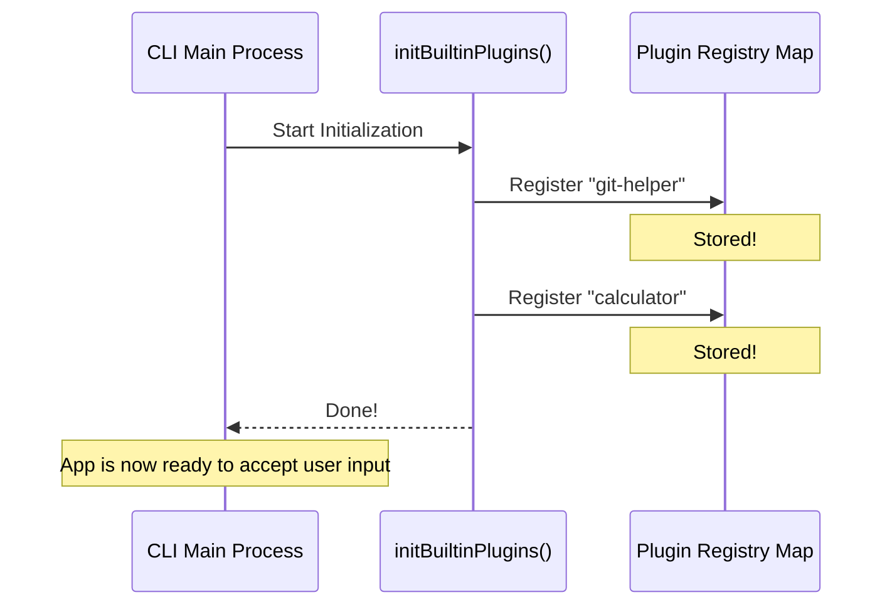

# Chapter 5: Initialization Scaffolding

Welcome to the final chapter of the **Plugins** project!

In the previous chapter, [Skill-to-Command Adaptation](04_skill_to_command_adaptation.md), we created a universal adapter that translates our fancy Plugin Skills into standard Commands the CLI can understand.

We now have all the pieces:
1.  **The Registry:** A place to store definitions.
2.  **The ID System:** A way to name them uniquely.
3.  **The State Logic:** A way to check if they are on or off.
4.  **The Adapter:** A way to run them.

But there is one final problem: **Who pushes the start button?**

## Motivation: The Unassembled Furniture

Imagine you bought a beautiful bookshelf from a furniture store.
*   **The Parts (The Definitions):** You have the wood, the screws, and the shelves.
*   **The Manual (The Logic):** You know how it *should* fit together.

However, if you just leave the box in your living room, you don't have a bookshelf. You have a box. You need an **Assembly Step**—a specific moment where you take the parts out of the box and put them together.

*   **The Problem:** The CLI starts up blank. Even though we wrote code for a "Git Helper" plugin, the system doesn't automatically know it exists.
*   **The Solution:** We need a dedicated entry point—a "manufacturing assembly line"—that runs exactly once when the app boots up. Its only job is to unbox our features and click them into the main system.

This concept is called **Initialization Scaffolding**.

### Core Use Case
We want the `git-helper` plugin to be available the moment the user opens the CLI. We need a specific function where we write the line of code that says: *"System, please load the Git Helper now."*

## Key Concepts

This step is intentionally simple. It acts as a bridge between your static code files and the running application.

### The Bootstrapping Function
We define a single function, usually named `initBuiltinPlugins`.
*   **When it runs:** Immediately when the application starts.
*   **What it does:** It imports plugin definitions and hands them to the Registry we built in [Built-in Plugin Registry](01_built_in_plugin_registry.md).

## How to Use the Scaffolding

Let's say you have defined a new plugin in a file called `gitPlugin.ts`. Now you need to "wire it up."

### 1. Import the Tools
First, we need the tool to register plugins, and the plugin definition itself.

```typescript
// src/bundled/index.ts
import { registerBuiltinPlugin } from '../builtinPlugins.js'
import { gitPluginDefinition } from '../skills/gitPlugin.js'
```

### 2. The Assembly Line
Inside our scaffolding function, we simply call the register function.

```typescript
export function initBuiltinPlugins(): void {
  // The application calls this once at startup.
  
  // 1. Load the Git plugin
  registerBuiltinPlugin(gitPluginDefinition)

  // 2. Load the Calculator plugin
  registerBuiltinPlugin(calculatorDefinition)
}
```
*Explanation:* This is the "Switchboard." If you want to add a new built-in feature, you add one line here. If you want to remove it, you delete the line. The rest of the application doesn't need to change.

## Internal Implementation

What happens when the user types `my-cli start`? Let's visualize the sequence.

### The Startup Flow

1.  **App Launch:** The main process begins.
2.  **Scaffolding Call:** The main process calls `initBuiltinPlugins()`.
3.  **Registration:** The function loops through every line of code we wrote above.
4.  **Storage:** The definitions are stored in the global `Map` (from Chapter 1).
5.  **Ready:** The app continues loading, now aware that these plugins exist.



### Deep Dive: Code Breakdown

Let's look at the actual file `src/bundled/index.ts`. Currently, it acts as a placeholder waiting for you to add features.

#### The File Structure
This file is the designated "Home" for built-in plugins.

```typescript
// src/bundled/index.ts

/**
 * Built-in Plugin Initialization
 * Initializes plugins that ship with the CLI.
 */

// This is the function exported to the main app
export function initBuiltinPlugins(): void {
  // Currently empty! 
  // This is where we will migrate hardcoded skills later.
}
```
*Explanation:* Right now, it does nothing. This is intentional. It is **Scaffolding**—a structure put in place *before* the building is built. As developers migrate old, hardcoded features into this new system, they will add lines here.

#### Why "Bundled" vs "Built-in"?
You might notice the folder is named `bundled`, but the function talks about `BuiltinPlugins`.

*   **Bundled:** Means "Included in the download."
*   **Built-in:** Means "Visible in the Plugin Manager."

Not every piece of code shipped with the app needs to be a "Plugin." Some things are just core system utilities. We only use this `initBuiltinPlugins` function for features we want the user to see, manage, and toggle on/off in their settings.

## Summary

In this final chapter, we learned:
1.  **Initialization Scaffolding** is the "main entry point" for plugins.
2.  It separates the **definition** of a feature from the **act of loading** it.
3.  It serves as a clean list of exactly which "factory settings" are installed.

### Project Wrap-Up

Congratulations! You have walked through the entire architecture of a modular Plugin System.

Let's review what we built:
1.  **[Built-in Plugin Registry](01_built_in_plugin_registry.md):** The storage warehouse (`Map`) for our features.
2.  **[Plugin Namespacing](02_plugin_namespacing.md):** The naming convention (`@builtin`) that keeps them safe from conflicts.
3.  **[Runtime Plugin State](03_runtime_plugin_state.md):** The logic ("Smart Switch") that respects user settings.
4.  **[Skill-to-Command Adaptation](04_skill_to_command_adaptation.md):** The translator that makes plugins compatible with the core CLI.
5.  **Initialization Scaffolding:** The assembly line that wires it all together at startup.

You now have a system that is modular, user-configurable, and ready to scale. Happy coding!

---

Generated by [Code IQ](https://github.com/adityasoni99/Code-IQ)