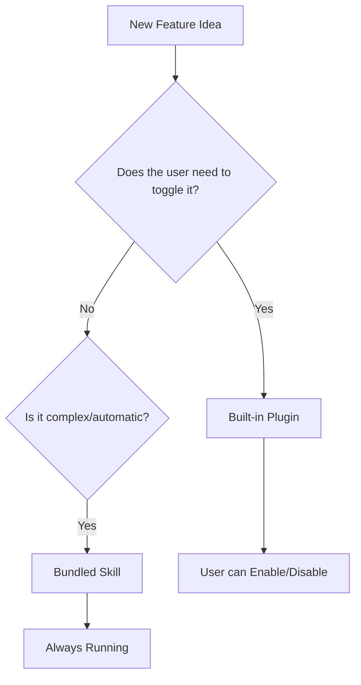
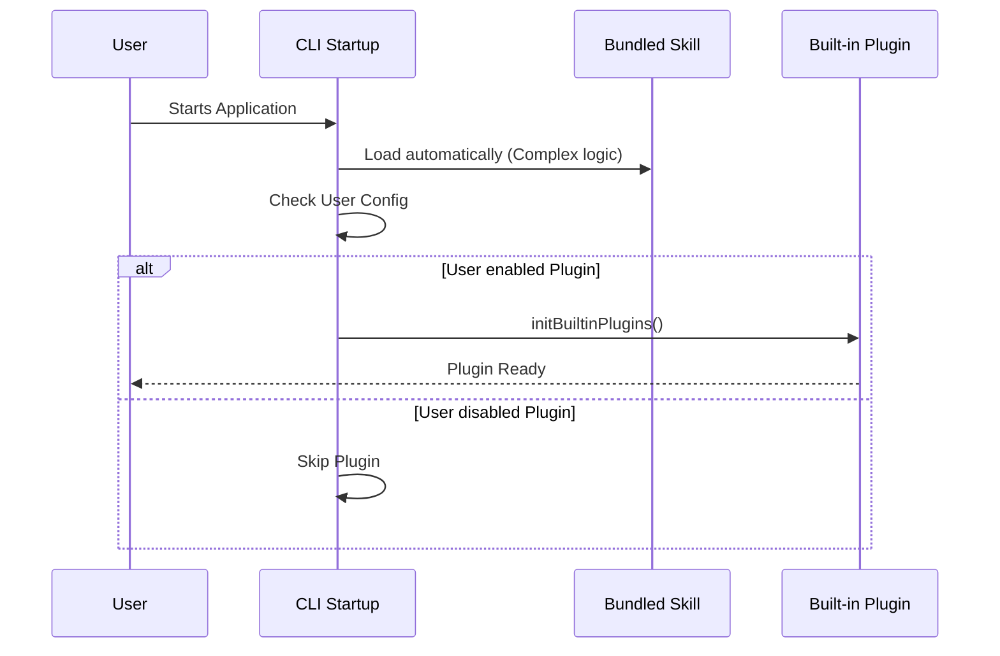

# Chapter 1: Feature Segregation Strategy

Welcome to the **bundled** project! If you are new here, you might be wondering: *"I have a great idea for a new feature, but where do I put the code?"*

This chapter introduces the **Feature Segregation Strategy**. This is a fancy name for a simple decision-making process: deciding if your code should be a "Built-in Plugin" or a "Bundled Skill."

## The Core Problem: The Smartphone Analogy

Imagine you are designing a smartphone. You have two types of software to include:

1.  **Cellular Connection Logic:** This is complex, runs deep in the system, and works automatically. You wouldn't want the user to accidentally delete this.
2.  **Calculator App:** This is simple, optional, and the user can choose to hide it or turn it off if they have a different calculator they prefer.

In our project `bundled`, we face the same choice.

*   **Bundled Skills** are like the cellular connection (Automatic, Complex).
*   **Built-in Plugins** are like the calculator app (Optional, User-Toggleable).

### Use Case: Adding a "Hello World" Feature

Let's say you want to add a feature that prints "Hello World" when the CLI starts.

*   **Approach A:** If this is vital system logic that *must* run for the CLI to work, it is a **Bundled Skill**.
*   **Approach B:** If this is a nice-to-have feature that users might want to disable via a settings menu, it is a **Built-in Plugin**.

## Key Concepts

Let's break down the two categories defined in this strategy.

### 1. Bundled Skills (The Foundation)
These are features with complex setups or logic that must be automatically enabled. An example is `claude-in-chrome`. These live in `src/skills/bundled/`.

*   **Pros:** Powerful, always on.
*   **Cons:** Harder for users to configure or disable.

### 2. Built-in Plugins (The Optional Add-ons)
These are features that ship with the CLI but appear in the `/plugin` UI. Users can explicitly enable or disable them. These are initialized in `index.ts`.

*   **Pros:** Great user control, modular.
*   **Cons:** Should be kept relatively simple.



## How to Apply the Strategy

When you look at the codebase, this strategy tells you exactly where to look.

If you are working with **Built-in Plugins**, you will primarily interact with the initialization logic.

### The Initialization Code
The file `index.ts` acts as the traffic controller for these plugins. Here is the relevant part of the code that enforces this strategy:

```typescript
// --- File: index.ts ---

/**
 * Initialize built-in plugins. Called during CLI startup.
 */
export function initBuiltinPlugins(): void {
  // No built-in plugins registered yet.
  // This function is the entry point for optional features.
}
```
*Explanation:* Currently, the function is empty. This is intentional! It is a placeholder (scaffolding) waiting for you to add the first toggleable plugin.

## Under the Hood: The Startup Sequence

How does the system know what to load? Let's look at the flow without code first.

1.  **System Start:** The CLI wakes up.
2.  **Load Skills:** It immediately loads all **Bundled Skills** because they are essential.
3.  **Check Configuration:** It looks at the [User-Controlled Configuration](02_user_controlled_configuration.md) to see what the user prefers.
4.  **Load Plugins:** Based on user preferences, it calls `initBuiltinPlugins` to load only the specific **Built-in Plugins** requested.

### Visualizing the Flow



### Implementation Details

The comments in the code specifically guide this architecture. Let's look at the documentation provided right inside `index.ts`.

```typescript
/**
 * Not all bundled features should be built-in plugins.
 * Use this for features that users should be able to explicitly enable/disable.
 *
 * For features with complex setup or automatic-enabling logic 
 * (e.g. claude-in-chrome), use src/skills/bundled/ instead.
 */
```

*Explanation:* This comment is the "rulebook." It explicitly tells developers not to put everything in one basket. It forces the separation between the "Phone OS" (bundled skills) and the "Apps" (plugins).

## Summary

In this chapter, we learned:

1.  **Feature Segregation** is about choosing between "Always On" (Skills) and "User Optional" (Plugins).
2.  **Bundled Skills** are for complex, automatic logic.
3.  **Built-in Plugins** are for simple, toggleable features.

This distinction is crucial because it affects how we handle user settings. If a feature is a **Built-in Plugin**, we need a way for the user to say "Yes" or "No" to it.

In the next chapter, we will learn exactly how the system handles those "Yes/No" choices.

[Next Chapter: User-Controlled Configuration](02_user_controlled_configuration.md)

---

Generated by [Code IQ](https://github.com/adityasoni99/Code-IQ)