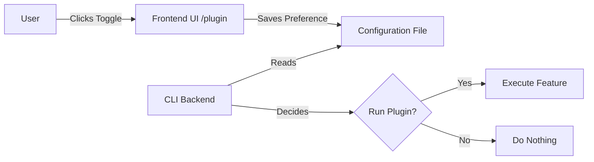
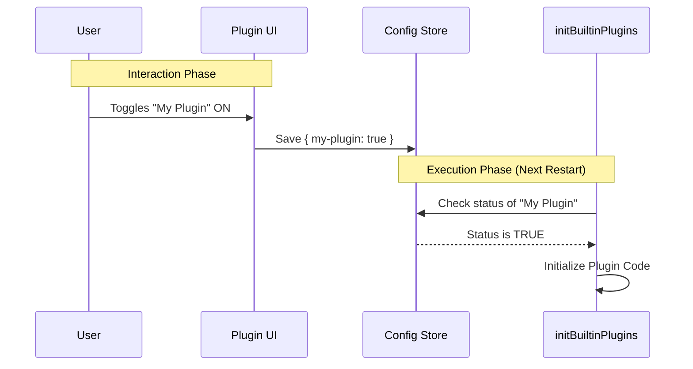

# Chapter 2: User-Controlled Configuration

Welcome back! In the previous chapter, [Feature Segregation Strategy](01_feature_segregation_strategy.md), we learned that we should separate our code into two buckets: "Must-Have" (Bundled Skills) and "Nice-to-Have" (Built-in Plugins).

Now, we face a new question: **How does the user actually turn those "Nice-to-Have" features on or off?**

This chapter introduces **User-Controlled Configuration**. This is the bridge that connects your code logic to the visual `/plugin` interface where users make choices.

## The Motivation: The Video Game Analogy

Imagine you are playing a video game.

1.  **The Game Engine:** This runs physics and graphics. You cannot turn this off; otherwise, the game won't work. This is like our **Bundled Skills**.
2.  **The Settings Menu:** Here, you can toggle "Subtitles," change "Volume," or enable "Colorblind Mode." These are choices. This is our **User-Controlled Configuration**.

### Use Case: The "Dark Mode" Toggle

Let's imagine we want to add a "Dark Mode" plugin to our CLI.
*   **Without Configuration:** We write the code, ship it, and *everyone* is forced to use Dark Mode. Users who like light mode will be unhappy.
*   **With Configuration:** We write the code, but we wrap it in a logic check: "Did the user turn this on?"

This chapter explains how the system checks for that permission.

## Key Concepts

To understand User-Controlled Configuration, we need to understand the relationship between the Backend (the logic) and the Frontend (the UI).

### 1. The Interface (The Frontend)
The project includes a `/plugin` page. This is a visual menu. It lists all available plugins with simple checkboxes or toggle switches.

### 2. The Gatekeeper (The Backend)
The backend code needs a specific place to look up these settings. Before running a plugin, the code asks: *"Is the switch on the /plugin page turned to ON?"*



## Implementation Scaffolding

In our codebase, the implementation of this concept is centralized in `index.ts`. This file acts as the "Settings Menu Manager."

Currently, the manager is empty (scaffolding). It is waiting for us to define what settings are available.

### The Entry Point

Let's look at the `initBuiltinPlugins` function. This is where the User-Controlled Configuration logic lives.

```typescript
// --- File: index.ts ---

/**
 * Initialize built-in plugins. Called during CLI startup.
 */
export function initBuiltinPlugins(): void {
  // No built-in plugins registered yet.
  // This is where the system checks user config before loading.
}
```

*Explanation:* Even though this function is empty right now, its purpose is to be the **Gatekeeper**. When we add code here later, we will be telling the system: *"Only run this code if the user explicitly asked for it."*

### Why is it empty?
This is a common pattern in software called **Scaffolding**. We have built the structure (the function), but we haven't moved the furniture in yet (the actual plugins). This prepares the project for migration.

## Under the Hood: The Configuration Lifecycle

How does the configuration actually travel from the user's mouse click to the code?

### Step-by-Step Walkthrough

1.  **Registration:** The code tells the system, "I have a plugin named 'Dark Mode'."
2.  **Display:** The `/plugin` UI sees this name and draws a toggle switch.
3.  **Action:** The user clicks the switch to "ON."
4.  **Storage:** The system saves `{ "dark-mode": true }` to a hidden config file.
5.  **Startup:** Next time the CLI starts, `initBuiltinPlugins` reads that file. It sees `true` and turns on the lights.

### Sequence Diagram

Here is how the participants interact:



## Applying the Concept

When you are ready to use this in practice (which we will do in the next chapter), you will follow a specific pattern.

### The pattern we aim for:

We want to move from "Hardcoded" to "Configurable."

**Bad Approach (Hardcoded):**
```typescript
// Bad: Runs for everyone, no choice.
console.log("Starting Dark Mode...");
startDarkMode();
```

**Good Approach (User-Controlled):**
```typescript
// Good: Uses the concept of User-Controlled Config
export function initBuiltinPlugins(): void {
   // We will learn how to write this registration logic
   // in Chapter 4. For now, understand the INTENT:
   
   // if (userConfig.isEnabled('dark-mode')) {
   //    startDarkMode();
   // }
}
```

By using the structure provided in `initBuiltinPlugins`, you ensure your feature respects the user's choice.

## Summary

In this chapter, we learned:

1.  **User-Controlled Configuration** acts like a video game settings menu.
2.  It bridges the gap between the **Frontend UI** and the **Backend CLI**.
3.  The file `index.ts` contains the scaffolding (`initBuiltinPlugins`) meant to handle these checks.
4.  Features here are **optional** by definition.

Now that we understand *where* the logic goes and *why* we need it, it is time to write some actual code. In the next chapter, we will fill in that empty function.

[Next Chapter: Built-in Plugin Initialization](03_built_in_plugin_initialization.md)

---

Generated by [Code IQ](https://github.com/adityasoni99/Code-IQ)