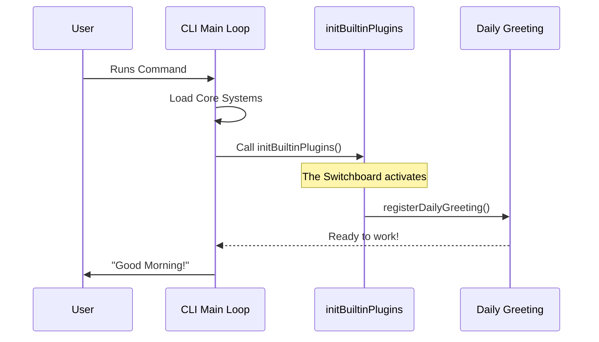

# Chapter 3: Built-in Plugin Initialization

Welcome back! In the previous chapter, [User-Controlled Configuration](02_user_controlled_configuration.md), we learned that users should be able to toggle "nice-to-have" features on and off, just like settings in a video game.

Now, we need to answer the question: **When does the system actually check those settings and turn the features on?**

This chapter covers **Built-in Plugin Initialization**. This is the specific moment in time—and the specific function in the code—where the application "wakes up" its optional tools.

## The Motivation: The Car Dashboard Analogy

Think of the CLI application like starting a modern car.

1.  **The Engine (Bundled Skills):** When you turn the key, the engine *must* start. You don't have a choice here.
2.  **The Dashboard (Built-in Plugins):** As the engine starts, the dashboard computer wakes up. It checks:
    *   *"Did the driver leave the automatic headlights on?"* -> If yes, turn them on.
    *   *"Is the traction control enabled?"* -> If yes, activate the sensor.

**The Problem:** Without a centralized startup sequence, features might try to run before the system is ready, or they might run even when the user wanted them off.

**The Solution:** We create a single function, `initBuiltinPlugins`. This acts as our "Dashboard Check." It is the **Switchboard** that goes down the list of optional tools and initializes them properly.

### Use Case: The "Daily Greeting"

Imagine we have a simple feature called "Daily Greeting" that says "Good Morning!" when the CLI starts. We only want this to run if the user hasn't disabled it.

We need a central place to plug in the logic that says: *"System is starting... load the Daily Greeting now."*

## Key Concepts

To understand initialization, we need to understand the "Bootstrapping" concept.

### 1. The Bootstrap (The Starter)
"Bootstrapping" is a fancy programming term for "pulling yourself up by your bootstraps." It refers to the startup sequence of an application. `initBuiltinPlugins` is the bootstrapping function for optional features.

### 2. The Switchboard (Centralized Control)
Instead of having code scattered all over the project, we bring all our optional plugins to this one function. It acts like a power strip. You plug everything into this one strip, and when you flip the switch, everything connected gets power.

## How to Use This Abstraction

In our project, the file `index.ts` is our switchboard.

Let's look at how we would use this to solve our "Daily Greeting" use case.

**Step 1: The Import**
First, we tell the file where our plugin lives.

```typescript
// inside index.ts
import { registerDailyGreeting } from './plugins/dailyGreeting';
```
*Explanation:* We import the registration logic for our specific feature.

**Step 2: The Initialization**
Then, we call that function inside our central initialization block.

```typescript
export function initBuiltinPlugins(): void {
  // We plug our feature into the switchboard here
  registerDailyGreeting();
}
```
*Explanation:* When the CLI starts, it calls `initBuiltinPlugins`. This function then calls `registerDailyGreeting`. The feature is now live!

## Under the Hood: The Startup Sequence

What happens when you actually run the command `bundled` in your terminal? Let's trace the steps.

1.  **User enters command:** The operating system starts the Node.js process.
2.  **Core System Loads:** The essential files (Bundled Skills) are loaded.
3.  **Bootstrap Call:** The system explicitly calls `initBuiltinPlugins()`.
4.  **Plugin Registration:** The function runs down its list and registers every plugin we added.

### Visualizing the Flow

Here is a sequence diagram showing how the CLI wakes up the plugins.



### Implementation Details

Let's look at the actual code provided in the project. You will find this in `index.ts`.

```typescript
// --- File: index.ts ---

/**
 * Initialize built-in plugins. Called during CLI startup.
 */
export function initBuiltinPlugins(): void {
  // No built-in plugins registered yet.
  // This is where you add your calls!
}
```

*Explanation:* 
*   **`export function`**: This means other parts of the system can see and use this function.
*   **`void`**: This function doesn't return a value (like a number or string). It just performs actions (side effects).
*   **The Empty Body**: Currently, it does nothing. This is intentional! It is a placeholder waiting for you to add your first plugin.

### Why separate this from the rest of the code?

You might wonder, *"Why not just put the Daily Greeting code right here inside this function?"*

If we put the actual logic (the code that prints "Good Morning") inside `index.ts`, this file would become thousands of lines long as we add more features.

By using `initBuiltinPlugins` only as a **Switchboard**, we keep the file clean. It simply delegates the work to the specific plugin files.

1.  `initBuiltinPlugins` calls -> `registerDailyGreeting`
2.  `initBuiltinPlugins` calls -> `registerCalculator`
3.  `initBuiltinPlugins` calls -> `registerWeatherWidget`

It is a tidy list of what is installed, similar to a Table of Contents.

## Summary

In this chapter, we learned:

1.  **Initialization** is the specific moment the application loads its optional tools.
2.  `initBuiltinPlugins` acts as a **Switchboard** or dashboard check.
3.  We do not write feature logic here; we only **call** the registration functions for other features.

Now we have the strategy (Chapter 1), the configuration concept (Chapter 2), and the initialization location (Chapter 3).

The final piece of the puzzle is the plugin code itself. How do we write that `registerDailyGreeting` function we imagined earlier?

[Next Chapter: Plugin Registration Pattern](04_plugin_registration_pattern.md)

---

Generated by [Code IQ](https://github.com/adityasoni99/Code-IQ)