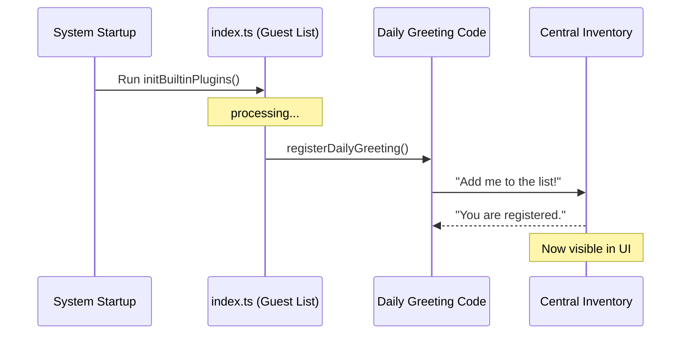

# Chapter 4: Plugin Registration Pattern

Welcome back! In the previous chapter, [Built-in Plugin Initialization](03_built_in_plugin_initialization.md), we discovered the "Switchboard"—a specific function called `initBuiltinPlugins` where the application wakes up its optional features.

Now, we need to learn exactly **how** to plug a feature into that switchboard.

This chapter covers the **Plugin Registration Pattern**. This is the standard way we tell the system: *"I have written a new feature, and I want you to acknowledge it."*

## The Core Problem: The Guest List Analogy

Imagine you are hosting an exclusive party (the CLI application). You hire a security guard (the System) to manage the door.

You have a friend named "Daily Greeting" (your new plugin code). Even if "Daily Greeting" shows up at the door dressed nicely, the security guard will **not** let them in unless their name is explicitly written on the **Guest List**.

In our project:
*   **The Party:** The running application.
*   **The Friend:** The code you wrote in a separate file.
*   **The Guest List:** The `initBuiltinPlugins` function in `index.ts`.

If you write the code but forget to register it, the system simply ignores it. It won't appear in the user's settings, and it won't run.

## Use Case: Registering "Daily Greeting"

Let's assume you have already written the logic for a "Daily Greeting" plugin in a file named `dailyGreeting.ts`. Now, we need to add it to the guest list so it appears in the `/plugin` menu.

## Key Concepts

To follow this pattern, we perform two simple steps.

### 1. The Import (The Introduction)
First, we need to tell the `index.ts` file where the plugin code lives. This is like introducing your friend to the host.

### 2. The Invocation (The Signature)
Second, we must call the registration function. This is the act of actually writing the name on the list.

## How to Apply the Pattern

We work inside `index.ts`. Here is how we transform the empty scaffolding into a working registry.

### Step 1: Import the Registration Function

At the very top of `index.ts`, we import the specific function from our plugin file.

```typescript
// --- File: index.ts ---

// 1. We import the specific "register" function from the plugin file
import { registerDailyGreeting } from './plugins/dailyGreeting';
```
*Explanation:* We are telling the system, *"Go look in the `plugins/dailyGreeting` file and find the function named `registerDailyGreeting`."*

### Step 2: Invoke inside the Initialization Block

Now, we go to our "Switchboard" function and call the function we just imported.

```typescript
// --- File: index.ts ---

export function initBuiltinPlugins(): void {
  // 2. We explicitly call the function to "sign the guest list"
  registerDailyGreeting();
}
```
*Explanation:* By adding `registerDailyGreeting();`, we execute the code that adds the plugin to the system's internal inventory.

### The Result

Once these two small lines of code are added:
1.  **Inventory:** The system knows "Daily Greeting" exists.
2.  **UI:** The user will see a "Daily Greeting" toggle on the `/plugin` page.
3.  **Logic:** The code acts based on the [User-Controlled Configuration](02_user_controlled_configuration.md).

## Under the Hood: The Registration Flow

What actually happens when that line of code runs?

### The "Bouncer" Walkthrough

1.  **Startup:** The CLI starts running.
2.  **Bootstrap:** It calls `initBuiltinPlugins()`.
3.  **Execution:** The line `registerDailyGreeting()` is hit.
4.  **Handover:** The system jumps to your plugin file, grabs the plugin's name and settings, and stores them in a central "Registry" array.
5.  **Display:** When the user opens the settings menu, the UI loops through that Registry array to draw the checkboxes.

### Visualizing the Sequence



### Why do we do it this way?

You might ask: *"Why can't the system just automatically find all files in the folder?"*

We use this **Explicit Registration Pattern** for safety and control:

1.  **Control:** We can temporarily disable a broken plugin by simply commenting out one line in `index.ts`.
2.  **Order:** We can control the order in which plugins load by changing the order of the lines.
3.  **Clarity:** A developer can open `index.ts` and see exactly what features are active in the build, just by reading the list.

## Implementation Deep Dive

Let's look at a simplified version of what that `register` function usually looks like inside the plugin file. You don't need to write this yet, but it helps to understand what you are calling.

```typescript
// --- Inside the plugin file (e.g., dailyGreeting.ts) ---

export function registerDailyGreeting() {
  // This is the function we imported and called!
  registerBuiltinPlugin({
    id: 'daily-greeting',
    name: 'Daily Greeting',
    enabled: false // Default state
  });
}
```

*Explanation:*
*   We export a specific function (`registerDailyGreeting`).
*   Inside, it talks to the core system (`registerBuiltinPlugin`) to hand over its ID and Name.
*   This confirms that `index.ts` is just the *coordinator*, while the plugin file defines the *details*.

## Summary

In this chapter, we learned:

1.  **The Guest List:** If a plugin isn't registered in `index.ts`, the system ignores it.
2.  **The Pattern:**
    *   **Import** the register function.
    *   **Call** the register function inside `initBuiltinPlugins`.
3.  **The Benefit:** This creates a centralized, controlled inventory of all user-facing extensions.

We have now covered the Strategy (Chapter 1), the Configuration (Chapter 2), the Location (Chapter 3), and the Pattern (Chapter 4).

You are now ready to start moving code! In the final chapter, we will discuss how to safely move existing features into this new structure.

[Next Chapter: Migration Scaffolding](05_migration_scaffolding.md)

---

Generated by [Code IQ](https://github.com/adityasoni99/Code-IQ)