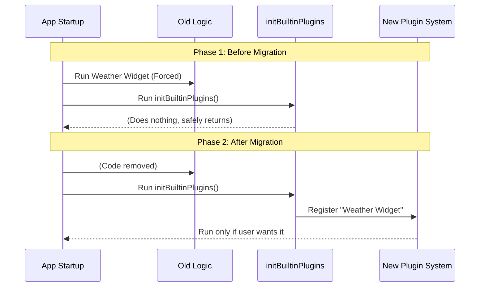

# Chapter 5: Migration Scaffolding

Welcome to the final chapter of our tutorial series!

In the previous chapter, [Plugin Registration Pattern](04_plugin_registration_pattern.md), we learned the specific code syntax needed to add a new plugin to the guest list.

Now, we face the final logical puzzle: **Migration.**

The project `bundled` is currently in a transition phase. We have many old features that run automatically, but we want to move them into our new "User-Controlled" system.

This chapter explains **Migration Scaffolding**. This is the structural preparation in the code that allows us to safely move features one by one without breaking the whole application.

## The Motivation: The Renovation Analogy

Imagine you are renovating a historic building.

1.  **The Old Structure:** The building stands, but the wiring is old and hardwired into the walls (Bundled Skills).
2.  **The Goal:** You want to install modern smart-home switches (Built-in Plugins).
3.  **The Scaffolding:** You put up a temporary wooden framework around the building. This marks the "Work Zone."

In our code, the file `index.ts` is that **Scaffolding**. It is intentionally empty right now. It marks the designated space where we will move features.

### Use Case: The "Weather Widget" Migration

Imagine we have an old feature called "Weather Widget." currently, it runs *every* time the CLI starts. Users are complaining.

**Our Goal:** Move "Weather Widget" from the automatic list to the optional list.
**The Tool:** The Migration Scaffolding inside `index.ts`.

## Key Concepts

To understand this concept, we need to look at code not just as instructions, but as a "Place."

### 1. The Placeholder (The Empty Space)
In programming, an empty function is often a signal. It says: *"Reserve this spot. Future logic goes here."* By having `initBuiltinPlugins` exist (even if empty), we ensure the rest of the app can call it safely without crashing.

### 2. The Bridge (The Transition)
Migration Scaffolding acts as a bridge. On one side, you have the messy old code. On the other side, you have the clean new system. The scaffolding is where we do the work of connecting them.

## How to Use the Scaffolding

The scaffolding is designed to guide your workflow. It tells you exactly where to put code during a refactor.

### Step 1: Locate the Empty Framework
Open `index.ts`. You will see it is mostly comments. These comments are the "Blueprints" attached to the scaffolding.

```typescript
// --- File: index.ts ---

/**
 * Initialize built-in plugins. Called during CLI startup.
 */
export function initBuiltinPlugins(): void {
  // No built-in plugins registered yet.
  // This is the scaffolding for migrating bundled skills.
}
```
*Explanation:* The code literally tells you: "This is the scaffolding." It is safe to touch this.

### Step 2: The Migration Action
When you decide to migrate the "Weather Widget," you don't rewrite the whole app. You simply "plug it in" to this scaffolding.

**Before Migration (Hardcoded elsewhere):**
```typescript
// Somewhere deep in the system...
startWeatherWidget(); // Runs automatically :(
```

**After Migration (In the Scaffolding):**
```typescript
// Inside index.ts
export function initBuiltinPlugins(): void {
  // We moved it here! Now it is user-controlled.
  registerWeatherWidget(); 
}
```

## Under the Hood: The Safety Net

Why do we call it "Scaffolding" and not just "The Plugin File"? Because it protects the app during the transition.

If we didn't have this function defined (even if empty), the application startup would fail because it would try to call a function that doesn't exist.

### Visualizing the Transition

Here is how the system handles the migration process safely.



### Implementation Details

Let's look at the comments provided in the scaffolding file. In professional software development, comments often explain the *architecture* (the plan), not just the code.

```typescript
// --- File: index.ts ---

/**
 * Not all bundled features should be built-in plugins.
 * ...
 * To add a new built-in plugin:
 * 1. Import registerBuiltinPlugin from '../builtinPlugins.js'
 * 2. Call registerBuiltinPlugin() with the plugin definition here
 */
```

*Explanation:*
1.  **Guidance:** The scaffolding includes instructions on *what* belongs here (see [Feature Segregation Strategy](01_feature_segregation_strategy.md)).
2.  **Instructions:** It lists the exact steps (1 and 2) needed to hook into the system.

This ensures that any developer—even a beginner—who opens this file knows exactly how to participate in the renovation.

## Why is this "Beginner Friendly"?

Migration Scaffolding is a safety feature for **you**.

*   **You can't break the startup:** Because the function already exists and is wired up to the main application, you don't need to touch the complex core files.
*   **You have a designated workspace:** You don't have to guess where to put your new code. `index.ts` is the labeled box for "New Optional Features."

## Conclusion

Congratulations! You have completed the tutorial series for the `bundled` project.

Let's recap what we have built together:

1.  **[Feature Segregation Strategy](01_feature_segregation_strategy.md):** We learned how to decide *what* needs to be optional.
2.  **[User-Controlled Configuration](02_user_controlled_configuration.md):** We learned *why* users need a toggle switch.
3.  **[Built-in Plugin Initialization](03_built_in_plugin_initialization.md):** We found the *location* where the system wakes up.
4.  **[Plugin Registration Pattern](04_plugin_registration_pattern.md):** We learned the *syntax* to sign the guest list.
5.  **Migration Scaffolding:** We learned that the current empty state of `index.ts` is a deliberate design to help us safely move features into the future.

You are now ready to contribute to `bundled`. The scaffolding is up, the blueprints are ready, and the tools are in your hands. Happy coding!

---

Generated by [Code IQ](https://github.com/adityasoni99/Code-IQ)