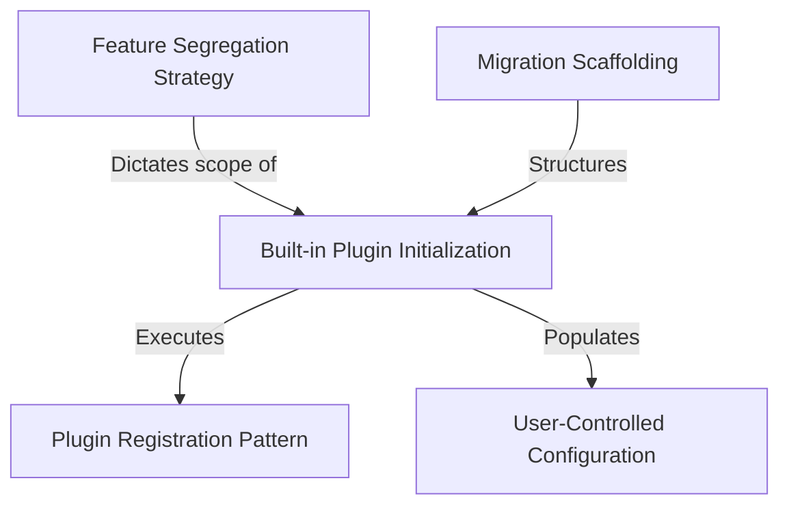

# Tutorial: bundled

This project establishes a **centralized framework** for managing the startup and organization of optional extensions within a CLI application. It creates a clear boundary between *automatic skills* and **user-toggleable plugins**, ensuring that features intended for user customization are correctly registered and exposed through a settings interface.

## Chapters

1. [Feature Segregation Strategy](01_feature_segregation_strategy.md)
2. [User-Controlled Configuration](02_user_controlled_configuration.md)
3. [Built-in Plugin Initialization](03_built_in_plugin_initialization.md)
4. [Plugin Registration Pattern](04_plugin_registration_pattern.md)
5. [Migration Scaffolding](05_migration_scaffolding.md)

---

Generated by [Code IQ](https://github.com/adityasoni99/Code-IQ)