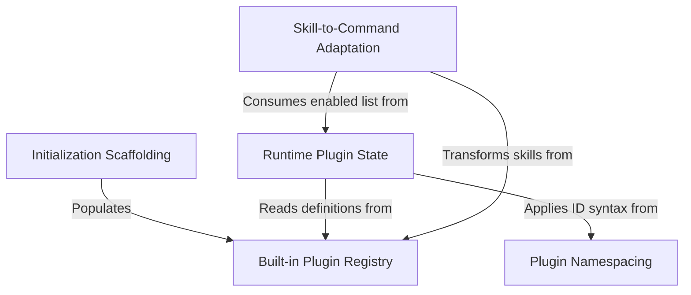

# Tutorial: plugins

This project manages **built-in plugins** that are compiled directly into the application code but function like modular extensions. It allows the system to *register*, *configure*, and *adapt* these internal features so users can toggle them on or off in their settings, distinguishing them from external marketplace downloads while ensuring they integrate smoothly with the core command system.

## Chapters

1. [Built-in Plugin Registry](01_built_in_plugin_registry.md)
2. [Plugin Namespacing](02_plugin_namespacing.md)
3. [Runtime Plugin State](03_runtime_plugin_state.md)
4. [Skill-to-Command Adaptation](04_skill_to_command_adaptation.md)
5. [Initialization Scaffolding](05_initialization_scaffolding.md)

---

Generated by [Code IQ](https://github.com/adityasoni99/Code-IQ)