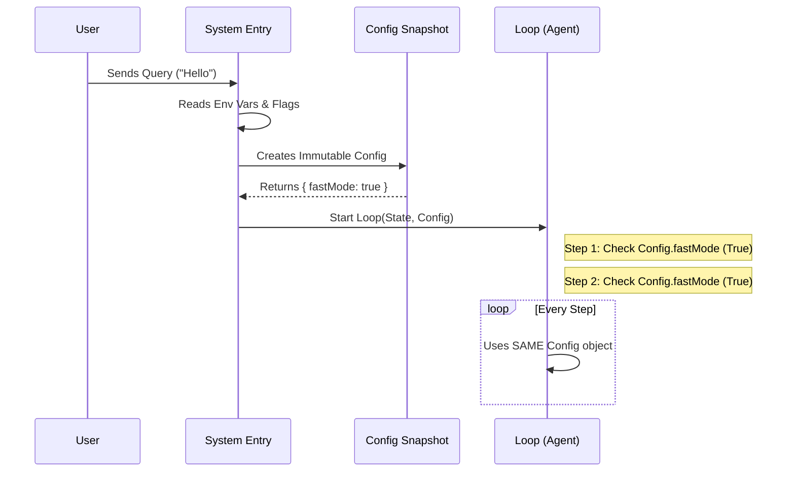

# Chapter 1: Immutable Query Configuration

Welcome to the **Query** project tutorial! In this series, we will build a robust system for managing AI agent interactions.

We start with the foundation: **consistency**.

## The Motivation: Why Snapshot?

Imagine you are playing a video game. You start a mission on "Easy Mode." Halfway through the level, someone secretly flips a switch on the console, and suddenly the game switches to "Hard Mode" while you are still playing. The enemies change behavior instantly, but your character is still geared for Easy Mode. Chaos ensues!

This happens in software too. An AI agent might start a task with one set of settings (like "Fast Mode" enabled), but if we read the settings directly from the environment every time the agent takes a step, a mid-run change could break the logic.

**The Solution:** We take a "Snapshot" of the settings the moment the mission starts. We seal these settings in an **Immutable Query Configuration**. The agent looks at this snapshot, not the changing outside world.

### Central Use Case: "Fast Mode" Consistency

Let's say we have a feature flag called `fastModeEnabled`.
1. **Without Snapshot:** The agent checks `process.env` every time it generates a sentence. If the env var changes mid-sentence, the behavior becomes erratic.
2. **With Snapshot:** We read `process.env` **once** at the start. We write down "Fast Mode is ON" in our config object. Even if the server restarts or flags update, this specific agent query will finish its job thinking Fast Mode is ON.

## Key Concepts

Before looking at code, let's define the terms:

1.  **Immutable:** Once created, it cannot be changed. It is read-only.
2.  **Snapshot:** A picture of the data at a specific moment in time.
3.  **Configuration vs. State:**
    *   **Configuration:** The rules of the game (Static).
    *   **State:** The score and player position (Mutable/Changing).

## How to Use It

In our system, we use a specific TypeScript type called `QueryConfig` to hold this snapshot.

### Step 1: Defining the Snapshot Shape

First, we define what data we want to lock in. We separate standard identifiers (like Session IDs) from "Gates" (feature flags).

```typescript
// config.ts
import type { SessionId } from '../types/ids.js'

export type QueryConfig = {
  // A unique ID for this specific interaction
  sessionId: SessionId 

  // Feature flags (Gates) that change behavior
  gates: {
    streamingToolExecution: boolean
    emitToolUseSummaries: boolean
    isAnt: boolean
    fastModeEnabled: boolean
  }
}
```

*Explanation:* This `type` acts like a form template. It says: "To run a query, you need to fill out this specific form with these specific details."

### Step 2: Taking the Snapshot

We create a factory function `buildQueryConfig` that reads the messy outside world (environment variables, analytics services) and packages them into a clean `QueryConfig` object.

```typescript
// config.ts - Part 1: The Setup
import { getSessionId } from '../bootstrap/state.js'
import { isEnvTruthy } from '../utils/envUtils.js'

export function buildQueryConfig(): QueryConfig {
  return {
    sessionId: getSessionId(), // Grab the ID right now
    gates: {
      // We will fill these in the next snippet...
      streamingToolExecution: false, 
      emitToolUseSummaries: false,
      isAnt: false,
      fastModeEnabled: false,
    },
  }
}
```

*Explanation:* This function is the "Camera." When you call `buildQueryConfig()`, you are pressing the shutter button. It captures the current `sessionId`.

### Step 3: Snapshotting Feature Flags

Now let's fill in the `gates`. This is where we safely convert volatile environment variables into static booleans.

```typescript
// config.ts - Part 2: filling the gates
    gates: {
      // Check Statsig or Env vars ONE time here
      streamingToolExecution: checkStatsigFeatureGate('streaming_tool'),
      
      emitToolUseSummaries: isEnvTruthy(
        process.env.CLAUDE_CODE_EMIT_TOOL_USE_SUMMARIES,
      ),

      isAnt: process.env.USER_TYPE === 'ant',

      // Lock in Fast Mode status
      fastModeEnabled: !isEnvTruthy(process.env.DISABLE_FAST_MODE),
    },
```

*Explanation:* We call functions like `isEnvTruthy`. If the environment variable is "true" right now, `fastModeEnabled` becomes `true` forever for this object.

## Under the Hood

What actually happens when a user asks a question?

1.  **Request Arrives:** The user sends a prompt.
2.  **Snapshot:** The system immediately calls `buildQueryConfig`.
3.  **Sealing:** The resulting object is passed to the main query loop.
4.  **Execution:** The loop runs many times (thinking, calling tools, thinking again). It refers to the snapshot object every time it needs to know a setting.

### Visual Flow



### Why Separate Config from State?

You might wonder why we don't just put `fastModeEnabled` inside the Agent's state (memory).

The Agent's **State** changes constantly—it adds messages, updates token counts, and tracks tool outputs. If we mix *static* settings with *changing* state, debugging becomes a nightmare.

By keeping `QueryConfig` separate, we can easily write tests:
> *"Given **Config X** and **State Y**, the agent should do **Z**."*

This approach makes the function "Pure" (predictable), which is essential for stable AI behavior.

## Summary

In this chapter, we learned:
1.  **Consistency is King:** We don't want an agent's personality or rules to change mid-sentence.
2.  **Snapshotting:** We read environment variables once at the start and lock them into a `QueryConfig` object.
3.  **Immutability:** Once created, this config object never changes for the duration of the query.

Now that we have our "Mission Parameters" set, we need to make sure the agent doesn't talk too much and run out of resources.

[Next Chapter: Token Budget Control](02_token_budget_control.md)

---

Generated by [Code IQ](https://github.com/adityasoni99/Code-IQ)