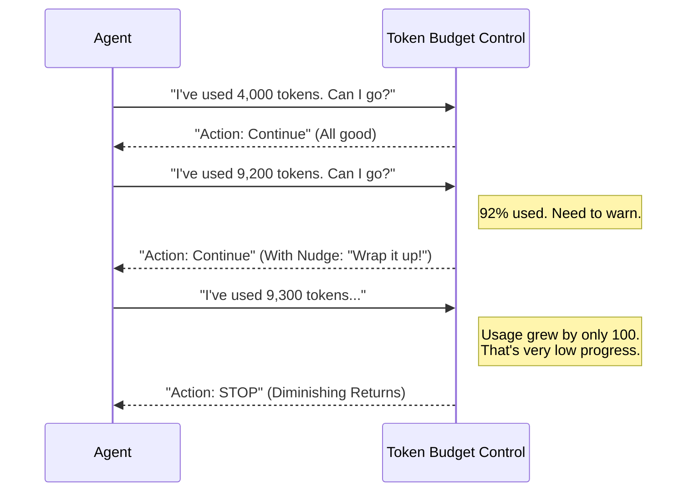

# Chapter 2: Token Budget Control

Welcome back! In [Chapter 1: Immutable Query Configuration](01_immutable_query_configuration.md), we learned how to lock in our "Mission Parameters" (Configuration) so they don't change while the agent is working.

Now, we face a new problem: **Resource Management**.

## The Motivation: The "Infinite Loop" Problem

Imagine you hire a taxi to drive you across the city. You agree on a price, but you fall asleep in the back seat. The driver gets lost and drives in circles for 5 hours. When you wake up, the meter reads $5,000.

AI Agents are similar. They run on "Tokens" (pieces of words).
1.  **The Risk:** An agent might get stuck in a logic loop, repeating "Thinking..." or making tiny, useless edits forever.
2.  **The Cost:** This burns through money (API costs) and time (user latency).

**The Solution:** We need a **Token Budget Control**. Think of this as a "Smart Trip Computer." It doesn't just cut the engine when the gas tank is empty; it watches *how* the car is driving. If the car is burning gas but not moving forward, it stops the car early to save fuel.

### Central Use Case: "Diminishing Returns"

If an agent has used 90% of its budget but is still outputting very short, unhelpful responses turn after turn, we shouldn't wait for 100%. We should stop it now. This is called detecting **Diminishing Returns**.

## Key Concepts

1.  **Budget:** The maximum amount of fuel (tokens) allowed for the entire conversation.
2.  **Tracker:** A clipboard that records how much fuel has been used so far.
3.  **Nudge:** A warning message sent to the agent (e.g., "You are almost out of fuel, wrap it up!") rather than just cutting it off.
4.  **Delta:** The difference in token usage between the current turn and the previous turn.

## How to Use It

Using the Token Budget Control is a two-step process: **Initialize** and **Check**.

### Step 1: Create the Tracker

Before the agent starts its loop, we create a fresh tracker. This records the starting time and sets counters to zero.

```typescript
// budget.ts - Initialization
import { createBudgetTracker } from './tokenBudget'

// Create a blank slate for tracking
const tracker = createBudgetTracker()

console.log(tracker) 
// Output: { continuationCount: 0, lastDeltaTokens: 0, ... }
```

*Explanation:* This `tracker` object is stateful. It will evolve as the conversation progresses, remembering history so we can detect patterns.

### Step 2: Checking the Budget

Inside the agent's main loop (every time it wants to speak), we ask the Budget Control for a decision.

```typescript
// Inside the Agent Execution Loop
import { checkTokenBudget } from './tokenBudget'

// 1. Current total usage (from API)
const currentUsage = 8500 
const maxBudget = 10000

// 2. Ask for a decision
const decision = checkTokenBudget(tracker, undefined, maxBudget, currentUsage)
```

*Explanation:* We pass the `tracker` (history), the `maxBudget` (limit), and `currentUsage` (current status). The function returns a `decision` object telling us what to do next.

## Under the Hood

How does the "Smart Trip Computer" make decisions? It's not just looking at the fuel gauge; it calculates efficiency.

### Visual Flow



### Internal Implementation

Let's look at the logic inside `checkTokenBudget`. We'll break it down into simple parts.

#### Part 1: The Tracker Structure

This is the state object we pass around.

```typescript
// tokenBudget.ts
export type BudgetTracker = {
  continuationCount: number  // How many times we've "nudged"
  lastDeltaTokens: number    // Tokens used in the PREVIOUS turn
  lastGlobalTurnTokens: number // Total tokens at the last check
  startedAt: number          // Timestamp
}
```

*Explanation:* `lastDeltaTokens` is crucial. It remembers how much "work" the agent did in the previous step.

#### Part 2: Calculating Progress

When the check function runs, it first calculates where we stand.

```typescript
// tokenBudget.ts - Calculation
  // ... inside checkTokenBudget ...

  const turnTokens = globalTurnTokens // e.g., 9000
  const pct = Math.round((turnTokens / budget) * 100) // e.g., 90%
  
  // How much did we do since the last time we checked?
  const deltaSinceLastCheck = globalTurnTokens - tracker.lastGlobalTurnTokens
```

*Explanation:* `deltaSinceLastCheck` tells us the "velocity" of the agent. If this number is small, the agent is moving slowly.

#### Part 3: The "Diminishing Returns" Heuristic

This is the "Smart" part of the system. It checks if the agent is stalling.

```typescript
// tokenBudget.ts - The Heuristic
  const DIMINISHING_THRESHOLD = 500

  // 1. Have we been nudged at least 3 times?
  // 2. Is current progress slow?
  // 3. Was PREVIOUS progress ALSO slow?
  const isDiminishing =
    tracker.continuationCount >= 3 &&
    deltaSinceLastCheck < DIMINISHING_THRESHOLD &&
    tracker.lastDeltaTokens < DIMINISHING_THRESHOLD
```

*Explanation:* This logic says: "If the agent has been warned 3 times, AND it barely did anything this turn, AND it barely did anything last turn... it's time to pull the plug." This prevents the agent from spending money on empty loops.

#### Part 4: The Decision

Finally, we return the verdict.

```typescript
// tokenBudget.ts - The Decision
  // If we detect stalling...
  if (isDiminishing) {
    return {
      action: 'stop',
      completionEvent: { /* details about why we stopped */ },
    }
  }

  // Otherwise, update tracker and continue
  tracker.continuationCount++
  return { 
      action: 'continue', 
      nudgeMessage: "You are nearing the token limit..." 
  }
```

*Explanation:* If `action` is `continue`, the agent keeps going (possibly seeing the `nudgeMessage`). If `action` is `stop`, the loop terminates immediately.

## Why is this "Beginner Friendly"?

Instead of writing complex `if` statements scattered throughout your agent code (e.g., `if (tokens > 10000) break`), we extract that logic into this dedicated module.

This makes your agent code cleaner and ensures you never accidentally create an expensive infinite loop. It also allows us to inject different budget rules later without rewriting the agent itself!

## Summary

In this chapter, we learned:
1.  **Cost Control:** AI agents need strict supervision on resource usage.
2.  **Smart Heuristics:** A simple hard limit isn't enough; we check for "Diminishing Returns" (low progress over time).
3.  **The Tracker:** We maintain a history of the conversation flow to make intelligent stop decisions.

Now that our agent has its **Configuration** (Chapter 1) and its **Budget** (Chapter 2), it needs tools to actually perform work.

[Next Chapter: Dependency Injection Interface](03_dependency_injection_interface.md)

---

Generated by [Code IQ](https://github.com/adityasoni99/Code-IQ)