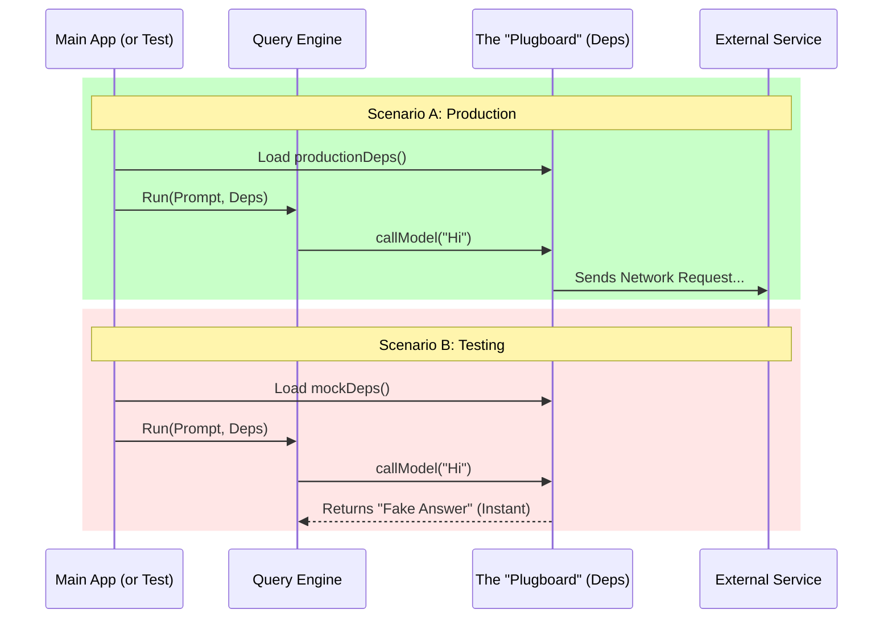

# Chapter 3: Dependency Injection Interface

Welcome back! In [Chapter 2: Token Budget Control](02_token_budget_control.md), we learned how to stop our agent from spending too much money (tokens) by monitoring its fuel usage.

Now, we need to talk about the tools the agent uses to drive.

## The Motivation: The "Stunt Double" Problem

Imagine you are filming a movie. You have a scene where the main character jumps off a building.
1.  **Production:** You want the real actor to do the scene (or a professional stunt person) to make it look real.
2.  **Rehearsal:** You don't want the actor jumping off a building 50 times just to practice the lines. It’s dangerous and expensive. You want them to jump onto a soft mattress in a gym instead.

In software, our "Building Jump" is calling the **LLM API** (like Claude or GPT).
*   **Real API:** Costs money, takes time, and sometimes gives different answers (non-deterministic).
*   **Testing:** We want to run our tests 1,000 times a second for free.

**The Solution:** We create a **Dependency Injection Interface**. This is a "Plugboard." We don't hard-code the API call inside the agent. Instead, we say: *"Hey Agent, here is a box of tools. Use whatever is inside."*

In production, we put the Real API in the box. In testing, we put a "Fake" API in the box.

## Key Concepts

1.  **Dependency:** Something your code needs to work (e.g., an internet connection, a random number generator).
2.  **Injection:** Passing the tools *into* the function from the outside, rather than the function reaching out and grabbing them itself.
3.  **Interface:** A strict contract defining what the tool must look like (e.g., "It must be a function that takes a string and returns a promise").

## How to Use It

We use a specific type called `QueryDeps` to define our tool belt.

### Step 1: Defining the Interface

First, we define the shape of the tools we need. We don't care *how* they work yet, just what they look like.

```typescript
// deps.ts - The Contract
import { queryModelWithStreaming } from '../services/api/claude.js'

export type QueryDeps = {
  // The heavy lifter: Calling the AI Model
  callModel: typeof queryModelWithStreaming

  // A simple utility: Generating IDs
  uuid: () => string
  
  // (We also include compaction tools here, omitted for brevity)
}
```

*Explanation:* This `type` is our socket. It says: "If you want to run a query, you must provide a `callModel` function and a `uuid` function."

### Step 2: Creating Production Tools

Now we create the "Real" tool belt. This is what we use when the application is actually running live.

```typescript
// deps.ts - The Real Deal
import { randomUUID } from 'crypto'
// Import the REAL api client
import { queryModelWithStreaming } from '../services/api/claude.js'

export function productionDeps(): QueryDeps {
  return {
    callModel: queryModelWithStreaming,
    uuid: randomUUID,
    // ... other real tools
  }
}
```

*Explanation:* This factory function bundles up the heavy, expensive, real-world functions into a single object that matches our interface.

### Step 3: Creating Fake Tools (For Testing)

This is where the magic happens. When writing a test, we create a "Fake" tool belt.

```typescript
// test-file.ts - The Stunt Double
const mockDeps: QueryDeps = {
  // Fake Model: Always returns "Hello" instantly for free
  callModel: async () => ({ text: "Hello from Mock!", usage: 10 }),
  
  // Fake UUID: Always returns "123" so tests are predictable
  uuid: () => "123-123-123",
  
  // ... other fake tools
}
```

*Explanation:* The agent doesn't know the difference! It calls `callModel`, gets a response, and keeps working. But we didn't spend a penny or wait for a network request.

## Under the Hood

How does the agent use these tools? It's all about passing arguments.

### Visual Flow



### Internal Implementation

Inside the core `query` function, we don't import `randomUUID` or the API client directly. We simply use the `deps` object passed to us.

#### The Function Signature

The `query` function requires `QueryDeps` as an argument.

```typescript
// query.ts (Simplified)
import type { QueryDeps } from './deps.js'

// The function asks for dependencies explicitly
export async function query(
  prompt: string, 
  deps: QueryDeps // <--- INJECTED HERE
) {
  // Logic follows...
}
```

#### Using the Tools

Inside the function, we access the tools via `deps.toolName`.

```typescript
// Inside query.ts logic

  // 1. We need an ID. Don't import randomUUID! Use deps.
  const completionId = deps.uuid()

  // 2. We need to talk to the AI. Use deps.
  const response = await deps.callModel({
    prompt: prompt,
    id: completionId
  })

  return response
```

*Explanation:* By forcing the code to use `deps.uuid()` instead of `import { randomUUID } ...`, we gain complete control over the behavior of the system from the outside.

## Why is this "Beginner Friendly"?

Without Dependency Injection, writing tests for AI agents is a nightmare. You have to use complex "Mocking" libraries (like `jest.spyOn`) to hack the module loading system and intercept imports. It is brittle and hard to debug.

With this pattern, testing is simple plain JavaScript:
1. Create an object.
2. Pass it to the function.
3. Check the result.

## Summary

In this chapter, we learned:
1.  **The "Plugboard" Concept:** We separate the logic of the agent from the heavy tools it uses (API, UUIDs).
2.  **Swappability:** We can plug in "Real" tools for production and "Fake" tools for testing.
3.  **Stability:** This allows us to test complex logic without making expensive, slow, or random network calls.

Now the agent has its **Configuration**, its **Budget**, and its **Tools**. But what happens when the agent finishes a turn? We might need to save data or log analytics.

[Next Chapter: Post-Turn Lifecycle Hooks](04_post_turn_lifecycle_hooks.md)

---

Generated by [Code IQ](https://github.com/adityasoni99/Code-IQ)