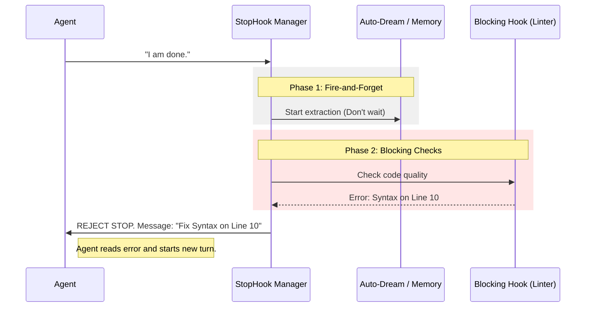

# Chapter 4: Post-Turn Lifecycle Hooks

Welcome to the final chapter of this tutorial series!

In [Chapter 3: Dependency Injection Interface](03_dependency_injection_interface.md), we gave our agent a "Tool Belt" so it could interact with the world (calling APIs, generating IDs).

Now we have a functioning agent. It has a config, a budget, and tools. But what happens when the agent says, "I'm finished"? Do we just turn off the lights?

## The Motivation: The Pilot's Checklist

Imagine an airline pilot landing a plane. The wheels touch the ground, and the plane parks at the gate. The flight is technically "over." However, the pilot doesn't just jump out of the cockpit and go home.

They run a **Post-Flight Checklist**:
1.  **Safety Check:** Are all switches off? (If not, the battery dies).
2.  **Logbook:** Write down flight duration and fuel usage.
3.  **Maintenance:** Did anything break? If so, report it immediately so it can be fixed before the next flight.

If a critical error is found during this checklist (e.g., "Brakes overheating"), the plane is grounded. It cannot officially "complete" its status until that is resolved.

**The Solution:** We implement **Post-Turn Lifecycle Hooks**.
This is a middleware layer that runs immediately after the agent generates a response. It ensures the system is healthy, saves memories, and can even **reject** the agent's attempt to stop if it left a mess behind.

### Central Use Case: "Don't Leave Broken Code"

Imagine the user asks: *"Refactor this file."*
The agent rewrites the code and says: *"I am done."*

**Without Hooks:** The system exits. The user tries to run the code, and it crashes because of a syntax error.
**With Hooks:** The system runs a "Linting Hook." It sees the syntax error. It intercepts the "I am done" message and sends a new message to the agent: *"Error: You introduced a syntax error on line 50. Fix it."* The agent effectively gets "un-finished" and must do one more turn.

## Key Concepts

1.  **Lifecycle:** The stages of an interaction. The specific stage we care about here is **Post-Turn** (after the AI speaks).
2.  **Hook:** A specific function that runs automatically at this stage.
3.  **Blocking vs. Non-Blocking:**
    *   **Non-Blocking (Fire-and-Forget):** Background tasks like saving logs or extracting memories. They don't stop the agent.
    *   **Blocking:** Critical checks. If these fail, the turn is *not* considered complete, and the agent is forced to try again.

## How to Use It

The core of this system is a generator function called `handleStopHooks`. It acts as the "Checklist Manager." It calls various services and decides if the turn can end.

### Step 1: Preparing the Context

Before running hooks, we need to bundle up everything that happened during the turn (messages, tools used, system prompts) into a snapshot.

```typescript
// stopHooks.ts - Context Setup
const stopHookContext = {
  messages: [...messagesForQuery, ...assistantMessages],
  systemPrompt,
  userContext,
  systemContext,
  toolUseContext, // Contains abort signals and permission modes
}
```

*Explanation:* Just like [Chapter 1: Immutable Query Configuration](01_immutable_query_configuration.md), we create a snapshot. The hooks need to see exactly what the agent saw.

### Step 2: Background Tasks (Non-Blocking)

First, the manager triggers background tasks. These run silently.

```typescript
// stopHooks.ts - Background Tasks
if (!isBareMode()) {
  // 1. Suggest new prompts based on what happened
  void executePromptSuggestion(stopHookContext)
  
  // 2. Extract useful memories for long-term storage
  void extractMemoriesModule!.executeExtractMemories(
      stopHookContext, 
      toolUseContext.appendSystemMessage
  )
}
```

*Explanation:* Note the `void` keyword. This tells the system: "Start this work, but don't wait for it to finish." We don't want the user to wait 5 seconds just for us to save a log file.

### Step 3: Executing Blocking Hooks

Now we run the critical checks. This calls `executeStopHooks`, which iterates through rules defined elsewhere (like linting or test checks).

```typescript
// stopHooks.ts - The Critical Path
const generator = executeStopHooks(
  permissionMode,
  toolUseContext.abortController.signal,
  // ... other args
  toolUseContext.agentType,
)
```

*Explanation:* This function returns a **Generator**. It will trickle out events (progress updates, errors) one by one.

### Step 4: Processing Results

We loop through the generator to see if anything went wrong.

```typescript
// stopHooks.ts - Processing the Checklist
for await (const result of generator) {
  // If a hook says "STOP!", we flag it
  if (result.blockingError) {
    blockingErrors.push(createUserMessage({
      content: getStopHookMessage(result.blockingError),
      isMeta: true,
    }))
  }
  
  // Pass progress messages back to the UI
  if (result.message) yield result.message
}
```

*Explanation:* As the checklist runs, we might get messages like "Running Linter...". We yield these so the user sees a spinner. If a blocking error occurs, we add it to our list.

## Under the Hood

What happens step-by-step when the agent tries to finish?

### Visual Flow



### Internal Implementation Details

Let's look deeper into how `handleStopHooks` makes the final decision.

#### Part 1: Auto-Dreaming

One of the most interesting "Non-Blocking" hooks is **Auto-Dreaming**. This is where the agent, while idle, thinks about what it learned to improve future performance.

```typescript
// stopHooks.ts
    if (!toolUseContext.agentId) {
      // If this is the main agent (not a sub-worker), dream!
      void executeAutoDream(
          stopHookContext, 
          toolUseContext.appendSystemMessage
      )
    }
```

*Explanation:* We check `!toolUseContext.agentId` to ensure only the main "Lead" agent dreams. We don't want temporary worker agents using up resources.

#### Part 2: Handling Interruptions

The user might hit `Ctrl+C` *while* the hooks are running. We need to handle this gracefully.

```typescript
// stopHooks.ts - Cancellation
      // Check if user pressed Ctrl+C
      if (toolUseContext.abortController.signal.aborted) {
        logEvent('tengu_pre_stop_hooks_cancelled', { /*...*/ })
        
        yield createUserInterruptionMessage({ toolUse: false })
        
        // Stop everything immediately
        return { blockingErrors: [], preventContinuation: true }
      }
```

*Explanation:* We check the `abortController` inside the loop. If aborted, we return `preventContinuation: true`.

#### Part 3: The Final Verdict

After all hooks run, the function returns a `StopHookResult` object.

```typescript
// stopHooks.ts - Return Type
type StopHookResult = {
  blockingErrors: Message[]   // List of things the agent must fix
  preventContinuation: boolean // Should we hard-stop?
}
```

If `blockingErrors` is not empty, the main query loop (outside this file) will see them, feed them back to the LLM, and force another generation cycle.

## Summary

In this chapter, we learned:
1.  **Safety Net:** We don't trust the agent to just "finish." We verify its work.
2.  **Middleware Pattern:** We use hooks to sanitize behavior without cluttering the main agent logic.
3.  **Blocking Errors:** The system can reject a "Stop" command if the state is invalid, creating a self-healing loop.

### Conclusion

Congratulations! You have completed the **Query** project tutorial.

You now understand the four pillars of a robust AI agent system:
1.  **Immutable Configuration:** Locking in rules at the start.
2.  **Token Budget:** Preventing infinite loops and wasted money.
3.  **Dependency Injection:** Making the system testable.
4.  **Lifecycle Hooks:** Ensuring quality and consistency between turns.

With these patterns, you can build AI agents that are reliable, testable, and safe for production use. Happy coding!

---

Generated by [Code IQ](https://github.com/adityasoni99/Code-IQ)