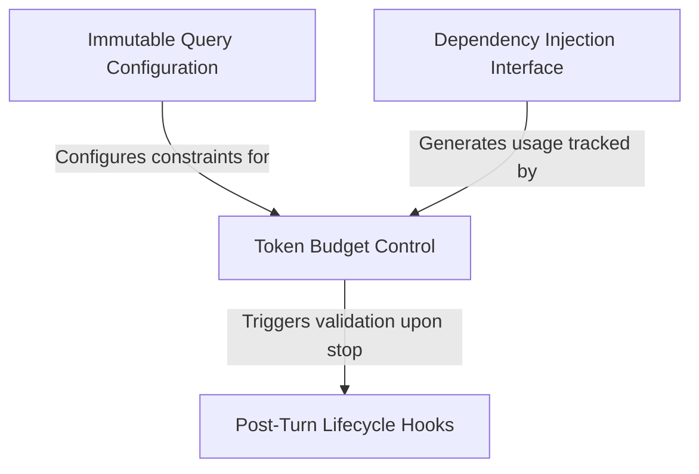

# Tutorial: query

This project implements a robust **execution runtime** for an AI agent, designed to manage the lifecycle of user queries safely and efficiently. It utilizes **immutable configuration** snapshots to ensure consistent behavior and employs a *token budget system* to intelligently monitor resource usage and prevent infinite loops. Additionally, it features a **dependency injection** layer for modular testing and *post-turn lifecycle hooks* that validate the agent's state and handle background tasks before a session concludes.

## Chapters

1. [Immutable Query Configuration](01_immutable_query_configuration.md)
2. [Token Budget Control](02_token_budget_control.md)
3. [Dependency Injection Interface](03_dependency_injection_interface.md)
4. [Post-Turn Lifecycle Hooks](04_post_turn_lifecycle_hooks.md)

---

Generated by [Code IQ](https://github.com/adityasoni99/Code-IQ)