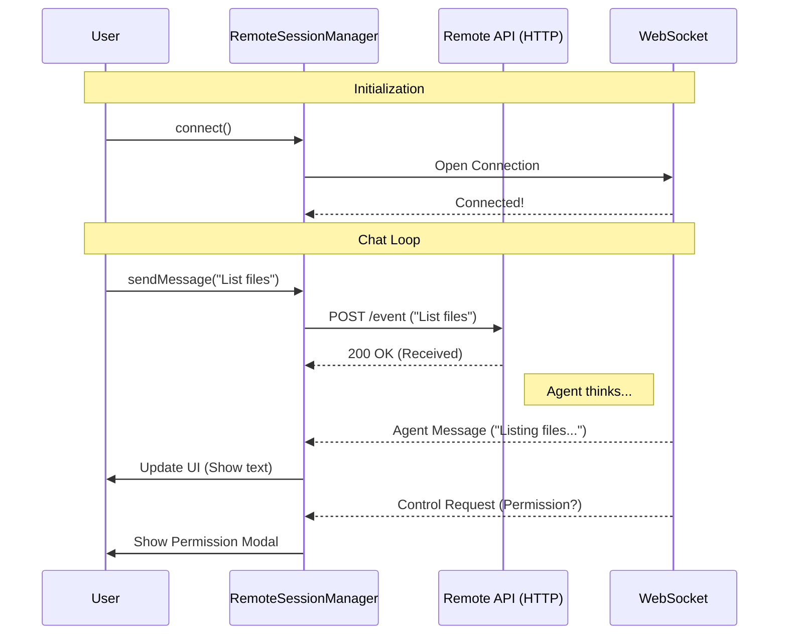

# Chapter 1: Remote Session Orchestration

Welcome to the **Remote** project!

Imagine you are building a robot that lives in a secure room miles away. You are sitting at your laptop at home. You need a way to tell the robot what to do ("Pick up the box") and a way for the robot to tell you what is happening ("I picked it up").

In our project, the "robot" is a remote AI agent running in a secure container, and your laptop is the user interface.

**Remote Session Orchestration** is the "Project Manager" that sits in the middle. It handles the phone lines, ensuring your instructions get to the agent and the agent's replies get back to you.

## The Motivation: Why do we need a Manager?

Connecting to a remote AI isn't as simple as opening a single pipe. We have two distinct needs:

1.  **Sending Commands:** When you type a message, we need to send it securely to the server immediately (using HTTP).
2.  **Listening for Updates:** The AI thinks and acts over time. It might take 10 seconds to generate a response. We need a live line open to receive these updates as they happen (using WebSockets).

Without a central manager, your code would be a mess of loose wires. The `RemoteSessionManager` ties everything together into one clean package.

## Key Concepts

### 1. The Coordinator
The `RemoteSessionManager` class is the heart of this system. It initializes the connection and stays alive as long as you are talking to the AI. It remembers who you are (Authentication) and which session you are looking at (Session ID).

### 2. Dual-Channel Communication
To make the experience smooth, the manager uses two different methods of communication simultaneously:
*   **The Mouth (HTTP):** Used to *push* data (like your chat messages) to the remote server.
*   **The Ears (WebSocket):** Used to *subscribe* to events coming from the remote server.

## How to Use It

Let's look at how to set up this manager in your application.

### Step 1: Configuration
First, we need to pack our "luggage"—the configuration data required to travel to the remote server.

```typescript
import { createRemoteSessionConfig } from './RemoteSessionManager';

// Setup the credentials and target session
const config = createRemoteSessionConfig(
  'session-uuid-123',    // The specific room ID
  () => 'my-secret-token', // Your access pass
  'org-uuid-456'         // Your organization ID
);
```
*Explanation: We create a config object that holds the "address" of the remote session and the keys to get in.*

### Step 2: Defining Callbacks
The manager needs to know what to do when it hears from the AI. We provide "callbacks"—functions that run when specific events happen.

```typescript
// What should happen when the AI speaks?
const callbacks = {
  onConnected: () => console.log('We are live!'),
  
  onMessage: (msg) => {
    // The AI sent a text message or code update
    console.log('AI said:', msg); 
  },
  
  // The AI wants permission to do something risky
  onPermissionRequest: (req, id) => {
    console.log('AI wants to use a tool:', req);
  }
};
```
*Explanation: Here we define our reactions. When the AI sends a message, we log it. When the AI asks for permission (like "Can I delete this file?"), we get notified.*

### Step 3: Starting the Manager
Now we put it all together and tell the manager to connect.

```typescript
import { RemoteSessionManager } from './RemoteSessionManager';

// Initialize the manager
const manager = new RemoteSessionManager(config, callbacks);

// Open the connection
manager.connect();
```
*Explanation: `manager.connect()` starts the "Ears" (WebSocket). It connects to the server and waits for the `onConnected` callback to fire.*

### Step 4: Sending a Message
When the user types something in the UI, we use the manager to send it.

```typescript
// The user typed "Hello!"
const userContent = { type: 'text', text: 'Hello!' };

// Send it to the remote session
await manager.sendMessage(userContent);
```
*Explanation: This uses the "Mouth" (HTTP). We don't wait for a reply here; the reply will come later through the `onMessage` callback we defined earlier.*

## Internal Implementation: Under the Hood

How does the `RemoteSessionManager` actually juggle these tasks?

### The Flow
Here is a high-level view of what happens when a user interacts with the session.



### Code Walkthrough

Let's look at the actual code inside `RemoteSessionManager.ts` to see how it handles incoming data.

#### 1. Routing Messages
The manager receives a raw message from the WebSocket and decides if it's a simple chat message or a system request.

```typescript
// Inside RemoteSessionManager.ts
private handleMessage(message): void {
  // Is the AI asking for permission?
  if (message.type === 'control_request') {
    this.handleControlRequest(message);
    return;
  }

  // Is it a normal chat message?
  if (isSDKMessage(message)) {
    this.callbacks.onMessage(message);
  }
}
```
*Explanation: This acts like a mail sorter. If the message is a "control request" (like asking for permission), it goes to a special handler. If it's standard content (text, code), it goes to the user interface.*

To understand the specific format of these messages, we will explore the **[Remote Control Protocol](02_remote_control_protocol.md)** in the next chapter.

#### 2. Managing Connections
The manager relies on a helper class for the actual WebSocket connection.

```typescript
// Inside connect()
this.websocket = new SessionsWebSocket(
  this.config.sessionId,
  this.config.orgUuid,
  this.config.getAccessToken,
  wsCallbacks // Pass our internal handlers
);

void this.websocket.connect();
```
*Explanation: The `RemoteSessionManager` doesn't know *how* to speak WebSocket itself; it delegates that to `SessionsWebSocket`. We will cover how we keep this connection alive in **[Resilient WebSocket Transport](04_resilient_websocket_transport.md)**.*

#### 3. Handling Permissions
One of the most critical roles of the Orchestrator is handling "Control Requests." This happens when the AI wants to run a command on the remote machine.

```typescript
// Inside handleControlRequest()
if (inner.subtype === 'can_use_tool') {
  // Store the request so we can answer it later
  this.pendingPermissionRequests.set(request_id, inner);
  
  // Ask the UI to show a "Yes/No" prompt
  this.callbacks.onPermissionRequest(inner, request_id);
}
```
*Explanation: The manager pauses the AI's action, stores the request ID, and asks the user interface to display a prompt. The AI will wait until the user responds.*

## Conclusion

The **Remote Session Orchestration** layer is the glue that holds the application together. It provides a simple interface for the UI to send commands and receive updates, hiding the complexity of managing HTTP requests and WebSocket streams.

Now that we understand *how* the data moves, we need to understand *what* that data actually looks like.

Let's move on to **[Remote Control Protocol](02_remote_control_protocol.md)** to see the language our agent speaks.

---

Generated by [Code IQ](https://github.com/adityasoni99/Code-IQ)