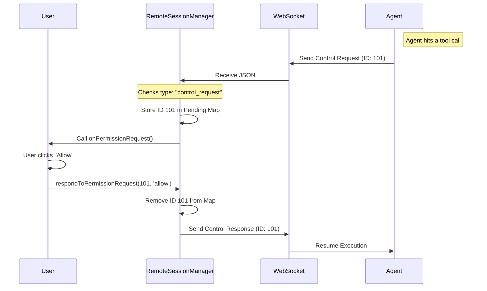

# Chapter 2: Remote Control Protocol

In the previous chapter, **[Remote Session Orchestration](01_remote_session_orchestration.md)**, we built the "Manager" that handles the phone lines between you and the remote AI agent.

But just having a connection isn't enough. We need to agree on a set of rules for **controlling** the agent.

## The Motivation: Chat vs. Control

Imagine you are texting a friend. You send messages back and forth asynchronously. This is the **Chat Stream**.

Now, imagine your friend is driving your car.
1.  **Permission:** They stop at a fork in the road and ask, "Left or Right? I will wait until you answer."
2.  **Interrupt:** You shout, "STOP!" because they missed a sign.

These interactions are different from chat. They are **Control Signals**. They require the agent to pause, wait for a specific ID-matched response, or halt execution immediately. This is what the **Remote Control Protocol** handles.

## Key Concepts

### 1. The Handshake (Request/Response)
When the Agent needs permission (e.g., to run a terminal command), it sends a `control_request`. This request has a unique ID (like a ticket number). The Agent **freezes** until it receives a `control_response` with that exact matching ticket number.

### 2. The Interrupt
Sometimes the user needs to force the Agent to stop thinking or working. This is a one-way signal sent from the User to the Agent to cancel the current operation.

## How to Use It

Let's look at how to handle these control signals in your application code.

### Scenario: The Agent Asks for Permission

The Agent wants to use a tool (like listing files). It sends a request, and your app needs to show a "Yes/No" popup.

#### Step 1: Receiving the Request
When setting up the Manager (from Chapter 1), we define `onPermissionRequest`.

```typescript
// Inside your callbacks definition
onPermissionRequest: (request, requestId) => {
  console.log(`Agent wants to: ${request.tool_name}`);
  
  // Save this ID! We need it to reply.
  showUserPrompt(requestId, request.tool_name);
}
```
*Explanation: The Manager unpacks the complex protocol message and gives you just what you need: the `request` details and the `requestId` ticket number.*

#### Step 2: Approving the Request
The user clicks "Yes" in your UI. You must send a response back using the same ticket number.

```typescript
// User clicked "Allow"
const response = {
  behavior: 'allow',
  updatedInput: {} // You can even edit the input here!
};

// Send the approval back to the manager
manager.respondToPermissionRequest(savedRequestId, response);
```
*Explanation: We tell the manager to find the request with `savedRequestId` and mark it as allowed. The Agent will now resume working.*

#### Step 3: Denying the Request
The user clicks "No".

```typescript
// User clicked "Deny"
const response = {
  behavior: 'deny',
  message: 'User rejected this command.'
};

manager.respondToPermissionRequest(savedRequestId, response);
```
*Explanation: We send a denial. The Agent will receive an error on its side saying the user refused the action.*

### Scenario: Stopping the Agent
If the Agent is generating a long response or running a script you don't like, you can hit the "Stop" button.

```typescript
// User clicked "Stop" / Ctrl+C
manager.cancelSession();
```
*Explanation: This sends an `interrupt` signal. It doesn't need a ticket number; it applies to whatever is happening right now.*

## Internal Implementation: Under the Hood

How does the system distinguish a simple chat message from a high-priority control signal?

### The Flow

Here is how a Permission Request travels through the system.



### Code Walkthrough

Let's look at `RemoteSessionManager.ts` to see how it separates these messages.

#### 1. Filtering Messages
When a message arrives from the WebSocket, the Manager checks its `type`.

```typescript
// RemoteSessionManager.ts
private handleMessage(message): void {
  // Priority 1: Control Requests (Permissions)
  if (message.type === 'control_request') {
    this.handleControlRequest(message);
    return;
  }
  
  // Priority 2: Standard Chat
  if (isSDKMessage(message)) {
    this.callbacks.onMessage(message);
  }
}
```
*Explanation: This is the traffic cop. If the packet says `control_request`, it goes to the special handler. Everything else is treated as standard chat data.*

#### 2. Tracking Pending Requests
We can't just send a response into the void; we need to know *which* request we are answering. The Manager keeps a list.

```typescript
// RemoteSessionManager.ts
private handleControlRequest(request): void {
  const { request_id, request: inner } = request;

  // Store the request in memory
  this.pendingPermissionRequests.set(request_id, inner);
  
  // Notify the UI
  this.callbacks.onPermissionRequest(inner, request_id);
}
```
*Explanation: We use a `Map` (a key-value store) to hold the request. The key is the ID. We won't delete this entry until the user responds.*

#### 3. Formatting the Response
When you call `respondToPermissionRequest`, the Manager wraps your answer in the correct protocol JSON.

```typescript
// RemoteSessionManager.ts
const response = {
  type: 'control_response',
  response: {
    subtype: 'success',
    request_id: requestId, // The Ticket Number
    response: {
      behavior: result.behavior // 'allow' or 'deny'
    },
  },
};

this.websocket?.sendControlResponse(response);
```
*Explanation: The Agent is expecting this exact nested JSON structure. If the structure is wrong, the Agent will keep waiting forever.*

## Conclusion

The **Remote Control Protocol** is the safety layer of our application. It allows synchronous, high-stakes interactions like tool permissions to happen safely alongside the asynchronous chat stream.

By using Request IDs, we ensure that when you say "Yes," you are approving exactly the action the Agent is currently asking about, keeping the human and the AI perfectly in sync.

Now that we can talk to the agent and control it, we face a new problem: How do we know what the Agent's computer looks like? Is a file open? Is the terminal running?

Let's explore how we mirror the remote computer's status in **[Synthetic State Bridging](03_synthetic_state_bridging.md)**.

---

Generated by [Code IQ](https://github.com/adityasoni99/Code-IQ)