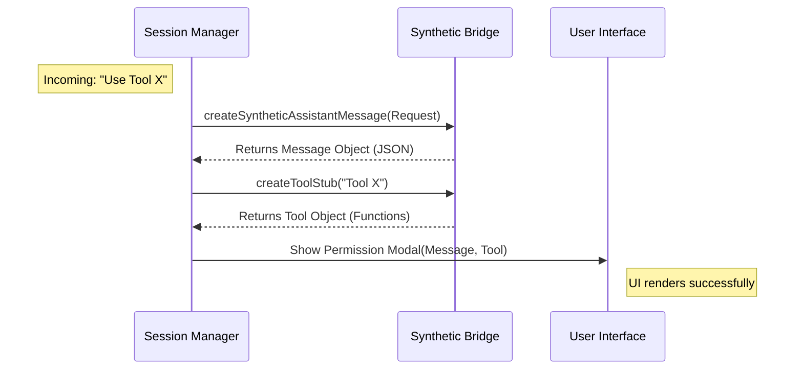

# Chapter 3: Synthetic State Bridging

In the previous chapter, **[Remote Control Protocol](02_remote_control_protocol.md)**, we learned how to send signals like "Permission Requested" and "Permission Granted" between the local computer and the remote server.

However, we have a practical problem. Your existing User Interface (UI) was likely built to run **locally**. It expects to see a real "Tool" object (like a file system tool) in memory to generate a nice-looking confirmation dialog.

But in our setup, the tools are on a server miles away. Your local laptop is empty. If the UI tries to look at the tool to render the dialog, it will crash because the tool doesn't exist.

**Synthetic State Bridging** is the art of creating "Holograms" or "Stunt Doubles." We create fake objects locally that look just real enough to trick the UI into working correctly.

## The Motivation: The "Ghost" Problem

Imagine your UI code looks like this:

1.  **Agent:** "I want to edit `file.txt`."
2.  **UI:** "Okay, let me load the `EditFile` tool to see how to display this request nicely."
3.  **System:** *Error: `EditFile` tool not found.*

Because the actual execution happens remotely, your local application doesn't have the `EditFile` code loaded. It lacks the **State** required to show the permission prompt.

We need to bridge this gap by manufacturing **Synthetic State**—fake objects that exist only to satisfy the UI's requirements.

## Key Concepts

### 1. The Synthetic Message (The False Memory)
Usually, when an AI asks to use a tool, it adds a message to the chat history: *"I am calling tool X with input Y."*
In Remote Mode, this message exists on the server, but not on your laptop. We must inject a **Synthetic Assistant Message** into your local chat stream so the UI thinks the Agent just spoke to it.

### 2. The Tool Stub (The Prop)
The UI might ask the tool: "What is your name?" or "How do I format your input?"
Since the real tool isn't there, we create a **Tool Stub**. Think of this like a prop in a movie. It looks like a hammer, but it's made of foam. It has a name and a description, but it can't actually hit nails.

## How to Use It

Let's see how to use the `remotePermissionBridge` helper functions to generate these ghosts.

### Scenario: Handling a Remote Request

The server sends a raw JSON request saying: *"I want to run `list_files`."*

#### Step 1: Create the Synthetic Message
We need to turn that raw JSON into a chat message object that our UI understands.

```typescript
import { createSyntheticAssistantMessage } from './remotePermissionBridge';

// 1. We receive raw data from the socket (Chapter 2)
const rawRequest = { tool_name: 'list_files', input: {}, tool_use_id: 'call_123' };
const requestId = 'req_999';

// 2. Create the "Ghost" message
const fakeMessage = createSyntheticAssistantMessage(rawRequest, requestId);
```
*Explanation: `fakeMessage` now looks exactly like a message object from a real AI SDK. We can safely pass this to our UI's message list.*

#### Step 2: Create the Tool Stub
The UI needs a tool object to render the confirmation box details.

```typescript
import { createToolStub } from './remotePermissionBridge';

// Create a "Prop" tool
const toolStub = createToolStub('list_files');

// The UI can now ask this stub for details
console.log(toolStub.userFacingName()); // Output: "list_files"
```
*Explanation: If we didn't do this, we would have to install every single tool on the client side just to show a text box. The stub allows us to be lightweight.*

#### Step 3: Render the UI
Now we have everything the local UI expects.

```typescript
// Pass the fake message and the fake tool to your existing UI component
myUiComponent.renderConfirmation({
  message: fakeMessage,
  tool: toolStub
});
```
*Explanation: The UI is happy. It displays the prompt. When the user clicks "Allow," we send the response back using the protocol from Chapter 2.*

## Internal Implementation: Under the Hood

How do we build these convincing fakes?

### The Flow

Here is what happens when a request arrives from the **[Remote Session Orchestration](01_remote_session_orchestration.md)** layer.



### Code Walkthrough

Let's look at `remotePermissionBridge.ts` to see how the sausage is made.

#### 1. Constructing the Message
The `createSyntheticAssistantMessage` function builds a complex object required by the AI SDK.

```typescript
export function createSyntheticAssistantMessage(req, requestId) {
  return {
    type: 'assistant',
    // We generate a random ID for local tracking
    uuid: randomUUID(), 
    message: {
      role: 'assistant',
      content: [
        {
          type: 'tool_use',
          name: req.tool_name, // Inject the name from the server
          input: req.input,    // Inject the input from the server
        },
      ],
      // ... fills in other required fields with null/empty values
    }
  }
}
```
*Explanation: We take the specific details from the server (`tool_name`, `input`) and wrap them in the standard boilerplate structure (roles, timestamps, tokens) that the local message renderer expects to see.*

#### 2. Building the Tool Stub
The `createToolStub` function creates an object that mimics the `Tool` interface.

```typescript
export function createToolStub(toolName: string): Tool {
  return {
    name: toolName,
    // Just return the name if asked
    userFacingName: () => toolName,
    
    // A simple way to show inputs as a string
    renderToolUseMessage: (input) => {
       return JSON.stringify(input);
    },

    // IMPORTANT: It does nothing if called!
    call: async () => ({ data: '' }),
    
    // ... other required methods return defaults
  } as unknown as Tool
}
```
*Explanation: This object satisfies TypeScript interfaces. It has a `call()` function, but it returns empty data. Why? Because **this tool never actually runs locally**. It exists solely so the UI can call `renderToolUseMessage` to show the user what is about to happen.*

## Conclusion

**Synthetic State Bridging** is a clever trick to reuse existing UI components. By creating "Stubs" (fake tools) and "Synthetic Messages" (fake history), we allow a lightweight local client to control a heavy remote server without needing to replicate the server's entire environment.

We have covered how to Orchestrate connections (Chapter 1), how to speak the Protocol (Chapter 2), and how to Fake the State (Chapter 3).

But what happens if the internet flickers? How do we keep the connection alive without losing these messages?

Let's move on to **[Resilient WebSocket Transport](04_resilient_websocket_transport.md)** to learn about keeping the line open.

---

Generated by [Code IQ](https://github.com/adityasoni99/Code-IQ)