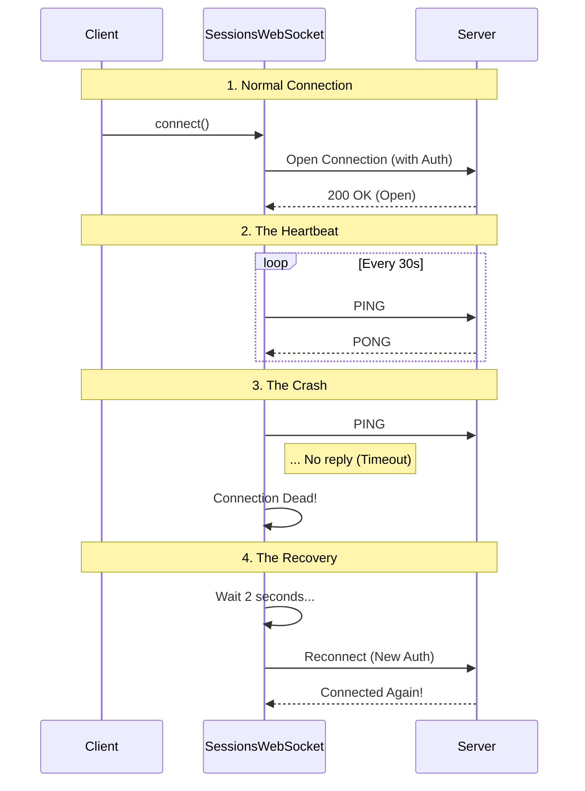

# Chapter 4: Resilient WebSocket Transport

In the previous chapter, **[Synthetic State Bridging](03_synthetic_state_bridging.md)**, we learned how to "fake" the remote computer's state so our local UI works smoothly.

But faking the state is only half the battle. To make the system actually work, we need a reliable pipeline to send data back and forth between your laptop and the remote server.

If **[Remote Session Orchestration](01_remote_session_orchestration.md)** is the Project Manager, the **Resilient WebSocket Transport** is the physical telephone line on which the manager speaks.

## The Motivation: The "Tunnel" Problem

Imagine you are on an important phone call with a robot, giving it instructions. Suddenly, you drive into a tunnel. The signal drops.

1.  **Without Resilience:** The call ends. You have to pick up your phone, unlock it, find the contact, and dial again manually. The robot stopped working the moment you disconnected.
2.  **With Resilience:** The phone realizes the signal is gone. It pauses. As soon as you exit the tunnel, it automatically redials, verifies it's still you, and reconnects you to the exact same session.

WebSockets are fragile. They break if your Wi-Fi flickers or if the server blinks. This layer ensures that **connection drops are temporary glitches, not session-ending crashes.**

## Key Concepts

### 1. The Wrapper
Raw WebSockets are low-level. They just send strings. Our `SessionsWebSocket` class wraps the raw socket to handle authentication (OAuth tokens) and environment differences (working in both Node.js and Bun).

### 2. The Heartbeat (Ping/Pong)
How do you know if a connection is dead? Silence doesn't always mean death; the other person might just be thinking.
To solve this, we send a "Ping" every 30 seconds. The server must reply with "Pong." If it doesn't, we know the line is dead and we need to reconnect.

### 3. Auto-Reconnect
When the line drops, we don't give up. We wait a few seconds and try again. We use logic to distinguish between "You are banned" (don't retry) and "The server blinked" (please retry).

## How to Use It

While this class is mostly used internally by the Manager, understanding how to configure it is essential.

### Step 1: Initialization
We create the socket with the specific "Room ID" (Session ID) and the "Key" (Auth Token).

```typescript
import { SessionsWebSocket } from './SessionsWebSocket';

const socket = new SessionsWebSocket(
  'session-123',      // The Room
  'org-456',          // The Organization
  () => 'my-token',   // Function to get fresh tokens
  myCallbacks         // Who listens to the data?
);
```
*Explanation: We pass a function for the token, not just the string. This is crucial because if we reconnect 1 hour later, we might need a new, fresh token.*

### Step 2: Connecting
We tell the socket to open the line.

```typescript
// Open the connection
await socket.connect();

// Verify we are live
if (socket.isConnected()) {
  console.log("We are live!");
}
```
*Explanation: This establishes the secure `wss://` (Secure WebSocket) connection to the server.*

### Step 3: Sending Control Signals
As discussed in **[Remote Control Protocol](02_remote_control_protocol.md)**, sometimes we need to send immediate commands.

```typescript
// Send an Interrupt signal (e.g., Stop!)
socket.sendControlRequest({ 
  subtype: 'interrupt' 
});
```
*Explanation: The transport layer handles converting this object into the specific JSON string format the server expects.*

## Internal Implementation: Under the Hood

How does this class keep the connection alive when the internet is unstable?

### The Flow
Here is the lifecycle of a resilient connection.



### Code Walkthrough

Let's look at `SessionsWebSocket.ts` to see how it handles the "Tunnel" problem.

#### 1. Handling the Connection
When we connect, we attach listeners to hear what the server says.

```typescript
// Inside connect()
ws.addEventListener('open', () => {
  this.state = 'connected';
  this.reconnectAttempts = 0; // Reset failure counter
  
  // Start the heartbeat!
  this.startPingInterval(); 
  this.callbacks.onConnected?.();
});
```
*Explanation: As soon as we connect, we reset our error counters. We also start the "Ping" timer immediately so we don't lose track of the connection status.*

#### 2. The Heartbeat (Ping)
We need to poke the server periodically.

```typescript
private startPingInterval(): void {
  // Clear any old timers
  this.stopPingInterval();

  // Every 30 seconds...
  this.pingInterval = setInterval(() => {
    if (this.state === 'connected') {
      // Send a ping frame
      this.ws.ping?.(); 
    }
  }, 30000); // 30000ms = 30s
}
```
*Explanation: This runs in the background. If the generic `WebSocket` implementation supports it, we send a standard ping. This keeps the network router from closing the "unused" connection.*

#### 3. Smart Reconnection Logic
When the connection closes, we have to decide: Do we give up, or try again?

```typescript
private handleClose(closeCode: number): void {
  this.state = 'closed';

  // 1. Give up if the server said "Unauthorized" (4003)
  if (PERMANENT_CLOSE_CODES.has(closeCode)) {
    this.callbacks.onClose?.();
    return;
  }

  // 2. Otherwise, try to reconnect
  if (this.reconnectAttempts < MAX_RECONNECT_ATTEMPTS) {
    this.reconnectAttempts++;
    this.scheduleReconnect(2000); // Try again in 2s
  }
}
```
*Explanation: This is the brain of the resilience. If the error is `4003` (Unauthorized), retrying won't help, so we stop. For almost anything else (network glitch, server restart), we wait 2 seconds and call `connect()` again.*

#### 4. Handling 4001 (Session Not Found)
Sometimes, the server is "compacting" data and briefly claims the session doesn't exist. We handle this special case gently.

```typescript
if (closeCode === 4001) {
  // Allow a few retries for this specific error
  this.sessionNotFoundRetries++;
  
  if (this.sessionNotFoundRetries <= 3) {
     // Retry with backoff
     this.scheduleReconnect(2000 * this.sessionNotFoundRetries);
     return;
  }
}
```
*Explanation: We give the server a "grace period." If it says "Session Not Found," we don't panic immediately. We wait a bit longer and ask again, just in case the server was busy doing maintenance.*

## Conclusion

The **Resilient WebSocket Transport** is the unsung hero of the Remote project. It abstracts away the complexity of networking, authentication, and error recovery, providing a stable pipe for data to flow.

Now that we have a stable pipe receiving raw text data, we need to translate that raw data into structured events that our application can understand and display.

Let's move on to the final piece of the puzzle: the **[Message Protocol Adapter](05_message_protocol_adapter.md)**.

---

Generated by [Code IQ](https://github.com/adityasoni99/Code-IQ)