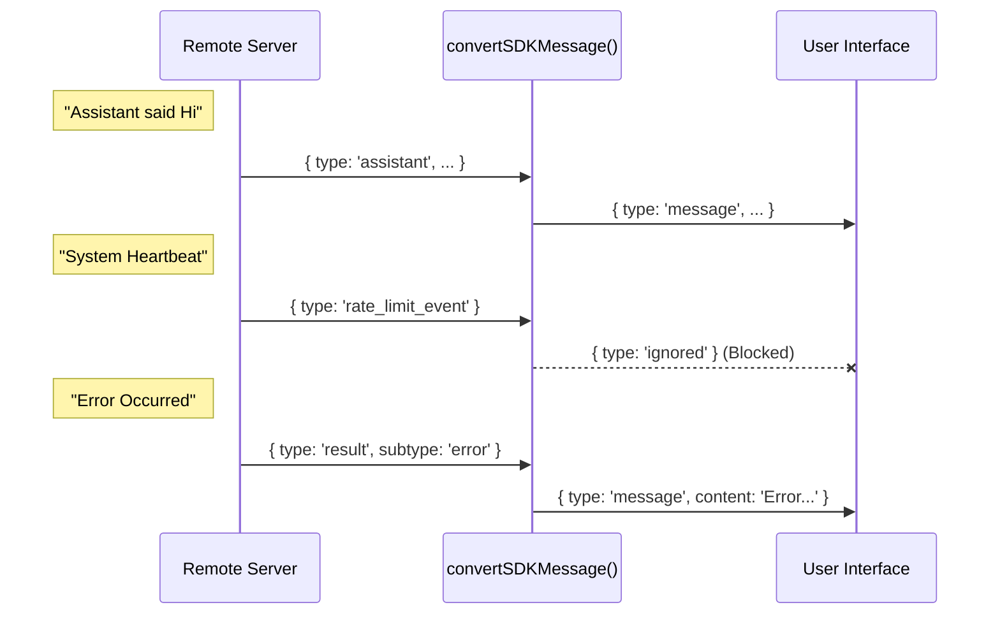

# Chapter 5: Message Protocol Adapter

Welcome to the final chapter of the **Remote** project tutorial!

In the previous chapter, **[Resilient WebSocket Transport](04_resilient_websocket_transport.md)**, we built a sturdy pipeline that keeps our connection alive even if the internet flickers. We now have a reliable flow of data coming from the remote server.

 However, we have a new problem: **The Language Barrier.**

The remote server speaks "Technical Machine Code" (SDK Messages). Your User Interface (UI) expects "Friendly Chat Objects" (Display Messages). If you plug the raw server data directly into your UI, it will break.

The **Message Protocol Adapter** is the universal translator that sits between the two, ensuring they understand each other.

## The Motivation: The "Firehose" Problem

The remote server is very chatty. It sends everything:
1.  **Useful Content:** "Here is the code you asked for."
2.  **System Noise:** "Heartbeat... I am still alive."
3.  **Status Updates:** "Compacting database... please wait."
4.  **Technical Events:** "Rate limit status update."

Your UI only cares about #1 and specific parts of #3. It doesn't know how to render a "Rate limit event."

If we don't filter and format this data, your chat window will be filled with garbage JSON and technical errors. We need an adapter to **clean, format, and filter** the stream.

## Key Concepts

### 1. The Translator (Mapping)
The server might call a text field `msg.message.content`. Your UI might expect just `content`. The adapter simply maps these fields so the UI gets exactly the shape it expects.

### 2. The Filter (Ignoring Noise)
Not every message needs to be seen by the user. The adapter inspects the message type. If it's a background technical event (like `auth_status`), the adapter returns `ignored`, and the UI stays clean.

### 3. The Stream handler
Sometimes the AI types out a response letter-by-letter. The backend sends these as `stream_event`s. The adapter needs to recognize these and pass them through specifically so the UI can show the "typing" effect.

## How to Use It

The core of this chapter is a single function: `convertSDKMessage`. Let's see how to use it to clean up incoming data.

### Scenario: Receiving a Chat Message

Imagine the server sends a raw message object.

#### Step 1: The Input (Raw Data)
This is what comes out of the WebSocket. It's nested and technical.

```javascript
// Raw data from the server
const rawMessage = {
  type: 'assistant',
  uuid: '550e8400-e29b...',
  message: {
    role: 'assistant',
    content: 'Hello World!'
  },
  timestamp: 1678900000
};
```

#### Step 2: The Conversion
We pass this raw object into our adapter.

```typescript
import { convertSDKMessage } from './sdkMessageAdapter';

// Run the translation
const result = convertSDKMessage(rawMessage);
```
*Explanation: The function looks at the `type` ('assistant') and decides which conversion logic to apply.*

#### Step 3: The Output (UI Ready)
The adapter returns a clean object ready for your React/Vue/HTML component.

```typescript
if (result.type === 'message') {
  console.log(result.message);
  // Output: { type: 'assistant', message: { role... }, uuid: ... }
  
  // Now safe to add to UI state!
  myChatList.push(result.message);
}
```
*Explanation: We check `result.type`. If it is `'message'`, we know it is safe to display. If it was `'ignored'`, we would simply do nothing.*

## Internal Implementation: Under the Hood

How does the function decide what to keep and what to throw away?

### The Flow

This diagram shows how the adapter acts as a sorting machine.



### Code Walkthrough

Let's look at `sdkMessageAdapter.ts` to see the logic.

#### 1. The Main Switch
The heart of the adapter is a big `switch` statement that checks the `msg.type`.

```typescript
export function convertSDKMessage(msg: SDKMessage): ConvertedMessage {
  switch (msg.type) {
    case 'assistant':
      // It's a chat message! Convert it.
      return { 
        type: 'message', 
        message: convertAssistantMessage(msg) 
      };

    case 'stream_event':
      // It's a live typing event.
      return { 
        type: 'stream_event', 
        event: convertStreamEvent(msg) 
      };
      
    // ... more cases below
```
*Explanation: This acts like a mail sorter. It reads the label (`type`) and sends the package to the correct department.*

#### 2. Handling System Messages
System messages are tricky. Some are useful (Errors), some are useless (Success confirmation).

```typescript
    case 'result':
      // Only show errors. Success is implied by the UI updating.
      if (msg.subtype !== 'success') {
        return { 
          type: 'message', 
          message: convertResultMessage(msg) 
        };
      }
      // If success, we don't need a chat bubble saying "Success".
      return { type: 'ignored' };
```
*Explanation: Here is our filtering logic. If `subtype` is success, we return `ignored`. The UI will receive nothing, keeping the chat history clean.*

#### 3. Filtering Noise
Some events are purely for the internal SDK state machine and shouldn't be seen by the user.

```typescript
    case 'rate_limit_event':
    case 'tool_use_summary':
    case 'auth_status':
      // These are technical events for the machine, not the human.
      return { type: 'ignored' };

    default:
      // Unknown message? Log it for devs, hide it from users.
      return { type: 'ignored' };
  }
}
```
*Explanation: By returning `ignored`, we ensure that new features added to the backend don't crash the frontend. It's a safe failure mode.*

#### 4. The Helper Converters
When we do decide to keep a message, we use small helper functions to format it.

```typescript
function convertAssistantMessage(msg: SDKAssistantMessage): AssistantMessage {
  return {
    type: 'assistant',
    message: msg.message, // Keep the content
    uuid: msg.uuid,       // Keep the ID
    timestamp: new Date().toISOString(), // Add a timestamp for the UI
  };
}
```
*Explanation: This function standardizes the object. It ensures that every 'assistant' message in our UI has a `timestamp`, even if the raw server message format changes in the future.*

## Conclusion

The **Message Protocol Adapter** is the final piece of our puzzle.

1.  **[Remote Session Orchestration](01_remote_session_orchestration.md)** manages the high-level flow.
2.  **[Remote Control Protocol](02_remote_control_protocol.md)** defines the rules of engagement.
3.  **[Synthetic State Bridging](03_synthetic_state_bridging.md)** fakes the local environment.
4.  **[Resilient WebSocket Transport](04_resilient_websocket_transport.md)** carries the data safely.
5.  **Message Protocol Adapter** (this chapter) translates the data for the user.

By separating these concerns, we have built a robust system where the backend and frontend can evolve independently. The backend can add complex new technical events, and thanks to the Adapter, the frontend will simply ignore them until we are ready to implement them, ensuring the user experience never breaks.

Congratulations! You have completed the **Remote** project tutorial. You now understand the full architecture of a modern, resilient remote control system for AI agents.

---

Generated by [Code IQ](https://github.com/adityasoni99/Code-IQ)