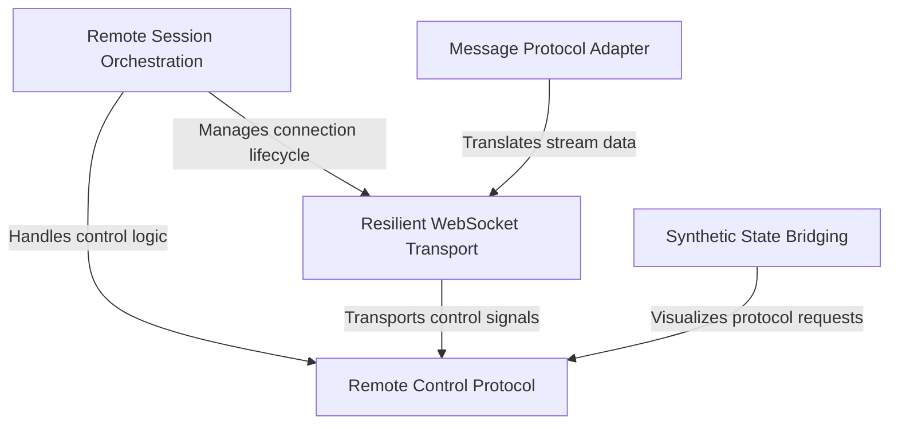

# Tutorial: remote

This project enables the **remote control** of an AI agent running in a separate environment (CCR) by bridging it to a local user interface. It manages a **resilient WebSocket connection** to stream chat events and synchronizes interactive states, such as **tool permission requests**, ensuring the remote agent behaves seamlessly like a local instance. The system handles protocol translation, authentication, and connection recovery automatically.

## Chapters

1. [Remote Session Orchestration](01_remote_session_orchestration.md)
2. [Remote Control Protocol](02_remote_control_protocol.md)
3. [Synthetic State Bridging](03_synthetic_state_bridging.md)
4. [Resilient WebSocket Transport](04_resilient_websocket_transport.md)
5. [Message Protocol Adapter](05_message_protocol_adapter.md)

---

Generated by [Code IQ](https://github.com/adityasoni99/Code-IQ)