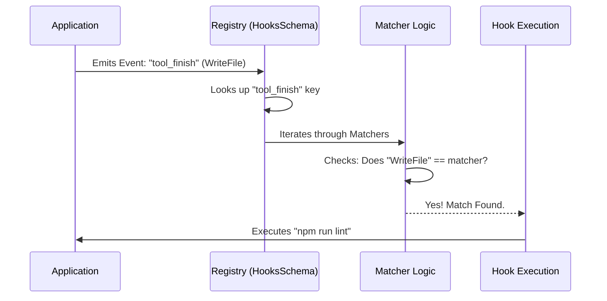

# Chapter 1: Event-Based Configuration Registry

Welcome to the first chapter of the **Schemas** project tutorial! In this series, we will explore how to build a flexible, reactive system using Zod schemas.

In this chapter, we will look at the foundation of our reactive system: the **Event-Based Configuration Registry**.

## The Problem: "How do I make the system react?"

Imagine you are building an automated coding assistant. You have a specific requirement:

> **Use Case:** Every time the assistant finishes writing a code file, you want to automatically run a "linter" to check for syntax errors.

Hardcoding this logic deep inside your code makes the system brittle. What if you later want to run a security scan instead? Or send a notification?

We need a flexible **Rulebook**. We need a way to say: "When **X** happens, check if it looks like **Y**, and if so, do **Z**."

## The Solution: `HooksSchema`

The `HooksSchema` is the master registry. It acts like a centralized dispatcher. It maps **Lifecycle Events** to a list of rules.

Here is the high-level hierarchy:

1.  **Event:** The trigger (e.g., "A tool is being executed").
2.  **Matcher:** The filter (e.g., "Is the tool named `WriteFile`?").
3.  **Hook:** The action (e.g., "Run the `eslint` command").

### Analogy: The Emergency Dispatcher

Think of this system like a 911 dispatcher's manual:

*   **Event:** Phone Rings.
*   **Matcher:** Is the caller reporting a "Fire"?
*   **Hook:** Dispatch the Fire Department.

## Solving the Use Case

Let's look at how we structure the data to solve our "Lint on Save" use case.

### Step 1: Defining the Event

First, we look at the top-level object. The keys of this object correspond to specific moments in the application's lifecycle, known as `HOOK_EVENTS`.

```typescript
// The top-level registry
const settings = {
  // We listen for the 'tool_finish' event
  "tool_finish": [
    // Rules go here...
  ]
}
```

**Explanation:** This tells the system, "I only care about adding behavior when a tool finishes its job." If an event isn't listed here, the system ignores it.

### Step 2: Adding the Matcher

Inside the event array, we add a **Matcher**. We don't want to lint *every* tool (like "ReadFile" or "ListDir"). We only match "WriteFile".

```typescript
// Inside "tool_finish":
[
  {
    // The filter
    "matcher": "WriteFile", 
    "hooks": [
      // Actions go here...
    ]
  }
]
```

**Explanation:** The `matcher` field acts as a gatekeeper. If the tool name matches "WriteFile", we proceed to the `hooks`. If not, we skip it.

### Step 3: Defining the Hook

Finally, we define the action. This is the **Hook**.

```typescript
// Inside "hooks":
[
  {
    "type": "command",
    "command": "npm run lint",
    "statusMessage": "Linting file..."
  }
]
```

**Explanation:** This describes *what* to do. In this case, it executes a shell command. We will learn about the different types of hooks (commands, prompts, etc.) in [Polymorphic Hook Definitions](02_polymorphic_hook_definitions.md).

## Internal Implementation: Under the Hood

How does the system process this registry? Let's visualize the flow.

### The Dispatch Sequence

When an event occurs in the application, the `HooksSchema` logic takes over.



1.  The **Application** yells, "I just finished a tool called WriteFile!"
2.  The **Registry** looks at its list of keys. It finds `tool_finish`.
3.  It loops through the **Matchers** configured for that event.
4.  It finds a matcher for "WriteFile".
5.  It executes the **Hooks** associated with that matcher.

### Code Deep Dive

Let's look at the actual Zod definition from `hooks.ts`.

#### The Matcher Schema

This defines the structure of a single rule (Filter + Actions).

```typescript
// hooks.ts
export const HookMatcherSchema = lazySchema(() =>
  z.object({
    // The filter string (e.g., "WriteFile")
    matcher: z.string().optional(), 
    // The list of actions to perform
    hooks: z.array(HookCommandSchema()),
  }),
)
```

**Explanation:**
*   `matcher`: This is optional. If you leave it empty, it acts like a wildcard (matches everything).
*   `hooks`: This uses `HookCommandSchema`, which we will detail in the next chapter.

#### The Registry Schema

This wraps everything together into the master lookup table.

```typescript
// hooks.ts
export const HooksSchema = lazySchema(() =>
  // Maps Event Names -> Array of Matchers
  z.partialRecord(
    z.enum(HOOK_EVENTS), 
    z.array(HookMatcherSchema())
  ),
)
```

**Explanation:**
*   `z.enum(HOOK_EVENTS)`: This ensures you can only use valid event names (like `tool_init`, `tool_finish`) as keys. You can't make up random events.
*   `z.partialRecord`: This is key! It means you **don't** have to define rules for every single event. You can define just one, or all of them.
*   `z.array(HookMatcherSchema)`: Each event can have multiple independent rules (e.g., one rule to Lint, another rule to Git Commit).

## Summary

In this chapter, we learned:
1.  **HooksSchema** is the top-level dictionary that organizes system behavior.
2.  It uses a hierarchy of **Event -> Matcher -> Hook**.
3.  It allows us to react to specific lifecycle moments without hardcoding logic.

But wait—what exactly goes inside that `hooks` array? In our example, we used a command, but can we ask the AI to think? Can we make an HTTP request?

Yes! The system is polymorphic. Read on to find out how.

[Next Chapter: Polymorphic Hook Definitions](02_polymorphic_hook_definitions.md)

---

Generated by [Code IQ](https://github.com/adityasoni99/Code-IQ)